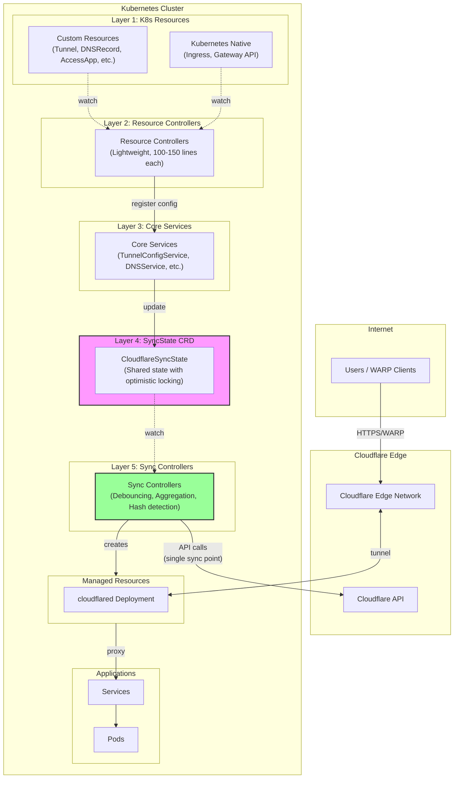

<h1 align=center>Cloudflare Zero Trust Operator</h1>

<div align="center">
  <a href="https://github.com/StringKe/cloudflare-operator">
    
  </a>
  <br />

  <p align="center">
    A Kubernetes Operator for Cloudflare Zero Trust: Tunnels, Access, Gateway, Device, DNS, R2, and Rules Management
    <br />
    <br />
    <a href="https://github.com/StringKe/cloudflare-operator/blob/main/docs/en/README.md"><strong>Documentation (English) »</strong></a>
    |
    <a href="https://github.com/StringKe/cloudflare-operator/blob/main/docs/zh/README.md"><strong>文档 (中文) »</strong></a>
    <br />
    <br />
    <a href="https://github.com/StringKe/cloudflare-operator/tree/main/examples">Examples</a>
    ·
    <a href="https://github.com/StringKe/cloudflare-operator/issues">Report Bug</a>
    ·
    <a href="https://github.com/StringKe/cloudflare-operator/issues">Request Feature</a>
  </p>
</div>

<div align="center">

[](https://github.com/StringKe/cloudflare-operator/blob/main/LICENSE)
[](https://github.com/StringKe/cloudflare-operator/releases)
[](https://goreportcard.com/report/github.com/StringKe/cloudflare-operator)
[](https://github.com/StringKe/cloudflare-operator/actions/workflows/release.yml)
[](https://github.com/StringKe/cloudflare-operator/actions/workflows/test.yml)
[](https://github.com/StringKe/cloudflare-operator/actions/workflows/lint.yml)
[](https://securityscorecards.dev/viewer/?uri=github.com/StringKe/cloudflare-operator)

</div>

> **Note**: This project is currently in Alpha (v0.23.x). This is **NOT** an official Cloudflare product. It uses the [Cloudflare API](https://api.cloudflare.com/) and [cloudflared](https://github.com/cloudflare/cloudflared) to automate Zero Trust configuration on Kubernetes.
>
> This project is a fork of [adyanth/cloudflare-operator](https://github.com/adyanth/cloudflare-operator) with extended Zero Trust features and improvements.

## Overview

The Cloudflare Zero Trust Operator provides Kubernetes-native management of Cloudflare Zero Trust resources. Built with `kubebuilder` and `controller-runtime`, it enables declarative configuration of tunnels, access policies, gateway rules, device settings, R2 storage, and zone rules through Custom Resource Definitions (CRDs).

## Features

| Category | Features |
|----------|----------|
| **Tunnel Management** | Create/manage Cloudflare Tunnels, automatic cloudflared deployments, Service binding with DNS |
| **Private Network** | Virtual Networks, Network Routes, Private Service exposure via WARP |
| **Access Control** | Zero Trust Applications, Access Groups, Identity Providers, Service Tokens |
| **Gateway & Security** | Gateway Rules (DNS/HTTP/L4), Gateway Lists, Browser Isolation |
| **Device Management** | Split Tunnel configuration, Fallback Domains, Device Posture Rules |
| **DNS & Connectivity** | DNS Record management, WARP Connectors for site-to-site |
| **Domain Management** | Zone settings (SSL/TLS, Cache, Security), Origin CA Certificates |
| **R2 Storage** | R2 Buckets, Custom Domains, Event Notifications |
| **Rules Engine** | Zone Rulesets, Transform Rules (URL/Header), Redirect Rules |
| **Registrar** | Domain Registration management (Enterprise) |
| **Kubernetes Integration** | Native Ingress support, Gateway API support (Gateway, HTTPRoute, TCPRoute, UDPRoute) |

## Architecture

This operator uses a **Unified Sync Architecture** with six layers to ensure concurrent safety and eliminate race conditions:



### Architecture Benefits

| Feature | Benefit |
|---------|---------|
| **Single Sync Point** | Only Sync Controllers call Cloudflare API, eliminating race conditions |
| **Optimistic Locking** | SyncState CRD uses K8s resourceVersion for multi-instance safety |
| **Debouncing** | 500ms delay aggregates multiple changes into single API call |
| **Hash Detection** | Skip sync when config unchanged, reducing API usage |
| **Separation of Concerns** | Each layer has clear, single responsibility |

> **Note**: See [Unified Sync Architecture Design](docs/design/UNIFIED_SYNC_ARCHITECTURE.md) for detailed documentation.

## Quick Start

### Prerequisites

- Kubernetes cluster v1.28+
- Cloudflare account with Zero Trust enabled
- Cloudflare API Token ([Create Token](https://dash.cloudflare.com/profile/api-tokens))

### Installation

**Option 1: Full Installation (Recommended for new users)**

```bash
# All-in-one: CRDs + Namespace + RBAC + Operator (without webhook)
kubectl apply -f https://github.com/StringKe/cloudflare-operator/releases/latest/download/cloudflare-operator-full-no-webhook.yaml

# Verify installation
kubectl get pods -n cloudflare-operator-system
```

**Option 2: Modular Installation (Recommended for production)**

```bash
# Step 1: Install CRDs (cluster-admin required)
kubectl apply -f https://github.com/StringKe/cloudflare-operator/releases/latest/download/cloudflare-operator-crds.yaml

# Step 2: Create namespace
kubectl apply -f https://github.com/StringKe/cloudflare-operator/releases/latest/download/cloudflare-operator-namespace.yaml

# Step 3: Install operator (RBAC + Deployment)
kubectl apply -f https://github.com/StringKe/cloudflare-operator/releases/latest/download/cloudflare-operator-no-webhook.yaml

# Verify installation
kubectl get pods -n cloudflare-operator-system
```

**Available Installation Files**

| File | Contents | Use Case |
|------|----------|----------|
| `cloudflare-operator-full.yaml` | CRDs + Namespace + RBAC + Operator + Webhook | Full installation with cert-manager |
| `cloudflare-operator-full-no-webhook.yaml` | CRDs + Namespace + RBAC + Operator | Full installation without webhook |
| `cloudflare-operator-crds.yaml` | CRDs only | Modular: install CRDs separately |
| `cloudflare-operator-namespace.yaml` | Namespace only | Modular: create namespace |
| `cloudflare-operator.yaml` | RBAC + Operator + Webhook | Modular: operator with webhook |
| `cloudflare-operator-no-webhook.yaml` | RBAC + Operator | Modular: operator without webhook |

### Create a Tunnel

```yaml
# 1. Create API credentials secret
apiVersion: v1
kind: Secret
metadata:
  name: cloudflare-credentials
type: Opaque
stringData:
  CLOUDFLARE_API_TOKEN: "<your-api-token>"
---
# 2. Create tunnel
apiVersion: networking.cloudflare-operator.io/v1alpha2
kind: Tunnel
metadata:
  name: my-tunnel
spec:
  newTunnel:
    name: k8s-tunnel
  cloudflare:
    accountId: "<your-account-id>"
    domain: example.com
    secret: cloudflare-credentials
```

### Expose a Service

```yaml
apiVersion: networking.cfargotunnel.com/v1alpha1
kind: TunnelBinding
metadata:
  name: web-binding
subjects:
  - kind: Service
    name: web-app
    spec:
      fqdn: app.example.com
      protocol: http
tunnelRef:
  kind: Tunnel
  name: my-tunnel
```

## CRD Reference

### Credentials & Configuration

| CRD | API Version | Scope | Description |
|-----|-------------|-------|-------------|
| CloudflareCredentials | `networking.cloudflare-operator.io/v1alpha2` | Cluster | Cloudflare API credentials management |
| CloudflareDomain | `networking.cloudflare-operator.io/v1alpha2` | Cluster | Zone settings (SSL/TLS, Cache, Security, WAF) |

### Tunnel Management

| CRD | API Version | Scope | Description |
|-----|-------------|-------|-------------|
| Tunnel | `networking.cloudflare-operator.io/v1alpha2` | Namespaced | Cloudflare Tunnel with managed cloudflared |
| ClusterTunnel | `networking.cloudflare-operator.io/v1alpha2` | Cluster | Cluster-wide Cloudflare Tunnel |
| TunnelBinding | `networking.cfargotunnel.com/v1alpha1` | Namespaced | Bind Services to Tunnels with DNS |

### Private Network Access

| CRD | API Version | Scope | Description |
|-----|-------------|-------|-------------|
| VirtualNetwork | `networking.cloudflare-operator.io/v1alpha2` | Cluster | Cloudflare virtual network for isolation |
| NetworkRoute | `networking.cloudflare-operator.io/v1alpha2` | Cluster | Route CIDR through tunnel |
| PrivateService | `networking.cloudflare-operator.io/v1alpha2` | Namespaced | Expose Service via private IP |

### Access Control

| CRD | API Version | Scope | Description |
|-----|-------------|-------|-------------|
| AccessApplication | `networking.cloudflare-operator.io/v1alpha2` | Namespaced | Zero Trust application |
| AccessGroup | `networking.cloudflare-operator.io/v1alpha2` | Cluster | Access policy group |
| AccessIdentityProvider | `networking.cloudflare-operator.io/v1alpha2` | Cluster | Identity provider config |
| AccessServiceToken | `networking.cloudflare-operator.io/v1alpha2` | Namespaced | Service token for M2M |

### Gateway & Security

| CRD | API Version | Scope | Description |
|-----|-------------|-------|-------------|
| GatewayRule | `networking.cloudflare-operator.io/v1alpha2` | Cluster | Gateway policy rule |
| GatewayList | `networking.cloudflare-operator.io/v1alpha2` | Cluster | List for gateway rules |
| GatewayConfiguration | `networking.cloudflare-operator.io/v1alpha2` | Cluster | Global gateway settings |

### Device Management

| CRD | API Version | Scope | Description |
|-----|-------------|-------|-------------|
| DeviceSettingsPolicy | `networking.cloudflare-operator.io/v1alpha2` | Cluster | WARP client settings |
| DevicePostureRule | `networking.cloudflare-operator.io/v1alpha2` | Cluster | Device posture check |

### DNS & Connectivity

| CRD | API Version | Scope | Description |
|-----|-------------|-------|-------------|
| DNSRecord | `networking.cloudflare-operator.io/v1alpha2` | Namespaced | DNS record management |
| WARPConnector | `networking.cloudflare-operator.io/v1alpha2` | Namespaced | WARP connector deployment |
| AccessTunnel | `networking.cloudflare-operator.io/v1alpha2` | Namespaced | Access tunnel configuration |

### SSL/TLS & Certificates

| CRD | API Version | Scope | Description |
|-----|-------------|-------|-------------|
| OriginCACertificate | `networking.cloudflare-operator.io/v1alpha2` | Namespaced | Cloudflare Origin CA certificate with K8s Secret |

### R2 Storage

| CRD | API Version | Scope | Description |
|-----|-------------|-------|-------------|
| R2Bucket | `networking.cloudflare-operator.io/v1alpha2` | Namespaced | R2 storage bucket with lifecycle rules |
| R2BucketDomain | `networking.cloudflare-operator.io/v1alpha2` | Namespaced | Custom domain for R2 bucket |
| R2BucketNotification | `networking.cloudflare-operator.io/v1alpha2` | Namespaced | Event notifications for R2 bucket |

### Rules Engine

| CRD | API Version | Scope | Description |
|-----|-------------|-------|-------------|
| ZoneRuleset | `networking.cloudflare-operator.io/v1alpha2` | Namespaced | Zone ruleset (WAF, rate limiting, etc.) |
| TransformRule | `networking.cloudflare-operator.io/v1alpha2` | Namespaced | URL rewrite & header modification |
| RedirectRule | `networking.cloudflare-operator.io/v1alpha2` | Namespaced | URL redirect rules |

### Registrar (Enterprise)

| CRD | API Version | Scope | Description |
|-----|-------------|-------|-------------|
| DomainRegistration | `networking.cloudflare-operator.io/v1alpha2` | Cluster | Domain registration settings |

### Kubernetes Integration

| CRD | API Version | Scope | Description |
|-----|-------------|-------|-------------|
| TunnelIngressClassConfig | `networking.cloudflare-operator.io/v1alpha2` | Cluster | Config for Ingress integration |
| TunnelGatewayClassConfig | `networking.cloudflare-operator.io/v1alpha2` | Cluster | Config for Gateway API integration |

> **Note**: The operator also supports native Kubernetes `Ingress` and Gateway API (`Gateway`, `HTTPRoute`, `TCPRoute`, `UDPRoute`) resources when configured with the appropriate IngressClass or GatewayClass.

## Examples

See the [examples](examples/) directory for comprehensive usage examples:

- **[Basic](examples/01-basic/)** - Credentials, Tunnels, DNS, Service Binding
- **[Private Network](examples/02-private-network/)** - Virtual Networks, Routes, Private Services
- **[Zero Trust](examples/03-zero-trust/)** - Access Apps, Groups, Identity Providers
- **[Gateway](examples/04-gateway/)** - Gateway Rules, Lists
- **[Device](examples/05-device/)** - Device Policies, Posture Rules
- **[Scenarios](examples/scenarios/)** - Complete real-world scenarios

## Documentation

| Language | Link |
|----------|------|
| English | [docs/en/README.md](docs/en/README.md) |
| 中文 | [docs/zh/README.md](docs/zh/README.md) |

Documentation includes:
- Installation Guide
- API Token Permissions
- Complete CRD Reference
- Troubleshooting Guide
- Migration Guide (v1alpha1 → v1alpha2)

## API Token Permissions

| Feature | Permission | Scope |
|---------|------------|-------|
| Tunnels | `Account:Cloudflare Tunnel:Edit` | Account |
| DNS | `Zone:DNS:Edit` | Zone |
| Access | `Account:Access: Apps and Policies:Edit` | Account |
| Gateway | `Account:Zero Trust:Edit` | Account |
| Zone Settings | `Zone:Zone Settings:Edit` | Zone |
| SSL/TLS | `Zone:SSL and Certificates:Edit` | Zone |
| R2 | `Account:Workers R2 Storage:Edit` | Account |
| Rules | `Zone:Zone Rulesets:Edit` | Zone |
| Registrar | `Account:Registrar:Edit` | Account |

## Contributing

Contributions are welcome! Please see [CONTRIBUTING.md](CONTRIBUTING.md) for guidelines.

## Acknowledgements

This project is forked from [adyanth/cloudflare-operator](https://github.com/adyanth/cloudflare-operator). We extend our gratitude to [@adyanth](https://github.com/adyanth) and all original contributors for their excellent work on the initial implementation.

### What's Different

This fork extends the original project with:
- Complete Zero Trust resource support (Access, Gateway, Device management)
- v1alpha2 API with improved resource management
- Native Kubernetes Ingress and Gateway API integration
- R2 Storage management (buckets, custom domains, notifications)
- Zone settings and rules engine (SSL/TLS, Cache, WAF, Transform/Redirect rules)
- Origin CA certificate integration
- Domain registration management (Enterprise)
- Enhanced error handling and status reporting
- Comprehensive documentation and examples

## License

Apache License 2.0 - See [LICENSE](LICENSE) for details.
