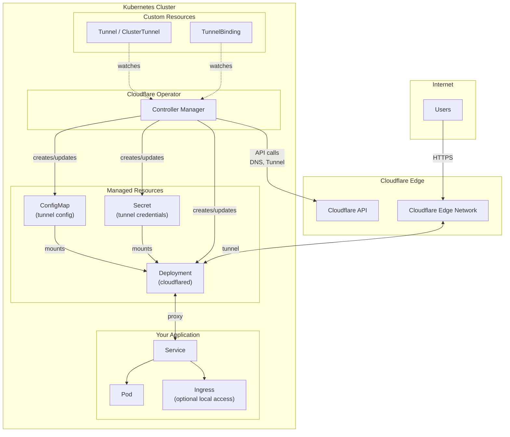

<h1 align=center>Cloudflare Operator</h1>

<div align="center">
  <a href="https://github.com/adyanth/cloudflare-operator">
    
  </a>
  <br />

  <p align="center">
    A Kubernetes Operator for Cloudflare Zero Trust: Tunnels, Access, Gateway, and Device Management
    <br />
    <br />
    <a href="https://github.com/adyanth/cloudflare-operator/blob/main/docs/getting-started.md"><strong>Getting Started Guide »</strong></a>
    <br />
    <br />
    <a href="https://github.com/adyanth/cloudflare-operator/issues">Report Bug</a>
    ·
    <a href="https://github.com/adyanth/cloudflare-operator/issues">Request Feature</a>
    <br />
  </p>
</div>

[](https://github.com/adyanth/cloudflare-operator/blob/main/LICENSE)
[](https://github.com/adyanth/cloudflare-operator/network)
[](https://github.com/adyanth/cloudflare-operator/stargazers)
[](https://github.com/adyanth/cloudflare-operator/issues)
[](https://goreportcard.com/report/github.com/adyanth/cloudflare-operator)

> **_NOTE_**: This project is currently in Alpha

## Overview

The Cloudflare Operator provides Kubernetes-native management of Cloudflare Zero Trust resources. Built with `operator-sdk`, it enables declarative configuration of tunnels, access policies, gateway rules, and device settings through Custom Resources (CRDs).

## Features

### Tunnel Management
- **Tunnel / ClusterTunnel**: Create and manage Cloudflare Tunnels with scaled `cloudflared` deployments
- **TunnelBinding**: Automatically configure tunnel ingress rules and DNS records for Services
- **AccessTunnel**: Reference existing tunnels created outside of Kubernetes
- **WARP Routing**: Enable private network access via WARP client (`enableWarpRouting`)

### Private Network Access (ZTNA)
- **VirtualNetwork**: Manage Cloudflare virtual networks for traffic isolation
- **NetworkRoute**: Configure IP routes through tunnels to private networks
- **PrivateService**: Expose Kubernetes Services to WARP clients via private IPs

### Access Control
- **AccessApplication**: Define Zero Trust applications with access policies
- **AccessGroup**: Create reusable access groups with include/exclude/require rules
- **AccessIdentityProvider**: Configure identity providers (OIDC, SAML, GitHub, Azure AD, etc.)
- **AccessServiceToken**: Manage service tokens for machine-to-machine authentication

### Gateway & Security
- **GatewayRule**: Configure Cloudflare Gateway DNS, HTTP, and network policies
- **GatewayList**: Manage lists (URLs, hostnames, IPs) for use in gateway rules
- **GatewayConfiguration**: Global gateway settings and configurations

### Device Management
- **DeviceSettingsPolicy**: Configure WARP client settings, split tunnels, and fallback domains
- **DevicePostureRule**: Define device posture checks for Zero Trust access

### DNS & Connectivity
- **DNSRecord**: Manage Cloudflare DNS records
- **WARPConnector**: Deploy WARP connectors for site-to-site connectivity

## Architecture

Here is how the operator and the Tunnel Resource fit into your deployment.



**Flow:**
1. User creates `Tunnel` and `TunnelBinding` custom resources
2. Operator watches CRDs and creates ConfigMap, Secret, and cloudflared Deployment
3. Operator calls Cloudflare API to register tunnel and DNS records
4. cloudflared establishes secure tunnel to Cloudflare Edge
5. Internet traffic flows: Users → Cloudflare Edge → Tunnel → Service → Pod

## Quick Start

### Prerequisites
- Kubernetes cluster (v1.28+)
- Cloudflare account with Zero Trust enabled
- Cloudflare API Token with appropriate permissions

### Installation

```bash
# Install CRDs
kubectl apply -f https://github.com/adyanth/cloudflare-operator/releases/latest/download/cloudflare-operator.crds.yaml

# Install operator
kubectl apply -f https://github.com/adyanth/cloudflare-operator/releases/latest/download/cloudflare-operator.yaml
```

### Create a Tunnel

```yaml
apiVersion: networking.cfargotunnel.com/v1alpha2
kind: Tunnel
metadata:
  name: my-tunnel
  namespace: default
spec:
  cloudflare:
    accountId: <your-account-id>
    domain: example.com
    secret: cloudflare-api-secret
  enableWarpRouting: true  # Enable private network access
```

### Expose a Service

```yaml
apiVersion: networking.cfargotunnel.com/v1alpha2
kind: TunnelBinding
metadata:
  name: my-service-binding
  namespace: default
spec:
  tunnelRef:
    name: my-tunnel
  subjects:
    - name: my-service
      spec:
        fqdn: app.example.com
        protocol: http
        target: my-service:8080
```

## CRD Reference

| CRD | Scope | Description |
|-----|-------|-------------|
| `Tunnel` | Namespaced | Cloudflare Tunnel with managed cloudflared deployment |
| `ClusterTunnel` | Cluster | Cluster-wide Cloudflare Tunnel |
| `TunnelBinding` | Namespaced | Bind Services to Tunnels with DNS records |
| `AccessTunnel` | Namespaced | Reference to external tunnel |
| `VirtualNetwork` | Cluster | Cloudflare virtual network |
| `NetworkRoute` | Cluster | IP route through tunnel |
| `PrivateService` | Namespaced | Expose Service via WARP private IP |
| `AccessApplication` | Namespaced | Zero Trust application |
| `AccessGroup` | Namespaced | Access policy group |
| `AccessIdentityProvider` | Namespaced | Identity provider configuration |
| `AccessServiceToken` | Namespaced | Service token for M2M auth |
| `GatewayRule` | Namespaced | Gateway policy rule |
| `GatewayList` | Namespaced | List for gateway policies |
| `GatewayConfiguration` | Cluster | Global gateway settings |
| `DeviceSettingsPolicy` | Cluster | WARP client settings |
| `DevicePostureRule` | Namespaced | Device posture check |
| `DNSRecord` | Namespaced | DNS record management |
| `WARPConnector` | Namespaced | WARP connector deployment |

## Documentation

- [Getting Started Guide](docs/getting-started.md)
- [API Reference (v1alpha2)](docs/v1alpha2.md)
- [Migration from v1alpha1](docs/migration/v1alpha2.md)
- [Examples](docs/examples/)

## Contributing

Contributions are welcome! Please read our [Contributing Guide](CONTRIBUTING.md) for details.

## License

This project is licensed under the Apache License 2.0 - see the [LICENSE](LICENSE) file for details.

> **_NOTE_**: This is **NOT** an official operator provided/backed by Cloudflare Inc. It utilizes their [v4 API](https://api.cloudflare.com/) and their [`cloudflared`](https://github.com/cloudflare/cloudflared) to automate setting up of tunnels on Kubernetes.
