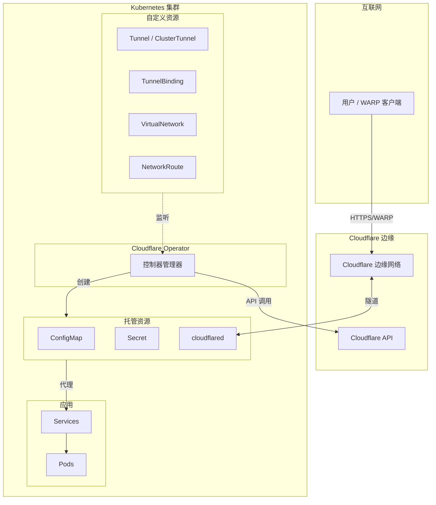

<h1 align=center>Cloudflare Zero Trust Operator</h1>

<div align="center">
  <a href="https://github.com/StringKe/cloudflare-operator">
    
  </a>
  <br />

  <p align="center">
    Cloudflare Zero Trust 的 Kubernetes Operator：隧道、访问控制、网关和设备管理
    <br />
    <br />
    <a href="https://github.com/StringKe/cloudflare-operator/blob/main/docs/en/README.md"><strong>Documentation (English) »</strong></a>
    |
    <a href="https://github.com/StringKe/cloudflare-operator/blob/main/docs/zh/README.md"><strong>文档 (中文) »</strong></a>
    <br />
    <br />
    <a href="https://github.com/StringKe/cloudflare-operator/tree/main/examples">示例</a>
    ·
    <a href="https://github.com/StringKe/cloudflare-operator/issues">报告 Bug</a>
    ·
    <a href="https://github.com/StringKe/cloudflare-operator/issues">功能请求</a>
  </p>
</div>

[](https://github.com/StringKe/cloudflare-operator/blob/main/LICENSE)
[](https://github.com/StringKe/cloudflare-operator/releases)
[](https://goreportcard.com/report/github.com/StringKe/cloudflare-operator)

> **注意**: 此项目目前处于 Alpha 阶段 (v0.17.x)

## 概述

Cloudflare Zero Trust Operator 提供 Kubernetes 原生的 Cloudflare Zero Trust 资源管理。基于 `kubebuilder` 和 `controller-runtime` 构建，通过自定义资源定义 (CRD) 实现隧道、访问策略、网关规则和设备设置的声明式配置。

## 功能特性

| 类别 | 功能 |
|------|------|
| **隧道管理** | 创建/管理 Cloudflare Tunnel，自动部署 cloudflared，服务绑定与 DNS |
| **私有网络** | 虚拟网络、网络路由、通过 WARP 暴露私有服务 |
| **访问控制** | Zero Trust 应用、访问组、身份提供商、服务令牌 |
| **网关与安全** | 网关规则 (DNS/HTTP/L4)、网关列表、浏览器隔离 |
| **设备管理** | Split Tunnel 配置、回退域、设备态势规则 |
| **DNS 与连接** | DNS 记录管理、WARP Connector 站点连接 |

## 架构



## 快速开始

### 前置条件

- Kubernetes 集群 v1.28+
- 启用 Zero Trust 的 Cloudflare 账户
- Cloudflare API Token ([创建 Token](https://dash.cloudflare.com/profile/api-tokens))

### 安装

```bash
# 安装 CRD 和 operator
kubectl apply -f https://github.com/StringKe/cloudflare-operator/releases/latest/download/cloudflare-operator.crds.yaml
kubectl apply -f https://github.com/StringKe/cloudflare-operator/releases/latest/download/cloudflare-operator.yaml

# 验证安装
kubectl get pods -n cloudflare-operator-system
```

### 创建隧道

```yaml
# 1. 创建 API 凭证 secret
apiVersion: v1
kind: Secret
metadata:
  name: cloudflare-credentials
type: Opaque
stringData:
  CLOUDFLARE_API_TOKEN: "<your-api-token>"
---
# 2. 创建隧道
apiVersion: networking.cloudflare-operator.io/v1alpha2
kind: Tunnel
metadata:
  name: my-tunnel
spec:
  newTunnel:
    name: k8s-tunnel
  cloudflare:
    accountId: "<your-account-id>"
    domain: example.com
    secret: cloudflare-credentials
```

### 暴露服务

```yaml
apiVersion: networking.cfargotunnel.com/v1alpha1
kind: TunnelBinding
metadata:
  name: web-binding
subjects:
  - kind: Service
    name: web-app
    spec:
      fqdn: app.example.com
      protocol: http
tunnelRef:
  kind: Tunnel
  name: my-tunnel
```

## CRD 参考

### 隧道管理

| CRD | API 版本 | 作用域 | 说明 |
|-----|---------|--------|------|
| Tunnel | `networking.cloudflare-operator.io/v1alpha2` | Namespaced | 带托管 cloudflared 的 Cloudflare Tunnel |
| ClusterTunnel | `networking.cloudflare-operator.io/v1alpha2` | Cluster | 集群级 Cloudflare Tunnel |
| TunnelBinding | `networking.cfargotunnel.com/v1alpha1` | Namespaced | 将服务绑定到隧道并配置 DNS |

### 私有网络访问

| CRD | API 版本 | 作用域 | 说明 |
|-----|---------|--------|------|
| VirtualNetwork | `networking.cloudflare-operator.io/v1alpha2` | Cluster | 用于隔离的 Cloudflare 虚拟网络 |
| NetworkRoute | `networking.cloudflare-operator.io/v1alpha2` | Cluster | 通过隧道路由 CIDR |
| PrivateService | `networking.cloudflare-operator.io/v1alpha2` | Namespaced | 通过私有 IP 暴露服务 |

### 访问控制

| CRD | API 版本 | 作用域 | 说明 |
|-----|---------|--------|------|
| AccessApplication | `networking.cloudflare-operator.io/v1alpha2` | Namespaced | Zero Trust 应用 |
| AccessGroup | `networking.cloudflare-operator.io/v1alpha2` | **Cluster** | 访问策略组 |
| AccessIdentityProvider | `networking.cloudflare-operator.io/v1alpha2` | **Cluster** | 身份提供商配置 |
| AccessServiceToken | `networking.cloudflare-operator.io/v1alpha2` | Namespaced | M2M 服务令牌 |

### 网关与安全

| CRD | API 版本 | 作用域 | 说明 |
|-----|---------|--------|------|
| GatewayRule | `networking.cloudflare-operator.io/v1alpha2` | **Cluster** | 网关策略规则 |
| GatewayList | `networking.cloudflare-operator.io/v1alpha2` | **Cluster** | 网关规则使用的列表 |
| GatewayConfiguration | `networking.cloudflare-operator.io/v1alpha2` | Cluster | 全局网关设置 |

### 设备管理

| CRD | API 版本 | 作用域 | 说明 |
|-----|---------|--------|------|
| DeviceSettingsPolicy | `networking.cloudflare-operator.io/v1alpha2` | Cluster | WARP 客户端设置 |
| DevicePostureRule | `networking.cloudflare-operator.io/v1alpha2` | **Cluster** | 设备态势检查 |

### DNS 与连接

| CRD | API 版本 | 作用域 | 说明 |
|-----|---------|--------|------|
| DNSRecord | `networking.cloudflare-operator.io/v1alpha2` | Namespaced | DNS 记录管理 |
| WARPConnector | `networking.cloudflare-operator.io/v1alpha2` | **Cluster** | WARP Connector 部署 |

## 示例

查看 [examples](examples/) 目录获取完整的使用示例：

- **[基础](examples/01-basic/)** - 凭证、隧道、DNS、服务绑定
- **[私有网络](examples/02-private-network/)** - 虚拟网络、路由、私有服务
- **[零信任](examples/03-zero-trust/)** - Access 应用、组、身份提供商
- **[网关](examples/04-gateway/)** - 网关规则、列表
- **[设备](examples/05-device/)** - 设备策略、态势规则
- **[场景](examples/scenarios/)** - 完整的实际场景

## 文档

| 语言 | 链接 |
|------|------|
| English | [docs/en/README.md](docs/en/README.md) |
| 中文 | [docs/zh/README.md](docs/zh/README.md) |

文档包含：
- 安装指南
- API Token 权限
- 完整 CRD 参考
- 故障排除指南
- 迁移指南 (v1alpha1 → v1alpha2)

## API Token 权限

| 功能 | 权限 | 范围 |
|------|------|------|
| 隧道 | `Account:Cloudflare Tunnel:Edit` | Account |
| DNS | `Zone:DNS:Edit` | Zone |
| Access | `Account:Access: Apps and Policies:Edit` | Account |
| Gateway | `Account:Zero Trust:Edit` | Account |

## 贡献

欢迎贡献！请查看 [CONTRIBUTING.md](CONTRIBUTING.md) 了解指南。

## 许可证

Apache License 2.0 - 详见 [LICENSE](LICENSE)。

---

> **声明**: 这**不是** Cloudflare 官方产品。它使用 [Cloudflare API](https://api.cloudflare.com/) 和 [cloudflared](https://github.com/cloudflare/cloudflared) 在 Kubernetes 上自动化 Zero Trust 配置。
