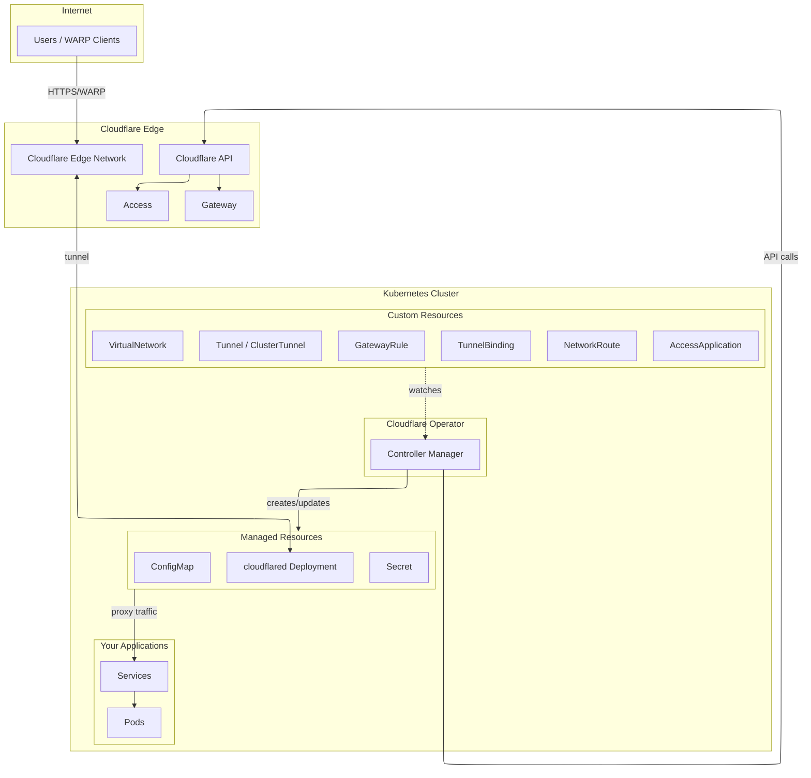

# Cloudflare Operator Documentation

A Kubernetes Operator for managing Cloudflare Zero Trust resources including Tunnels, Access, Gateway, and Device Management.

## Table of Contents

- [Overview](#overview)
- [Architecture](#architecture)
- [Prerequisites](#prerequisites)
- [Installation](#installation)
- [Cloudflare API Token Configuration](#cloudflare-api-token-configuration)
- [Quick Start](#quick-start)
- [CRD Reference](#crd-reference)
  - [Tunnel Management](#tunnel-management)
  - [Private Network Access](#private-network-access)
  - [Access Control](#access-control)
  - [Gateway & Security](#gateway--security)
  - [Device Management](#device-management)
  - [DNS & Connectivity](#dns--connectivity)
- [Usage Examples](#usage-examples)
- [Troubleshooting](#troubleshooting)
- [Migration Guide](#migration-guide)

---

## Overview

The Cloudflare Operator enables Kubernetes-native management of Cloudflare Zero Trust resources. Built with `operator-sdk`, it provides declarative configuration through Custom Resource Definitions (CRDs).

### Features

| Category | Features |
|----------|----------|
| **Tunnel Management** | Create/manage Cloudflare Tunnels, automatic cloudflared deployments, TunnelBinding for Services |
| **Private Network Access** | Virtual Networks, Network Routes, WARP routing for private IPs |
| **Access Control** | Zero Trust Applications, Access Groups, Identity Providers, Service Tokens |
| **Gateway & Security** | Gateway Rules, Gateway Lists, DNS/HTTP/Network policies |
| **Device Management** | Split Tunnel configuration, Fallback Domains, Device Posture Rules |
| **DNS & Connectivity** | DNS Record management, WARP Connectors for site-to-site |

---

## Architecture



### Traffic Flow

1. User creates CRDs (Tunnel, TunnelBinding, etc.)
2. Operator watches CRDs and creates ConfigMap, Secret, and cloudflared Deployment
3. Operator calls Cloudflare API to configure tunnel, DNS, Access policies, etc.
4. cloudflared establishes secure tunnel to Cloudflare Edge
5. Traffic flows: Users → Cloudflare Edge → Tunnel → Service → Pod

---

## Prerequisites

- Kubernetes cluster v1.28+
- `kubectl` configured with cluster access
- Cloudflare account with Zero Trust enabled
- Cloudflare API Token with appropriate permissions (see below)

---

## Installation

### Option 1: kubectl (Recommended)

```bash
# Install CRDs
kubectl apply -f https://github.com/StringKe/cloudflare-operator/releases/latest/download/cloudflare-operator.crds.yaml

# Install operator
kubectl apply -f https://github.com/StringKe/cloudflare-operator/releases/latest/download/cloudflare-operator.yaml
```

### Option 2: Specific Version

```bash
# Replace v0.15.0 with desired version
VERSION=v0.15.0
kubectl apply -f https://github.com/StringKe/cloudflare-operator/releases/download/${VERSION}/cloudflare-operator.crds.yaml
kubectl apply -f https://github.com/StringKe/cloudflare-operator/releases/download/${VERSION}/cloudflare-operator.yaml
```

### Verify Installation

```bash
# Check operator is running
kubectl get pods -n cloudflare-operator-system

# Check CRDs are installed
kubectl get crds | grep cloudflare
```

---

## Cloudflare API Token Configuration

### Creating an API Token

1. Go to [Cloudflare Dashboard](https://dash.cloudflare.com/profile/api-tokens)
2. Click **Create Token**
3. Select **Create Custom Token**
4. Configure permissions based on the features you need

### Permission Matrix

| Feature | Permission | Scope |
|---------|------------|-------|
| **Tunnel Management** | `Account:Cloudflare Tunnel:Edit` | Account |
| **DNS Records** | `Zone:DNS:Edit` | Zone (specific or all zones) |
| **Access Applications** | `Account:Access: Apps and Policies:Edit` | Account |
| **Access Groups** | `Account:Access: Apps and Policies:Edit` | Account |
| **Access Identity Providers** | `Account:Access: Apps and Policies:Edit` | Account |
| **Access Service Tokens** | `Account:Access: Service Tokens:Edit` | Account |
| **Gateway Rules** | `Account:Zero Trust:Edit` | Account |
| **Gateway Lists** | `Account:Zero Trust:Edit` | Account |
| **Gateway Configuration** | `Account:Zero Trust:Edit` | Account |
| **Device Settings** | `Account:Zero Trust:Edit` | Account |
| **Device Posture** | `Account:Zero Trust:Edit` | Account |
| **WARP Connector** | `Account:Cloudflare Tunnel:Edit` | Account |

### Recommended Token Configurations

#### Minimal (Tunnel + DNS only)

```
Permissions:
- Account > Cloudflare Tunnel > Edit
- Zone > DNS > Edit

Account Resources:
- Include > Your Account

Zone Resources:
- Include > Specific zone > example.com
```

#### Full Zero Trust

```
Permissions:
- Account > Cloudflare Tunnel > Edit
- Account > Access: Apps and Policies > Edit
- Account > Access: Service Tokens > Edit
- Account > Zero Trust > Edit
- Zone > DNS > Edit

Account Resources:
- Include > Your Account

Zone Resources:
- Include > All zones (or specific zones)
```

### Creating the Kubernetes Secret

```yaml
apiVersion: v1
kind: Secret
metadata:
  name: cloudflare-api-credentials
  namespace: default
type: Opaque
stringData:
  # Option 1: API Token (Recommended)
  CLOUDFLARE_API_TOKEN: "your-api-token-here"

  # Option 2: API Key + Email (Legacy)
  # CLOUDFLARE_API_KEY: "your-api-key-here"
  # CLOUDFLARE_EMAIL: "your-email@example.com"
```

```bash
kubectl apply -f cloudflare-secret.yaml
```

### Finding Your Account ID

1. Log in to [Cloudflare Dashboard](https://dash.cloudflare.com)
2. Select any domain
3. On the right sidebar, find **Account ID** under API section
4. Or go to **Account Home** > **Account ID** is shown in the URL

---

## Quick Start

### 1. Create API Secret

```yaml
apiVersion: v1
kind: Secret
metadata:
  name: cloudflare-credentials
  namespace: default
type: Opaque
stringData:
  CLOUDFLARE_API_TOKEN: "your-api-token"
```

### 2. Create a Tunnel

```yaml
apiVersion: networking.cloudflare-operator.io/v1alpha2
kind: Tunnel
metadata:
  name: my-tunnel
  namespace: default
spec:
  newTunnel:
    name: k8s-tunnel
  cloudflare:
    accountId: "your-account-id"
    domain: example.com
    secret: cloudflare-credentials
```

### 3. Expose a Service

```yaml
apiVersion: networking.cfargotunnel.com/v1alpha1
kind: TunnelBinding
metadata:
  name: my-app-binding
  namespace: default
subjects:
  - kind: Service
    name: my-app
    spec:
      fqdn: app.example.com
      protocol: http
      target: http://my-app.default.svc:8080
tunnelRef:
  kind: Tunnel
  name: my-tunnel
```

### 4. Verify

```bash
# Check tunnel status
kubectl get tunnel my-tunnel

# Check binding status
kubectl get tunnelbinding my-app-binding

# Check cloudflared deployment
kubectl get deployment -l app.kubernetes.io/name=cloudflared
```

---

## CRD Reference

### Tunnel Management

#### Tunnel

Namespaced resource for creating and managing Cloudflare Tunnels.

```yaml
apiVersion: networking.cloudflare-operator.io/v1alpha2
kind: Tunnel
metadata:
  name: my-tunnel
  namespace: default
spec:
  # Create a new tunnel (mutually exclusive with existingTunnel)
  newTunnel:
    name: my-new-tunnel

  # Or use an existing tunnel
  # existingTunnel:
  #   id: "tunnel-uuid"      # Tunnel ID
  #   name: "tunnel-name"    # Or tunnel name

  cloudflare:
    accountId: "account-id"           # Required
    domain: example.com               # Required
    secret: cloudflare-credentials    # Secret name
    # accountName: "My Account"       # Alternative to accountId
    # email: admin@example.com        # For API Key auth
    # CLOUDFLARE_API_TOKEN: "key"     # Key in secret (default)
    # CLOUDFLARE_API_KEY: "key"       # Key in secret for API Key

  # Optional settings
  protocol: auto              # auto, quic, http2
  noTlsVerify: false          # Disable origin TLS verification
  originCaPool: ca-secret     # Secret with custom CA certificates
  fallbackTarget: http_status:404  # Default response
  enableWarpRouting: false    # Enable WARP private network routing

  # Customize cloudflared deployment
  deployPatch: |
    spec:
      replicas: 3
      template:
        spec:
          nodeSelector:
            node-type: edge
```

**Status Fields:**

| Field | Description |
|-------|-------------|
| `tunnelId` | Cloudflare Tunnel ID |
| `tunnelName` | Tunnel name in Cloudflare |
| `accountId` | Cloudflare Account ID |
| `zoneId` | Cloudflare Zone ID |

#### ClusterTunnel

Cluster-scoped version of Tunnel. Same spec as Tunnel.

```yaml
apiVersion: networking.cloudflare-operator.io/v1alpha2
kind: ClusterTunnel
metadata:
  name: shared-tunnel  # No namespace
spec:
  # Same as Tunnel spec
```

#### TunnelBinding

Binds Kubernetes Services to Tunnels with automatic DNS configuration.

```yaml
apiVersion: networking.cfargotunnel.com/v1alpha1
kind: TunnelBinding
metadata:
  name: my-binding
  namespace: default
subjects:
  - kind: Service
    name: web-service
    spec:
      fqdn: web.example.com      # Custom domain
      protocol: https            # http, https, tcp, udp, ssh, rdp
      target: https://web-service.default.svc:443
      path: /api/.*              # Path regex (http/https only)
      noTlsVerify: false         # Skip origin TLS verify
      http2Origin: true          # Use HTTP/2 to origin
      caPool: custom-ca          # Custom CA from tunnel's originCaPool
      proxyAddress: 127.0.0.1    # Proxy listen address (tcp/ssh/rdp)
      proxyPort: 0               # Proxy listen port
      proxyType: ""              # "", "socks"
tunnelRef:
  kind: Tunnel                   # Tunnel or ClusterTunnel
  name: my-tunnel
  disableDNSUpdates: false       # Skip DNS record creation
```

**Supported Protocols:**

| Protocol | Default Ports | Description |
|----------|---------------|-------------|
| `http` | Any except below | Standard HTTP |
| `https` | 443 | HTTPS with TLS |
| `tcp` | Any | Raw TCP proxy |
| `udp` | Any | UDP proxy |
| `ssh` | 22 | SSH tunneling |
| `rdp` | 3389 | Remote Desktop |
| `smb` | 139, 445 | SMB/CIFS |

---

### Private Network Access

#### VirtualNetwork

Cluster-scoped resource for Cloudflare Virtual Networks.

```yaml
apiVersion: networking.cloudflare-operator.io/v1alpha2
kind: VirtualNetwork
metadata:
  name: production-vnet
spec:
  name: production-network        # Name in Cloudflare (optional)
  comment: Production environment virtual network
  isDefaultNetwork: false         # Set as account default
  cloudflare:
    accountId: "account-id"
    domain: example.com
    secret: cloudflare-credentials
```

**Status Fields:**

| Field | Description |
|-------|-------------|
| `virtualNetworkId` | Cloudflare Virtual Network ID |
| `accountId` | Cloudflare Account ID |
| `state` | Current state (active, deleted) |
| `isDefault` | Whether this is the default network |

#### NetworkRoute

Cluster-scoped resource for routing CIDR ranges through tunnels.

```yaml
apiVersion: networking.cloudflare-operator.io/v1alpha2
kind: NetworkRoute
metadata:
  name: internal-network-route
spec:
  network: 10.0.0.0/8             # CIDR to route
  comment: Internal network access
  tunnelRef:
    kind: ClusterTunnel           # Tunnel or ClusterTunnel
    name: main-tunnel
    namespace: default            # Only for Tunnel kind
  virtualNetworkRef:              # Optional
    name: production-vnet
  cloudflare:
    accountId: "account-id"
    domain: example.com
    secret: cloudflare-credentials
```

**Status Fields:**

| Field | Description |
|-------|-------------|
| `network` | Configured CIDR |
| `tunnelId` | Associated Tunnel ID |
| `tunnelName` | Associated Tunnel name |
| `virtualNetworkId` | Associated Virtual Network ID |
| `state` | Current state |

---

### Access Control

#### AccessApplication

Cluster-scoped resource for Cloudflare Access Applications.

```yaml
apiVersion: networking.cloudflare-operator.io/v1alpha2
kind: AccessApplication
metadata:
  name: internal-dashboard
spec:
  name: Internal Dashboard
  domain: dashboard.example.com
  type: self_hosted              # self_hosted, saas, ssh, vnc, app_launcher, warp, biso, bookmark, dash_sso
  sessionDuration: 24h

  # Identity Provider configuration
  allowedIdps:                   # Direct IDP IDs
    - "idp-uuid-1"
  allowedIdpRefs:                # Reference AccessIdentityProvider resources
    - name: google-workspace
  autoRedirectToIdentity: false

  # Cookie settings
  enableBindingCookie: true
  httpOnlyCookieAttribute: true
  sameSiteCookieAttribute: lax   # strict, lax, none

  # UI settings
  logoUrl: https://example.com/logo.png
  skipInterstitial: true
  appLauncherVisible: true

  # Access denied settings
  customDenyMessage: Contact IT for access
  customDenyUrl: https://example.com/denied

  # Advanced
  allowAuthenticateViaWarp: true
  serviceAuth401Redirect: false
  tags:
    - production
    - internal

  # Access policies
  policies:
    - name: employees-group      # Reference AccessGroup
      decision: allow
      precedence: 1

  cloudflare:
    accountId: "account-id"
    domain: example.com
    secret: cloudflare-credentials
```

**Application Types:**

| Type | Description |
|------|-------------|
| `self_hosted` | Self-hosted web application |
| `saas` | SaaS application |
| `ssh` | SSH access |
| `vnc` | VNC remote access |
| `app_launcher` | App Launcher portal |
| `warp` | WARP client access |
| `biso` | Browser Isolation |
| `bookmark` | Bookmark (no proxy) |
| `dash_sso` | Cloudflare Dashboard SSO |

#### AccessGroup

Cluster-scoped resource for reusable access groups.

```yaml
apiVersion: networking.cloudflare-operator.io/v1alpha2
kind: AccessGroup
metadata:
  name: engineering-team
spec:
  name: Engineering Team

  # Users must match at least one include rule
  include:
    - emailDomain:
        domain: company.com
    - email:
        email: contractor@external.com
    - github:
        name: company-org
        identityProviderId: "github-idp-id"
        teams:
          - engineering
          - devops

  # Users matching exclude are denied even if they match include
  exclude:
    - email:
        email: suspended@company.com
    - country:
        country:
          - CN
          - RU

  # Users must also match all require rules
  require:
    - devicePosture:
        integrationUid: "posture-rule-id"
    - certificate: true

  cloudflare:
    accountId: "account-id"
    domain: example.com
    secret: cloudflare-credentials
```

**Rule Types:**

| Rule | Description |
|------|-------------|
| `email` | Match specific email |
| `emailDomain` | Match email domain |
| `everyone` | Match all users |
| `ipRanges` | Match IP ranges |
| `country` | Match country codes |
| `group` | Match IdP group |
| `serviceToken` | Match service token |
| `anyValidServiceToken` | Any valid service token |
| `certificate` | Valid mTLS certificate |
| `commonName` | Certificate common name |
| `devicePosture` | Device posture check |
| `gsuite` | Google Workspace |
| `github` | GitHub organization/teams |
| `azure` | Azure AD group |
| `oidc` | OIDC claims |
| `saml` | SAML attributes |
| `externalEvaluation` | External evaluation endpoint |

#### AccessIdentityProvider

Cluster-scoped resource for identity provider configuration.

```yaml
apiVersion: networking.cloudflare-operator.io/v1alpha2
kind: AccessIdentityProvider
metadata:
  name: google-workspace
spec:
  name: Google Workspace
  type: google                   # See types below

  # Type-specific configuration
  config:
    clientId: "google-client-id"
    clientSecretRef:
      name: google-oauth-secret
      key: client-secret
    # Additional fields based on type

  cloudflare:
    accountId: "account-id"
    domain: example.com
    secret: cloudflare-credentials
```

**Identity Provider Types:**

| Type | Description |
|------|-------------|
| `google` | Google |
| `google-apps` | Google Workspace |
| `azure` | Azure AD |
| `github` | GitHub |
| `gitlab` | GitLab |
| `okta` | Okta |
| `onelogin` | OneLogin |
| `saml` | Generic SAML |
| `oidc` | Generic OIDC |
| `onetimepin` | One-time PIN |

#### AccessServiceToken

Namespaced resource for machine-to-machine authentication.

```yaml
apiVersion: networking.cloudflare-operator.io/v1alpha2
kind: AccessServiceToken
metadata:
  name: ci-cd-token
  namespace: default
spec:
  name: CI/CD Pipeline Token
  duration: 8760h               # Token validity (1 year)

  cloudflare:
    accountId: "account-id"
    domain: example.com
    secret: cloudflare-credentials
```

---

### Gateway & Security

#### GatewayRule

Cluster-scoped resource for Gateway DNS, HTTP, and network policies.

```yaml
apiVersion: networking.cloudflare-operator.io/v1alpha2
kind: GatewayRule
metadata:
  name: block-malware
spec:
  name: Block Malware Domains
  description: Block known malware and phishing domains
  precedence: 100               # Lower = higher priority
  enabled: true

  action: block                 # allow, block, log, isolate, l4_override, egress, resolve, quarantine

  # Traffic filter (wirefilter syntax)
  traffic: 'dns.security_category in {80 83 84 85 86}'

  # Identity filter
  identity: 'identity.groups.name[*] in {"Engineering"}'

  # Device posture filter
  devicePosture: 'device_posture.checks.passed[*] == true'

  # Filter types
  filters:
    - dns
    - http
    - l4

  # Action-specific settings
  ruleSettings:
    blockPageEnabled: true
    blockReason: This site has been blocked for security reasons

    # For DNS override
    overrideIps:
      - 192.0.2.1
    overrideHost: safe.example.com

    # For L4 override
    l4Override:
      ip: 192.0.2.1
      port: 443

    # Browser Isolation controls
    bisoAdminControls:
      disablePrinting: true
      disableCopyPaste: true
      disableDownload: true
      disableUpload: false
      disableKeyboard: false

    # Session check
    checkSession:
      enforce: true
      duration: 30m

    # Add headers
    addHeaders:
      X-Custom-Header: value

    # Egress settings
    egress:
      ipv4: 203.0.113.1
      ipv6: 2001:db8::1

    # Notification
    notificationSettings:
      enabled: true
      message: Access blocked by policy
      supportUrl: https://support.example.com

  cloudflare:
    accountId: "account-id"
    domain: example.com
    secret: cloudflare-credentials
```

**Gateway Rule Actions:**

| Action | Description |
|--------|-------------|
| `allow` | Allow the request |
| `block` | Block the request |
| `log` | Log the request |
| `isolate` | Browser isolation |
| `l4_override` | Override L4 destination |
| `egress` | Custom egress IP |
| `resolve` | DNS resolution |
| `quarantine` | Quarantine file downloads |

#### GatewayList

Cluster-scoped resource for lists used in Gateway rules.

```yaml
apiVersion: networking.cloudflare-operator.io/v1alpha2
kind: GatewayList
metadata:
  name: blocked-domains
spec:
  name: Blocked Domains
  type: DOMAIN                   # DOMAIN, EMAIL, URL, IP, SERIAL
  description: List of blocked domains

  items:
    - value: malware.example.com
      description: Known malware domain
    - value: phishing.example.com
      description: Phishing site

  cloudflare:
    accountId: "account-id"
    domain: example.com
    secret: cloudflare-credentials
```

---

### Device Management

#### DeviceSettingsPolicy

Cluster-scoped resource for WARP client configuration.

```yaml
apiVersion: networking.cloudflare-operator.io/v1alpha2
kind: DeviceSettingsPolicy
metadata:
  name: default-device-policy
spec:
  # Split tunnel mode: exclude (default) or include
  splitTunnelMode: exclude

  # Addresses to exclude from tunnel (when mode=exclude)
  splitTunnelExclude:
    - address: 10.0.0.0/8
      description: Internal network
    - address: 192.168.0.0/16
      description: Local network
    - host: printer.local
      description: Local printer

  # Addresses to include in tunnel (when mode=include)
  # splitTunnelInclude:
  #   - address: 10.10.0.0/16
  #     description: Corporate network

  # Fallback domains (use custom DNS servers)
  fallbackDomains:
    - suffix: internal.company.com
      description: Internal domains
      dnsServer:
        - 10.0.0.53
        - 10.0.1.53

  # Auto-populate from NetworkRoute resources
  autoPopulateFromRoutes:
    enabled: true
    labelSelector:
      matchLabels:
        auto-populate: "true"
    descriptionPrefix: "Auto: "

  cloudflare:
    accountId: "account-id"
    domain: example.com
    secret: cloudflare-credentials
```

#### DevicePostureRule

Namespaced resource for device posture checks.

```yaml
apiVersion: networking.cloudflare-operator.io/v1alpha2
kind: DevicePostureRule
metadata:
  name: require-disk-encryption
  namespace: default
spec:
  name: Require Disk Encryption
  type: disk_encryption         # See types below
  description: Ensure device has disk encryption enabled

  # Type-specific configuration
  match:
    platform: mac

  input:
    requireAll: true

  cloudflare:
    accountId: "account-id"
    domain: example.com
    secret: cloudflare-credentials
```

**Device Posture Rule Types:**

| Type | Description |
|------|-------------|
| `file` | File exists |
| `application` | Application installed |
| `serial_number` | Device serial number |
| `os_version` | OS version check |
| `domain_joined` | Domain membership |
| `disk_encryption` | Disk encryption enabled |
| `firewall` | Firewall enabled |
| `workspace_one` | VMware Workspace ONE |
| `crowdstrike_s2s` | CrowdStrike |
| `sentinelone` | SentinelOne |
| `tanium` | Tanium |
| `intune` | Microsoft Intune |
| `kolide` | Kolide |

---

### DNS & Connectivity

#### DNSRecord

Namespaced resource for Cloudflare DNS records.

```yaml
apiVersion: networking.cloudflare-operator.io/v1alpha2
kind: DNSRecord
metadata:
  name: www-record
  namespace: default
spec:
  name: www                      # Record name (or FQDN)
  type: A                        # A, AAAA, CNAME, TXT, MX, etc.
  content: 203.0.113.1           # Record value
  ttl: 3600                      # TTL in seconds (1 = auto)
  proxied: true                  # Enable Cloudflare proxy
  priority: 10                   # For MX/SRV records
  comment: Web server record
  tags:
    - production

  # For complex record types (SRV, CAA, etc.)
  # data:
  #   service: _http
  #   proto: _tcp
  #   weight: 10
  #   port: 80
  #   target: server.example.com

  cloudflare:
    # accountId not needed for DNS
    domain: example.com
    secret: cloudflare-credentials
```

**Supported DNS Record Types:**

| Type | Description | Proxiable |
|------|-------------|-----------|
| `A` | IPv4 address | Yes |
| `AAAA` | IPv6 address | Yes |
| `CNAME` | Canonical name | Yes |
| `TXT` | Text record | No |
| `MX` | Mail exchange | No |
| `NS` | Name server | No |
| `SRV` | Service record | No |
| `CAA` | Certification Authority | No |

#### WARPConnector

Namespaced resource for WARP Connector deployments.

```yaml
apiVersion: networking.cloudflare-operator.io/v1alpha2
kind: WARPConnector
metadata:
  name: site-connector
  namespace: default
spec:
  name: Site A Connector
  replicas: 2
  image: cloudflare/cloudflared:latest

  virtualNetworkRef:
    name: production-vnet

  routes:
    - network: 10.1.0.0/16
      comment: Site A network
    - network: 10.2.0.0/16
      comment: Site A secondary

  resources:
    requests:
      cpu: 100m
      memory: 128Mi
    limits:
      cpu: 500m
      memory: 512Mi

  nodeSelector:
    node-type: edge

  tolerations:
    - key: edge-node
      operator: Exists
      effect: NoSchedule

  serviceAccountName: warp-connector-sa

  cloudflare:
    accountId: "account-id"
    domain: example.com
    secret: cloudflare-credentials
```

---

## Usage Examples

### Example 1: Expose Web Application

```yaml
---
apiVersion: v1
kind: Secret
metadata:
  name: cf-credentials
type: Opaque
stringData:
  CLOUDFLARE_API_TOKEN: "your-token"
---
apiVersion: networking.cloudflare-operator.io/v1alpha2
kind: Tunnel
metadata:
  name: web-tunnel
spec:
  newTunnel:
    name: web-tunnel
  cloudflare:
    accountId: "account-id"
    domain: example.com
    secret: cf-credentials
---
apiVersion: networking.cfargotunnel.com/v1alpha1
kind: TunnelBinding
metadata:
  name: web-binding
subjects:
  - name: nginx
    spec:
      fqdn: www.example.com
      protocol: http
tunnelRef:
  kind: Tunnel
  name: web-tunnel
```

### Example 2: Private Network Access

```yaml
---
apiVersion: networking.cloudflare-operator.io/v1alpha2
kind: ClusterTunnel
metadata:
  name: private-tunnel
spec:
  newTunnel:
    name: private-network-tunnel
  enableWarpRouting: true
  cloudflare:
    accountId: "account-id"
    domain: example.com
    secret: cf-credentials
---
apiVersion: networking.cloudflare-operator.io/v1alpha2
kind: VirtualNetwork
metadata:
  name: corp-vnet
spec:
  name: Corporate Network
  isDefaultNetwork: true
  cloudflare:
    accountId: "account-id"
    domain: example.com
    secret: cf-credentials
---
apiVersion: networking.cloudflare-operator.io/v1alpha2
kind: NetworkRoute
metadata:
  name: k8s-pods-route
spec:
  network: 10.244.0.0/16
  comment: Kubernetes pod network
  tunnelRef:
    kind: ClusterTunnel
    name: private-tunnel
  virtualNetworkRef:
    name: corp-vnet
  cloudflare:
    accountId: "account-id"
    domain: example.com
    secret: cf-credentials
```

### Example 3: Zero Trust Application

```yaml
---
apiVersion: networking.cloudflare-operator.io/v1alpha2
kind: AccessGroup
metadata:
  name: employees
spec:
  name: All Employees
  include:
    - emailDomain:
        domain: company.com
  cloudflare:
    accountId: "account-id"
    domain: example.com
    secret: cf-credentials
---
apiVersion: networking.cloudflare-operator.io/v1alpha2
kind: AccessApplication
metadata:
  name: internal-app
spec:
  name: Internal Dashboard
  domain: internal.example.com
  type: self_hosted
  sessionDuration: 12h
  policies:
    - name: employees
      decision: allow
      precedence: 1
  cloudflare:
    accountId: "account-id"
    domain: example.com
    secret: cf-credentials
```

---

## Troubleshooting

### Common Issues

#### 1. Tunnel not connecting

```bash
# Check tunnel status
kubectl get tunnel -A

# Check cloudflared logs
kubectl logs -l app.kubernetes.io/name=cloudflared -n <namespace>

# Verify secret exists
kubectl get secret <secret-name> -o yaml
```

**Common causes:**
- Invalid API token
- Wrong account ID
- Network connectivity issues

#### 2. DNS records not created

```bash
# Check TunnelBinding status
kubectl get tunnelbinding -A -o wide

# Check operator logs
kubectl logs -n cloudflare-operator-system deployment/cloudflare-operator-controller-manager
```

**Common causes:**
- Missing DNS:Edit permission on token
- Wrong domain in cloudflare spec
- Zone not found

#### 3. Access Application not working

```bash
# Check AccessApplication status
kubectl get accessapp -o wide

# Describe for events
kubectl describe accessapp <name>
```

**Common causes:**
- Missing Access: Apps and Policies permission
- Invalid identity provider configuration

### Debug Mode

Enable debug logging by patching the operator deployment:

```bash
kubectl patch deployment cloudflare-operator-controller-manager \
  -n cloudflare-operator-system \
  --type='json' \
  -p='[{"op": "add", "path": "/spec/template/spec/containers/0/args/-", "value": "--zap-log-level=debug"}]'
```

### Checking Resource Status

All resources have a `.status.conditions` field with detailed state:

```bash
kubectl get <resource> <name> -o jsonpath='{.status.conditions}' | jq
```

---

## Migration Guide

### From v1alpha1 to v1alpha2

The API Group changed from `networking.cfargotunnel.com` to `networking.cloudflare-operator.io`.

#### TunnelBinding

TunnelBinding remains in `v1alpha1` under `networking.cfargotunnel.com`:

```yaml
# Still uses old API group
apiVersion: networking.cfargotunnel.com/v1alpha1
kind: TunnelBinding
```

#### Tunnel and ClusterTunnel

Updated API group:

```yaml
# Old (v1alpha1)
apiVersion: networking.cfargotunnel.com/v1alpha1
kind: Tunnel

# New (v1alpha2)
apiVersion: networking.cloudflare-operator.io/v1alpha2
kind: Tunnel
```

#### Migration Steps

1. Back up existing resources:
   ```bash
   kubectl get tunnels -A -o yaml > tunnels-backup.yaml
   kubectl get clustertunnels -o yaml > clustertunnels-backup.yaml
   ```

2. Install new CRDs:
   ```bash
   kubectl apply -f https://github.com/StringKe/cloudflare-operator/releases/latest/download/cloudflare-operator.crds.yaml
   ```

3. Update operator:
   ```bash
   kubectl apply -f https://github.com/StringKe/cloudflare-operator/releases/latest/download/cloudflare-operator.yaml
   ```

4. Update resource manifests to use new API group

5. Apply updated resources

---

## Support

- **Issues**: [GitHub Issues](https://github.com/StringKe/cloudflare-operator/issues)
- **Discussions**: [GitHub Discussions](https://github.com/StringKe/cloudflare-operator/discussions)

---

## License

Apache License 2.0 - See [LICENSE](../LICENSE) for details.

> **Note**: This is NOT an official Cloudflare product. It uses the [Cloudflare API](https://api.cloudflare.com/) and [cloudflared](https://github.com/cloudflare/cloudflared) to automate Zero Trust configuration on Kubernetes.
