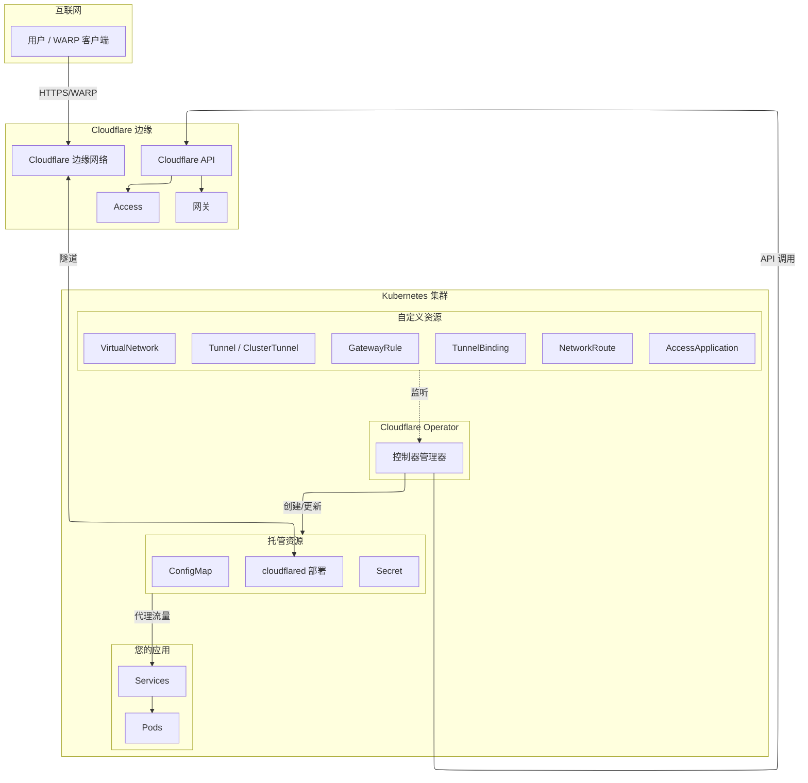

# Cloudflare Operator 文档

用于管理 Cloudflare Zero Trust 资源的 Kubernetes Operator，包括 Tunnel、Access、Gateway 和设备管理。

## 目录

- [概述](#概述)
- [架构](#架构)
- [前置条件](#前置条件)
- [安装](#安装)
- [Cloudflare API Token 配置](#cloudflare-api-token-配置)
- [快速开始](#快速开始)
- [CRD 参考](#crd-参考)
  - [隧道管理](#隧道管理)
  - [私有网络访问](#私有网络访问)
  - [访问控制](#访问控制)
  - [网关与安全](#网关与安全)
  - [设备管理](#设备管理)
  - [DNS 与连接](#dns-与连接)
- [使用示例](#使用示例)
- [故障排除](#故障排除)
- [迁移指南](#迁移指南)

---

## 概述

Cloudflare Operator 实现了 Kubernetes 原生的 Cloudflare Zero Trust 资源管理。基于 `operator-sdk` 构建，通过自定义资源定义 (CRD) 提供声明式配置。

### 功能特性

| 类别 | 功能 |
|------|------|
| **隧道管理** | 创建/管理 Cloudflare Tunnel，自动部署 cloudflared，TunnelBinding 绑定 Service |
| **私有网络访问** | 虚拟网络、网络路由、WARP 私有 IP 路由 |
| **访问控制** | Zero Trust 应用、访问组、身份提供商、服务令牌 |
| **网关与安全** | 网关规则、网关列表、DNS/HTTP/网络策略 |
| **设备管理** | Split Tunnel 配置、回退域、设备态势规则 |
| **DNS 与连接** | DNS 记录管理、WARP Connector 站点连接 |

---

## 架构



### 流量流向

1. 用户创建 CRD（Tunnel、TunnelBinding 等）
2. Operator 监听 CRD 并创建 ConfigMap、Secret 和 cloudflared Deployment
3. Operator 调用 Cloudflare API 配置隧道、DNS、Access 策略等
4. cloudflared 与 Cloudflare 边缘建立安全隧道
5. 流量流向：用户 → Cloudflare 边缘 → 隧道 → Service → Pod

---

## 前置条件

- Kubernetes 集群 v1.28+
- 已配置集群访问权限的 `kubectl`
- 启用 Zero Trust 的 Cloudflare 账户
- 具有适当权限的 Cloudflare API Token（见下文）

---

## 安装

### 方式一：kubectl（推荐）

```bash
# 安装 CRD
kubectl apply -f https://github.com/StringKe/cloudflare-operator/releases/latest/download/cloudflare-operator.crds.yaml

# 安装 operator
kubectl apply -f https://github.com/StringKe/cloudflare-operator/releases/latest/download/cloudflare-operator.yaml
```

### 方式二：指定版本

```bash
# 将 v0.15.0 替换为所需版本
VERSION=v0.15.0
kubectl apply -f https://github.com/StringKe/cloudflare-operator/releases/download/${VERSION}/cloudflare-operator.crds.yaml
kubectl apply -f https://github.com/StringKe/cloudflare-operator/releases/download/${VERSION}/cloudflare-operator.yaml
```

### 验证安装

```bash
# 检查 operator 是否运行
kubectl get pods -n cloudflare-operator-system

# 检查 CRD 是否已安装
kubectl get crds | grep cloudflare
```

---

## Cloudflare API Token 配置

### 创建 API Token

1. 访问 [Cloudflare 控制台](https://dash.cloudflare.com/profile/api-tokens)
2. 点击 **Create Token**
3. 选择 **Create Custom Token**
4. 根据所需功能配置权限

### 权限矩阵

| 功能 | 权限 | 范围 |
|------|------|------|
| **隧道管理** | `Account:Cloudflare Tunnel:Edit` | 账户 |
| **DNS 记录** | `Zone:DNS:Edit` | 区域（指定或全部） |
| **Access 应用** | `Account:Access: Apps and Policies:Edit` | 账户 |
| **Access 组** | `Account:Access: Apps and Policies:Edit` | 账户 |
| **Access 身份提供商** | `Account:Access: Apps and Policies:Edit` | 账户 |
| **Access 服务令牌** | `Account:Access: Service Tokens:Edit` | 账户 |
| **网关规则** | `Account:Zero Trust:Edit` | 账户 |
| **网关列表** | `Account:Zero Trust:Edit` | 账户 |
| **网关配置** | `Account:Zero Trust:Edit` | 账户 |
| **设备设置** | `Account:Zero Trust:Edit` | 账户 |
| **设备态势** | `Account:Zero Trust:Edit` | 账户 |
| **WARP Connector** | `Account:Cloudflare Tunnel:Edit` | 账户 |

### 推荐的 Token 配置

#### 最小权限（仅 Tunnel + DNS）

```
权限：
- Account > Cloudflare Tunnel > Edit
- Zone > DNS > Edit

账户资源：
- Include > 您的账户

区域资源：
- Include > Specific zone > example.com
```

#### 完整 Zero Trust

```
权限：
- Account > Cloudflare Tunnel > Edit
- Account > Access: Apps and Policies > Edit
- Account > Access: Service Tokens > Edit
- Account > Zero Trust > Edit
- Zone > DNS > Edit

账户资源：
- Include > 您的账户

区域资源：
- Include > All zones（或指定区域）
```

### 创建 Kubernetes Secret

```yaml
apiVersion: v1
kind: Secret
metadata:
  name: cloudflare-api-credentials
  namespace: default
type: Opaque
stringData:
  # 方式一：API Token（推荐）
  CLOUDFLARE_API_TOKEN: "your-api-token-here"

  # 方式二：API Key + Email（旧版）
  # CLOUDFLARE_API_KEY: "your-api-key-here"
  # CLOUDFLARE_EMAIL: "your-email@example.com"
```

```bash
kubectl apply -f cloudflare-secret.yaml
```

### 获取账户 ID

1. 登录 [Cloudflare 控制台](https://dash.cloudflare.com)
2. 选择任意域名
3. 在右侧边栏的 API 部分找到 **Account ID**
4. 或进入 **Account Home** > URL 中包含 Account ID

---

## 快速开始

### 1. 创建 API Secret

```yaml
apiVersion: v1
kind: Secret
metadata:
  name: cloudflare-credentials
  namespace: default
type: Opaque
stringData:
  CLOUDFLARE_API_TOKEN: "your-api-token"
```

### 2. 创建隧道

```yaml
apiVersion: networking.cloudflare-operator.io/v1alpha2
kind: Tunnel
metadata:
  name: my-tunnel
  namespace: default
spec:
  newTunnel:
    name: k8s-tunnel
  cloudflare:
    accountId: "your-account-id"
    domain: example.com
    secret: cloudflare-credentials
```

### 3. 暴露服务

```yaml
apiVersion: networking.cfargotunnel.com/v1alpha1
kind: TunnelBinding
metadata:
  name: my-app-binding
  namespace: default
subjects:
  - kind: Service
    name: my-app
    spec:
      fqdn: app.example.com
      protocol: http
      target: http://my-app.default.svc:8080
tunnelRef:
  kind: Tunnel
  name: my-tunnel
```

### 4. 验证

```bash
# 检查隧道状态
kubectl get tunnel my-tunnel

# 检查绑定状态
kubectl get tunnelbinding my-app-binding

# 检查 cloudflared 部署
kubectl get deployment -l app.kubernetes.io/name=cloudflared
```

---

## CRD 参考

### 隧道管理

#### Tunnel

命名空间级资源，用于创建和管理 Cloudflare Tunnel。

```yaml
apiVersion: networking.cloudflare-operator.io/v1alpha2
kind: Tunnel
metadata:
  name: my-tunnel
  namespace: default
spec:
  # 创建新隧道（与 existingTunnel 互斥）
  newTunnel:
    name: my-new-tunnel

  # 或使用现有隧道
  # existingTunnel:
  #   id: "tunnel-uuid"      # 隧道 ID
  #   name: "tunnel-name"    # 或隧道名称

  cloudflare:
    accountId: "account-id"           # 必填
    domain: example.com               # 必填
    secret: cloudflare-credentials    # Secret 名称
    # accountName: "My Account"       # accountId 的替代
    # email: admin@example.com        # API Key 认证用
    # CLOUDFLARE_API_TOKEN: "key"     # Secret 中的键（默认）
    # CLOUDFLARE_API_KEY: "key"       # API Key 在 Secret 中的键

  # 可选设置
  protocol: auto              # auto, quic, http2
  noTlsVerify: false          # 禁用源站 TLS 验证
  originCaPool: ca-secret     # 自定义 CA 证书的 Secret
  fallbackTarget: http_status:404  # 默认响应
  enableWarpRouting: false    # 启用 WARP 私有网络路由

  # 自定义 cloudflared 部署
  deployPatch: |
    spec:
      replicas: 3
      template:
        spec:
          nodeSelector:
            node-type: edge
```

**状态字段：**

| 字段 | 说明 |
|------|------|
| `tunnelId` | Cloudflare Tunnel ID |
| `tunnelName` | Cloudflare 中的隧道名称 |
| `accountId` | Cloudflare 账户 ID |
| `zoneId` | Cloudflare 区域 ID |

#### ClusterTunnel

集群级 Tunnel，规格与 Tunnel 相同。

```yaml
apiVersion: networking.cloudflare-operator.io/v1alpha2
kind: ClusterTunnel
metadata:
  name: shared-tunnel  # 无 namespace
spec:
  # 与 Tunnel spec 相同
```

#### TunnelBinding

将 Kubernetes Service 绑定到 Tunnel，自动配置 DNS。

```yaml
apiVersion: networking.cfargotunnel.com/v1alpha1
kind: TunnelBinding
metadata:
  name: my-binding
  namespace: default
subjects:
  - kind: Service
    name: web-service
    spec:
      fqdn: web.example.com      # 自定义域名
      protocol: https            # http, https, tcp, udp, ssh, rdp
      target: https://web-service.default.svc:443
      path: /api/.*              # 路径正则（仅 http/https）
      noTlsVerify: false         # 跳过源站 TLS 验证
      http2Origin: true          # 使用 HTTP/2 连接源站
      caPool: custom-ca          # 隧道 originCaPool 中的自定义 CA
      proxyAddress: 127.0.0.1    # 代理监听地址（tcp/ssh/rdp）
      proxyPort: 0               # 代理监听端口
      proxyType: ""              # "", "socks"
tunnelRef:
  kind: Tunnel                   # Tunnel 或 ClusterTunnel
  name: my-tunnel
  disableDNSUpdates: false       # 跳过 DNS 记录创建
```

**支持的协议：**

| 协议 | 默认端口 | 说明 |
|------|---------|------|
| `http` | 除下列外的任意端口 | 标准 HTTP |
| `https` | 443 | 带 TLS 的 HTTPS |
| `tcp` | 任意 | 原始 TCP 代理 |
| `udp` | 任意 | UDP 代理 |
| `ssh` | 22 | SSH 隧道 |
| `rdp` | 3389 | 远程桌面 |
| `smb` | 139, 445 | SMB/CIFS |

---

### 私有网络访问

#### VirtualNetwork

集群级资源，用于 Cloudflare 虚拟网络。

```yaml
apiVersion: networking.cloudflare-operator.io/v1alpha2
kind: VirtualNetwork
metadata:
  name: production-vnet
spec:
  name: production-network        # Cloudflare 中的名称（可选）
  comment: 生产环境虚拟网络
  isDefaultNetwork: false         # 设为账户默认
  cloudflare:
    accountId: "account-id"
    domain: example.com
    secret: cloudflare-credentials
```

**状态字段：**

| 字段 | 说明 |
|------|------|
| `virtualNetworkId` | Cloudflare 虚拟网络 ID |
| `accountId` | Cloudflare 账户 ID |
| `state` | 当前状态（active、deleted） |
| `isDefault` | 是否为默认网络 |

#### NetworkRoute

集群级资源，用于通过隧道路由 CIDR 范围。

```yaml
apiVersion: networking.cloudflare-operator.io/v1alpha2
kind: NetworkRoute
metadata:
  name: internal-network-route
spec:
  network: 10.0.0.0/8             # 要路由的 CIDR
  comment: 内网访问
  tunnelRef:
    kind: ClusterTunnel           # Tunnel 或 ClusterTunnel
    name: main-tunnel
    namespace: default            # 仅 Tunnel 类型需要
  virtualNetworkRef:              # 可选
    name: production-vnet
  cloudflare:
    accountId: "account-id"
    domain: example.com
    secret: cloudflare-credentials
```

**状态字段：**

| 字段 | 说明 |
|------|------|
| `network` | 配置的 CIDR |
| `tunnelId` | 关联的隧道 ID |
| `tunnelName` | 关联的隧道名称 |
| `virtualNetworkId` | 关联的虚拟网络 ID |
| `state` | 当前状态 |

---

### 访问控制

#### AccessApplication

集群级资源，用于 Cloudflare Access 应用。

```yaml
apiVersion: networking.cloudflare-operator.io/v1alpha2
kind: AccessApplication
metadata:
  name: internal-dashboard
spec:
  name: 内部仪表板
  domain: dashboard.example.com
  type: self_hosted              # self_hosted, saas, ssh, vnc, app_launcher, warp, biso, bookmark, dash_sso
  sessionDuration: 24h

  # 身份提供商配置
  allowedIdps:                   # 直接指定 IDP ID
    - "idp-uuid-1"
  allowedIdpRefs:                # 引用 AccessIdentityProvider 资源
    - name: google-workspace
  autoRedirectToIdentity: false

  # Cookie 设置
  enableBindingCookie: true
  httpOnlyCookieAttribute: true
  sameSiteCookieAttribute: lax   # strict, lax, none

  # UI 设置
  logoUrl: https://example.com/logo.png
  skipInterstitial: true
  appLauncherVisible: true

  # 拒绝访问设置
  customDenyMessage: 请联系 IT 部门获取访问权限
  customDenyUrl: https://example.com/denied

  # 高级选项
  allowAuthenticateViaWarp: true
  serviceAuth401Redirect: false
  tags:
    - production
    - internal

  # 访问策略
  policies:
    - name: employees-group      # 引用 AccessGroup
      decision: allow
      precedence: 1

  cloudflare:
    accountId: "account-id"
    domain: example.com
    secret: cloudflare-credentials
```

**应用类型：**

| 类型 | 说明 |
|------|------|
| `self_hosted` | 自托管 Web 应用 |
| `saas` | SaaS 应用 |
| `ssh` | SSH 访问 |
| `vnc` | VNC 远程访问 |
| `app_launcher` | 应用启动器门户 |
| `warp` | WARP 客户端访问 |
| `biso` | 浏览器隔离 |
| `bookmark` | 书签（无代理） |
| `dash_sso` | Cloudflare 控制台 SSO |

#### AccessGroup

集群级资源，用于可复用的访问组。

```yaml
apiVersion: networking.cloudflare-operator.io/v1alpha2
kind: AccessGroup
metadata:
  name: engineering-team
spec:
  name: 工程团队

  # 用户必须匹配至少一个 include 规则
  include:
    - emailDomain:
        domain: company.com
    - email:
        email: contractor@external.com
    - github:
        name: company-org
        identityProviderId: "github-idp-id"
        teams:
          - engineering
          - devops

  # 匹配 exclude 的用户会被拒绝，即使匹配了 include
  exclude:
    - email:
        email: suspended@company.com
    - country:
        country:
          - CN
          - RU

  # 用户还必须匹配所有 require 规则
  require:
    - devicePosture:
        integrationUid: "posture-rule-id"
    - certificate: true

  cloudflare:
    accountId: "account-id"
    domain: example.com
    secret: cloudflare-credentials
```

**规则类型：**

| 规则 | 说明 |
|------|------|
| `email` | 匹配特定邮箱 |
| `emailDomain` | 匹配邮箱域名 |
| `everyone` | 匹配所有用户 |
| `ipRanges` | 匹配 IP 范围 |
| `country` | 匹配国家代码 |
| `group` | 匹配 IdP 组 |
| `serviceToken` | 匹配服务令牌 |
| `anyValidServiceToken` | 任意有效服务令牌 |
| `certificate` | 有效 mTLS 证书 |
| `commonName` | 证书通用名称 |
| `devicePosture` | 设备态势检查 |
| `gsuite` | Google Workspace |
| `github` | GitHub 组织/团队 |
| `azure` | Azure AD 组 |
| `oidc` | OIDC 声明 |
| `saml` | SAML 属性 |
| `externalEvaluation` | 外部评估端点 |

#### AccessIdentityProvider

集群级资源，用于身份提供商配置。

```yaml
apiVersion: networking.cloudflare-operator.io/v1alpha2
kind: AccessIdentityProvider
metadata:
  name: google-workspace
spec:
  name: Google Workspace
  type: google                   # 见下方类型

  # 类型特定配置
  config:
    clientId: "google-client-id"
    clientSecretRef:
      name: google-oauth-secret
      key: client-secret
    # 根据类型的其他字段

  cloudflare:
    accountId: "account-id"
    domain: example.com
    secret: cloudflare-credentials
```

**身份提供商类型：**

| 类型 | 说明 |
|------|------|
| `google` | Google |
| `google-apps` | Google Workspace |
| `azure` | Azure AD |
| `github` | GitHub |
| `gitlab` | GitLab |
| `okta` | Okta |
| `onelogin` | OneLogin |
| `saml` | 通用 SAML |
| `oidc` | 通用 OIDC |
| `onetimepin` | 一次性 PIN |

#### AccessServiceToken

命名空间级资源，用于机器对机器认证。

```yaml
apiVersion: networking.cloudflare-operator.io/v1alpha2
kind: AccessServiceToken
metadata:
  name: ci-cd-token
  namespace: default
spec:
  name: CI/CD 流水线令牌
  duration: 8760h               # 令牌有效期（1年）

  cloudflare:
    accountId: "account-id"
    domain: example.com
    secret: cloudflare-credentials
```

---

### 网关与安全

#### GatewayRule

集群级资源，用于网关 DNS、HTTP 和网络策略。

```yaml
apiVersion: networking.cloudflare-operator.io/v1alpha2
kind: GatewayRule
metadata:
  name: block-malware
spec:
  name: 阻止恶意软件域名
  description: 阻止已知的恶意软件和钓鱼域名
  precedence: 100               # 值越小优先级越高
  enabled: true

  action: block                 # allow, block, log, isolate, l4_override, egress, resolve, quarantine

  # 流量过滤器（wirefilter 语法）
  traffic: 'dns.security_category in {80 83 84 85 86}'

  # 身份过滤器
  identity: 'identity.groups.name[*] in {"Engineering"}'

  # 设备态势过滤器
  devicePosture: 'device_posture.checks.passed[*] == true'

  # 过滤器类型
  filters:
    - dns
    - http
    - l4

  # 动作特定设置
  ruleSettings:
    blockPageEnabled: true
    blockReason: 由于安全原因，此站点已被阻止

    # DNS 覆盖
    overrideIps:
      - 192.0.2.1
    overrideHost: safe.example.com

    # L4 覆盖
    l4Override:
      ip: 192.0.2.1
      port: 443

    # 浏览器隔离控制
    bisoAdminControls:
      disablePrinting: true
      disableCopyPaste: true
      disableDownload: true
      disableUpload: false
      disableKeyboard: false

    # 会话检查
    checkSession:
      enforce: true
      duration: 30m

    # 添加请求头
    addHeaders:
      X-Custom-Header: value

    # 出口设置
    egress:
      ipv4: 203.0.113.1
      ipv6: 2001:db8::1

    # 通知
    notificationSettings:
      enabled: true
      message: 策略已阻止访问
      supportUrl: https://support.example.com

  cloudflare:
    accountId: "account-id"
    domain: example.com
    secret: cloudflare-credentials
```

**网关规则动作：**

| 动作 | 说明 |
|------|------|
| `allow` | 允许请求 |
| `block` | 阻止请求 |
| `log` | 记录请求 |
| `isolate` | 浏览器隔离 |
| `l4_override` | 覆盖 L4 目标 |
| `egress` | 自定义出口 IP |
| `resolve` | DNS 解析 |
| `quarantine` | 隔离文件下载 |

#### GatewayList

集群级资源，用于网关规则中使用的列表。

```yaml
apiVersion: networking.cloudflare-operator.io/v1alpha2
kind: GatewayList
metadata:
  name: blocked-domains
spec:
  name: 阻止的域名
  type: DOMAIN                   # DOMAIN, EMAIL, URL, IP, SERIAL
  description: 阻止的域名列表

  items:
    - value: malware.example.com
      description: 已知恶意软件域名
    - value: phishing.example.com
      description: 钓鱼站点

  cloudflare:
    accountId: "account-id"
    domain: example.com
    secret: cloudflare-credentials
```

---

### 设备管理

#### DeviceSettingsPolicy

集群级资源，用于 WARP 客户端配置。

```yaml
apiVersion: networking.cloudflare-operator.io/v1alpha2
kind: DeviceSettingsPolicy
metadata:
  name: default-device-policy
spec:
  # Split tunnel 模式：exclude（默认）或 include
  splitTunnelMode: exclude

  # 从隧道排除的地址（mode=exclude 时）
  splitTunnelExclude:
    - address: 10.0.0.0/8
      description: 内部网络
    - address: 192.168.0.0/16
      description: 本地网络
    - host: printer.local
      description: 本地打印机

  # 包含在隧道中的地址（mode=include 时）
  # splitTunnelInclude:
  #   - address: 10.10.0.0/16
  #     description: 企业网络

  # 回退域（使用自定义 DNS 服务器）
  fallbackDomains:
    - suffix: internal.company.com
      description: 内部域名
      dnsServer:
        - 10.0.0.53
        - 10.0.1.53

  # 从 NetworkRoute 资源自动填充
  autoPopulateFromRoutes:
    enabled: true
    labelSelector:
      matchLabels:
        auto-populate: "true"
    descriptionPrefix: "自动: "

  cloudflare:
    accountId: "account-id"
    domain: example.com
    secret: cloudflare-credentials
```

#### DevicePostureRule

命名空间级资源，用于设备态势检查。

```yaml
apiVersion: networking.cloudflare-operator.io/v1alpha2
kind: DevicePostureRule
metadata:
  name: require-disk-encryption
  namespace: default
spec:
  name: 要求磁盘加密
  type: disk_encryption         # 见下方类型
  description: 确保设备启用磁盘加密

  # 类型特定配置
  match:
    platform: mac

  input:
    requireAll: true

  cloudflare:
    accountId: "account-id"
    domain: example.com
    secret: cloudflare-credentials
```

**设备态势规则类型：**

| 类型 | 说明 |
|------|------|
| `file` | 文件存在 |
| `application` | 应用已安装 |
| `serial_number` | 设备序列号 |
| `os_version` | 操作系统版本 |
| `domain_joined` | 域成员身份 |
| `disk_encryption` | 磁盘加密已启用 |
| `firewall` | 防火墙已启用 |
| `workspace_one` | VMware Workspace ONE |
| `crowdstrike_s2s` | CrowdStrike |
| `sentinelone` | SentinelOne |
| `tanium` | Tanium |
| `intune` | Microsoft Intune |
| `kolide` | Kolide |

---

### DNS 与连接

#### DNSRecord

命名空间级资源，用于 Cloudflare DNS 记录。

```yaml
apiVersion: networking.cloudflare-operator.io/v1alpha2
kind: DNSRecord
metadata:
  name: www-record
  namespace: default
spec:
  name: www                      # 记录名称（或 FQDN）
  type: A                        # A, AAAA, CNAME, TXT, MX 等
  content: 203.0.113.1           # 记录值
  ttl: 3600                      # TTL 秒数（1 = 自动）
  proxied: true                  # 启用 Cloudflare 代理
  priority: 10                   # MX/SRV 记录用
  comment: Web 服务器记录
  tags:
    - production

  # 复杂记录类型（SRV、CAA 等）
  # data:
  #   service: _http
  #   proto: _tcp
  #   weight: 10
  #   port: 80
  #   target: server.example.com

  cloudflare:
    # DNS 不需要 accountId
    domain: example.com
    secret: cloudflare-credentials
```

**支持的 DNS 记录类型：**

| 类型 | 说明 | 可代理 |
|------|------|--------|
| `A` | IPv4 地址 | 是 |
| `AAAA` | IPv6 地址 | 是 |
| `CNAME` | 规范名称 | 是 |
| `TXT` | 文本记录 | 否 |
| `MX` | 邮件交换 | 否 |
| `NS` | 名称服务器 | 否 |
| `SRV` | 服务记录 | 否 |
| `CAA` | 证书颁发机构 | 否 |

#### WARPConnector

命名空间级资源，用于 WARP Connector 部署。

```yaml
apiVersion: networking.cloudflare-operator.io/v1alpha2
kind: WARPConnector
metadata:
  name: site-connector
  namespace: default
spec:
  name: 站点 A 连接器
  replicas: 2
  image: cloudflare/cloudflared:latest

  virtualNetworkRef:
    name: production-vnet

  routes:
    - network: 10.1.0.0/16
      comment: 站点 A 网络
    - network: 10.2.0.0/16
      comment: 站点 A 备用网络

  resources:
    requests:
      cpu: 100m
      memory: 128Mi
    limits:
      cpu: 500m
      memory: 512Mi

  nodeSelector:
    node-type: edge

  tolerations:
    - key: edge-node
      operator: Exists
      effect: NoSchedule

  serviceAccountName: warp-connector-sa

  cloudflare:
    accountId: "account-id"
    domain: example.com
    secret: cloudflare-credentials
```

---

## 使用示例

### 示例 1：暴露 Web 应用

```yaml
---
apiVersion: v1
kind: Secret
metadata:
  name: cf-credentials
type: Opaque
stringData:
  CLOUDFLARE_API_TOKEN: "your-token"
---
apiVersion: networking.cloudflare-operator.io/v1alpha2
kind: Tunnel
metadata:
  name: web-tunnel
spec:
  newTunnel:
    name: web-tunnel
  cloudflare:
    accountId: "account-id"
    domain: example.com
    secret: cf-credentials
---
apiVersion: networking.cfargotunnel.com/v1alpha1
kind: TunnelBinding
metadata:
  name: web-binding
subjects:
  - name: nginx
    spec:
      fqdn: www.example.com
      protocol: http
tunnelRef:
  kind: Tunnel
  name: web-tunnel
```

### 示例 2：私有网络访问

```yaml
---
apiVersion: networking.cloudflare-operator.io/v1alpha2
kind: ClusterTunnel
metadata:
  name: private-tunnel
spec:
  newTunnel:
    name: private-network-tunnel
  enableWarpRouting: true
  cloudflare:
    accountId: "account-id"
    domain: example.com
    secret: cf-credentials
---
apiVersion: networking.cloudflare-operator.io/v1alpha2
kind: VirtualNetwork
metadata:
  name: corp-vnet
spec:
  name: 企业网络
  isDefaultNetwork: true
  cloudflare:
    accountId: "account-id"
    domain: example.com
    secret: cf-credentials
---
apiVersion: networking.cloudflare-operator.io/v1alpha2
kind: NetworkRoute
metadata:
  name: k8s-pods-route
spec:
  network: 10.244.0.0/16
  comment: Kubernetes Pod 网络
  tunnelRef:
    kind: ClusterTunnel
    name: private-tunnel
  virtualNetworkRef:
    name: corp-vnet
  cloudflare:
    accountId: "account-id"
    domain: example.com
    secret: cf-credentials
```

### 示例 3：Zero Trust 应用

```yaml
---
apiVersion: networking.cloudflare-operator.io/v1alpha2
kind: AccessGroup
metadata:
  name: employees
spec:
  name: 全体员工
  include:
    - emailDomain:
        domain: company.com
  cloudflare:
    accountId: "account-id"
    domain: example.com
    secret: cf-credentials
---
apiVersion: networking.cloudflare-operator.io/v1alpha2
kind: AccessApplication
metadata:
  name: internal-app
spec:
  name: 内部仪表板
  domain: internal.example.com
  type: self_hosted
  sessionDuration: 12h
  policies:
    - name: employees
      decision: allow
      precedence: 1
  cloudflare:
    accountId: "account-id"
    domain: example.com
    secret: cf-credentials
```

---

## 故障排除

### 常见问题

#### 1. 隧道无法连接

```bash
# 检查隧道状态
kubectl get tunnel -A

# 检查 cloudflared 日志
kubectl logs -l app.kubernetes.io/name=cloudflared -n <namespace>

# 验证 secret 存在
kubectl get secret <secret-name> -o yaml
```

**常见原因：**
- API token 无效
- Account ID 错误
- 网络连接问题

#### 2. DNS 记录未创建

```bash
# 检查 TunnelBinding 状态
kubectl get tunnelbinding -A -o wide

# 检查 operator 日志
kubectl logs -n cloudflare-operator-system deployment/cloudflare-operator-controller-manager
```

**常见原因：**
- Token 缺少 DNS:Edit 权限
- cloudflare spec 中域名错误
- 找不到区域

#### 3. Access 应用不工作

```bash
# 检查 AccessApplication 状态
kubectl get accessapp -o wide

# 查看事件详情
kubectl describe accessapp <name>
```

**常见原因：**
- 缺少 Access: Apps and Policies 权限
- 身份提供商配置无效

### 调试模式

通过修补 operator deployment 启用调试日志：

```bash
kubectl patch deployment cloudflare-operator-controller-manager \
  -n cloudflare-operator-system \
  --type='json' \
  -p='[{"op": "add", "path": "/spec/template/spec/containers/0/args/-", "value": "--zap-log-level=debug"}]'
```

### 检查资源状态

所有资源都有 `.status.conditions` 字段，包含详细状态：

```bash
kubectl get <resource> <name> -o jsonpath='{.status.conditions}' | jq
```

---

## 迁移指南

### 从 v1alpha1 迁移到 v1alpha2

API Group 从 `networking.cfargotunnel.com` 变更为 `networking.cloudflare-operator.io`。

#### TunnelBinding

TunnelBinding 仍在 `networking.cfargotunnel.com` 下使用 `v1alpha1`：

```yaml
# 仍使用旧 API group
apiVersion: networking.cfargotunnel.com/v1alpha1
kind: TunnelBinding
```

#### Tunnel 和 ClusterTunnel

更新了 API group：

```yaml
# 旧版 (v1alpha1)
apiVersion: networking.cfargotunnel.com/v1alpha1
kind: Tunnel

# 新版 (v1alpha2)
apiVersion: networking.cloudflare-operator.io/v1alpha2
kind: Tunnel
```

#### 迁移步骤

1. 备份现有资源：
   ```bash
   kubectl get tunnels -A -o yaml > tunnels-backup.yaml
   kubectl get clustertunnels -o yaml > clustertunnels-backup.yaml
   ```

2. 安装新 CRD：
   ```bash
   kubectl apply -f https://github.com/StringKe/cloudflare-operator/releases/latest/download/cloudflare-operator.crds.yaml
   ```

3. 更新 operator：
   ```bash
   kubectl apply -f https://github.com/StringKe/cloudflare-operator/releases/latest/download/cloudflare-operator.yaml
   ```

4. 将资源清单更新为使用新 API group

5. 应用更新后的资源

---

## 支持

- **问题反馈**：[GitHub Issues](https://github.com/StringKe/cloudflare-operator/issues)
- **讨论**：[GitHub Discussions](https://github.com/StringKe/cloudflare-operator/discussions)

---

## 许可证

Apache License 2.0 - 详见 [LICENSE](../LICENSE)。

> **注意**：这不是 Cloudflare 官方产品。它使用 [Cloudflare API](https://api.cloudflare.com/) 和 [cloudflared](https://github.com/cloudflare/cloudflared) 在 Kubernetes 上自动化 Zero Trust 配置。
