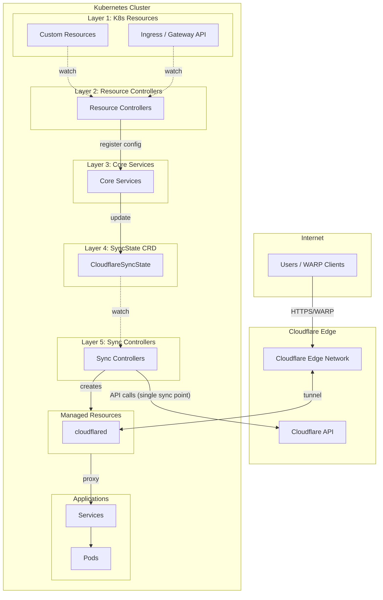

# Cloudflare Operator Documentation

Welcome to the Cloudflare Zero Trust Operator documentation. This operator enables Kubernetes-native management of Cloudflare Zero Trust resources.

## Quick Navigation

| Topic | Description |
|-------|-------------|
| [Getting Started](getting-started.md) | Installation and first tunnel |
| [Configuration](configuration.md) | API tokens and credentials |
| [Namespace Restrictions](namespace-restrictions.md) | CRD scope and Secret management |
| [API Reference](api-reference/) | Complete CRD documentation |
| [Guides](guides/) | How-to guides for common tasks |
| [Troubleshooting](troubleshooting.md) | Common issues and solutions |
| [Migration](migration.md) | Upgrading from v1alpha1 |

## Overview

The Cloudflare Operator provides Kubernetes-native management of:

- **Tunnels** - Secure connections from your cluster to Cloudflare's edge
- **Private Network Access** - Enable WARP clients to access internal services
- **Access Control** - Zero Trust authentication for applications
- **Gateway** - DNS/HTTP/L4 security policies
- **Device Management** - WARP client configuration and posture rules
- **Kubernetes Integration** - Native Ingress and Gateway API support

## Architecture

The operator uses a **Unified Sync Architecture** with six layers:

```
K8s Resources → Resource Controllers → Core Services → SyncState CRD → Sync Controllers → Cloudflare API
```



### Key Benefits

| Feature | Description |
|---------|-------------|
| **Single Sync Point** | Only Sync Controllers call Cloudflare API |
| **Race Condition Free** | SyncState CRD uses K8s optimistic locking |
| **Debouncing** | 500ms delay aggregates multiple changes |
| **Hash Detection** | Skip sync when config unchanged |

> See [Unified Sync Architecture](../design/UNIFIED_SYNC_ARCHITECTURE.md) for details.

## CRD Summary (30 Total)

### Credentials & Configuration

| CRD | Scope | Description |
|-----|-------|-------------|
| `CloudflareCredentials` | Cluster | Shared API credential configuration |
| `CloudflareDomain` | Cluster | Zone settings (SSL/TLS, Cache, Security, WAF) |

### Tunnel Management

| CRD | Scope | Description |
|-----|-------|-------------|
| `Tunnel` | Namespaced | Cloudflare Tunnel with managed cloudflared |
| `ClusterTunnel` | Cluster | Cluster-wide Cloudflare Tunnel |
| `TunnelBinding` | Namespaced | Bind Services to Tunnels with DNS |

### Private Network

| CRD | Scope | Description |
|-----|-------|-------------|
| `VirtualNetwork` | Cluster | Traffic isolation network |
| `NetworkRoute` | Cluster | Route CIDR through tunnel |
| `PrivateService` | Namespaced | Expose Service via private IP |
| `WARPConnector` | Namespaced | WARP connector for site-to-site |

### Access Control

| CRD | Scope | Description |
|-----|-------|-------------|
| `AccessApplication` | Namespaced | Zero Trust application |
| `AccessGroup` | Cluster | Reusable access policy group |
| `AccessIdentityProvider` | Cluster | Identity provider configuration |
| `AccessServiceToken` | Namespaced | M2M authentication token |
| `AccessTunnel` | Namespaced | Access-protected tunnel endpoint |

### Gateway & Security

| CRD | Scope | Description |
|-----|-------|-------------|
| `GatewayRule` | Cluster | DNS/HTTP/L4 policy rule |
| `GatewayList` | Cluster | List for gateway rules |
| `GatewayConfiguration` | Cluster | Global gateway settings |

### Device Management

| CRD | Scope | Description |
|-----|-------|-------------|
| `DeviceSettingsPolicy` | Cluster | WARP client configuration |
| `DevicePostureRule` | Cluster | Device health check rule |

### DNS & Connectivity

| CRD | Scope | Description |
|-----|-------|-------------|
| `DNSRecord` | Namespaced | DNS record management |

### SSL/TLS & Certificates

| CRD | Scope | Description |
|-----|-------|-------------|
| `OriginCACertificate` | Namespaced | Cloudflare Origin CA certificate with auto K8s Secret |

### R2 Storage

| CRD | Scope | Description |
|-----|-------|-------------|
| `R2Bucket` | Namespaced | R2 storage bucket with lifecycle rules |
| `R2BucketDomain` | Namespaced | Custom domain for R2 bucket |
| `R2BucketNotification` | Namespaced | Event notifications for R2 bucket |

### Rules Engine

| CRD | Scope | Description |
|-----|-------|-------------|
| `ZoneRuleset` | Namespaced | Zone ruleset (WAF, rate limiting, etc.) |
| `TransformRule` | Namespaced | URL rewrite & header modification |
| `RedirectRule` | Namespaced | URL redirect rules |

### Registrar (Enterprise)

| CRD | Scope | Description |
|-----|-------|-------------|
| `DomainRegistration` | Cluster | Domain registration settings |

### Kubernetes Integration

| CRD | Scope | Description |
|-----|-------|-------------|
| `TunnelIngressClassConfig` | Cluster | Configuration for Ingress integration |
| `TunnelGatewayClassConfig` | Cluster | Configuration for Gateway API integration |

> **Note**: The operator also supports native Kubernetes `Ingress` and Gateway API (`Gateway`, `HTTPRoute`, `TCPRoute`, `UDPRoute`) resources when configured with the appropriate IngressClass or GatewayClass.

## Namespace and Secret Rules

The operator uses different Secret lookup rules based on CRD scope:

| Resource Scope | Secret Location |
|----------------|-----------------|
| Namespaced | Same namespace as the resource |
| Cluster | Operator namespace (`cloudflare-operator-system`) |

See [Namespace Restrictions](namespace-restrictions.md) for detailed information.

## Getting Help

- **Examples**: See [/examples](../../examples/) for practical usage
- **Issues**: [GitHub Issues](https://github.com/StringKe/cloudflare-operator/issues)
- **Discussions**: [GitHub Discussions](https://github.com/StringKe/cloudflare-operator/discussions)

## Version Information

- Current Version: v0.21.x (Alpha)
- API Version: `networking.cloudflare-operator.io/v1alpha2`
- Kubernetes: v1.28+
- Go: 1.24+

## Recent Changes (v0.18.0 → v0.21.0)

### v0.21.0 - Type Safety Improvements
- Replaced all `interface{}`/`any` types with precise typed structs
- 30+ typed structs for Access rules, Gateway settings, DNS record data
- 200+ new unit tests for type conversion functions

### v0.20.0 - New CRDs
- **R2 Storage**: R2Bucket, R2BucketDomain, R2BucketNotification
- **Rules Engine**: ZoneRuleset, TransformRule, RedirectRule
- **SSL/TLS**: OriginCACertificate (with auto K8s Secret)
- **Registrar**: DomainRegistration (Enterprise)
- OpenSSF Scorecard security compliance improvements

### v0.19.0 - Multi-Zone Support
- **CloudflareDomain** CRD for zone settings (SSL/TLS, Cache, Security, WAF)
- Multi-zone DNS support for DNSRecord resources

### v0.18.0 - Kubernetes Integration
- Native Kubernetes Ingress controller support
- Gateway API support (Gateway, HTTPRoute, TCPRoute, UDPRoute)
- TunnelIngressClassConfig and TunnelGatewayClassConfig CRDs
