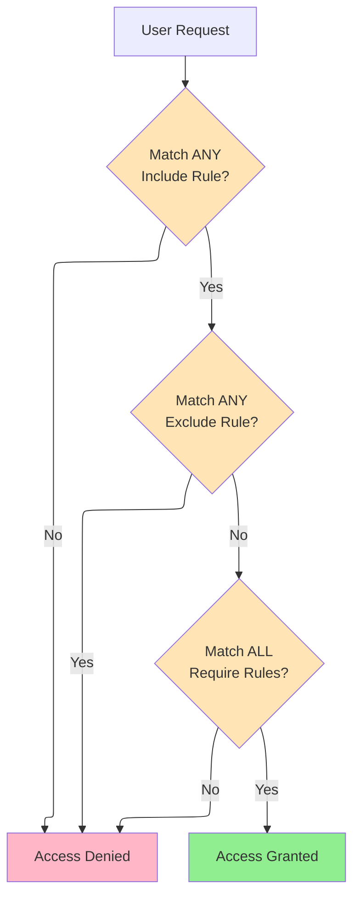
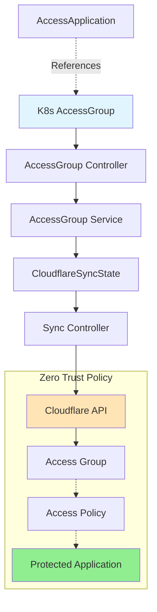

# AccessGroup

AccessGroup is a cluster-scoped resource that defines reusable access control rules in Cloudflare Zero Trust. Access Groups use include/exclude/require logic to determine user eligibility for applications and policies.

## Overview

AccessGroup provides a centralized way to define who can access your applications. Groups can be referenced by multiple AccessApplication resources, enabling consistent and maintainable access control across your infrastructure.

### Access Control Logic



### Use Cases

| Scenario | AccessGroup Configuration |
|----------|--------------------------|
| **Department Access** | Include: `emailDomain: company.com`, Exclude: contractors |
| **Geographic Restriction** | Include: employees, Require: `country: ["US", "CA"]` |
| **MFA Enforcement** | Include: employees, Require: `authMethod: mfa` |
| **Service-to-Service** | Include: `anyValidServiceToken: true` |

## Spec

| Field | Type | Required | Default | Description |
|-------|------|----------|---------|-------------|
| `name` | string | No | K8s resource name | Access Group name in Cloudflare |
| `include` | []AccessGroupRule | **Yes** | - | Rules for inclusion (OR logic) |
| `exclude` | []AccessGroupRule | No | - | Rules for exclusion (NOT logic) |
| `require` | []AccessGroupRule | No | - | Rules that must all match (AND logic) |
| `isDefault` | bool | No | `false` | Mark as default group |
| `cloudflare` | CloudflareDetails | **Yes** | - | Cloudflare API credentials |

### AccessGroupRule Types

AccessGroupRule supports the following rule types. Each rule type has its own configuration:

| Rule Type | Description | Example |
|-----------|-------------|---------|
| `email` | Match specific email | `email: { email: "admin@example.com" }` |
| `emailDomain` | Match email domain | `emailDomain: { domain: "example.com" }` |
| `emailList` | Match predefined email list | `emailList: { id: "list-uuid" }` |
| `everyone` | Match all users | `everyone: true` |
| `ipRanges` | Match IP ranges | `ipRanges: { ip: ["10.0.0.0/8"] }` |
| `ipList` | Match predefined IP list | `ipList: { id: "list-uuid" }` |
| `country` | Match country codes | `country: { country: ["US", "CA"] }` |
| `group` | Match IdP group | `group: { id: "group-id" }` |
| `serviceToken` | Match specific service token | `serviceToken: { tokenId: "token-id" }` |
| `anyValidServiceToken` | Match any valid service token | `anyValidServiceToken: true` |
| `certificate` | Match client certificate | `certificate: true` |
| `commonName` | Match certificate CN | `commonName: { commonName: "*.example.com" }` |
| `devicePosture` | Match device posture check | `devicePosture: { integrationUid: "uid" }` |
| `gsuite` | Match Google Workspace | `gsuite: { email: "user@example.com", identityProviderId: "id" }` |
| `github` | Match GitHub org/team | `github: { name: "org-name", identityProviderId: "id" }` |
| `azure` | Match Azure AD group | `azure: { id: "group-id", identityProviderId: "id" }` |
| `okta` | Match Okta group | `okta: { name: "group-name", identityProviderId: "id" }` |
| `oidc` | Match OIDC claim | `oidc: { claimName: "role", claimValue: "admin", identityProviderId: "id" }` |
| `saml` | Match SAML attribute | `saml: { attributeName: "role", attributeValue: "admin", identityProviderId: "id" }` |
| `authMethod` | Match auth method (MFA) | `authMethod: { authMethod: "mfa" }` |
| `authContext` | Match Azure auth context | `authContext: { id: "ctx-id", acId: "ac-id", identityProviderId: "id" }` |
| `loginMethod` | Match IdP | `loginMethod: { id: "idp-id" }` |
| `externalEvaluation` | External API evaluation | `externalEvaluation: { evaluateUrl: "https://...", keysUrl: "https://..." }` |

## Status

| Field | Type | Description |
|-------|------|-------------|
| `groupId` | string | Cloudflare Access Group ID |
| `accountId` | string | Cloudflare Account ID |
| `state` | string | Current state (pending, Ready, Error) |
| `conditions` | []Condition | Standard Kubernetes conditions |
| `observedGeneration` | int64 | Last observed generation |

## Examples

### Basic Employee Group

```yaml
apiVersion: networking.cloudflare-operator.io/v1alpha2
kind: AccessGroup
metadata:
  name: employees
spec:
  name: Company Employees
  include:
    - emailDomain:
        domain: "example.com"

  cloudflare:
    accountId: "<account-id>"
    domain: example.com
    secret: cloudflare-credentials
```

### Department with Geographic Restriction

```yaml
apiVersion: networking.cloudflare-operator.io/v1alpha2
kind: AccessGroup
metadata:
  name: engineering-us
spec:
  name: Engineering Team - US Only
  include:
    - emailDomain:
        domain: "example.com"
  require:
    - country:
        country: ["US"]

  cloudflare:
    accountId: "<account-id>"
    domain: example.com
    secret: cloudflare-credentials
```

### Exclude Contractors

```yaml
apiVersion: networking.cloudflare-operator.io/v1alpha2
kind: AccessGroup
metadata:
  name: full-time-employees
spec:
  name: Full-Time Employees Only
  include:
    - emailDomain:
        domain: "example.com"
  exclude:
    - emailDomain:
        domain: "contractor.example.com"
    - email:
        email: "temp-worker@example.com"

  cloudflare:
    accountId: "<account-id>"
    domain: example.com
    secret: cloudflare-credentials
```

### MFA Required Group

```yaml
apiVersion: networking.cloudflare-operator.io/v1alpha2
kind: AccessGroup
metadata:
  name: admin-with-mfa
spec:
  name: Admins with MFA
  include:
    - emailDomain:
        domain: "example.com"
  require:
    - authMethod:
        authMethod: "mfa"

  cloudflare:
    accountId: "<account-id>"
    domain: example.com
    secret: cloudflare-credentials
```

### Service Token Group (Machine-to-Machine)

```yaml
apiVersion: networking.cloudflare-operator.io/v1alpha2
kind: AccessGroup
metadata:
  name: api-services
spec:
  name: API Service Tokens
  include:
    - anyValidServiceToken: true

  cloudflare:
    accountId: "<account-id>"
    domain: example.com
    secret: cloudflare-credentials
```

### Multiple Conditions (Advanced)

```yaml
apiVersion: networking.cloudflare-operator.io/v1alpha2
kind: AccessGroup
metadata:
  name: secure-admin
spec:
  name: Secure Admin Access
  include:
    # Include specific admin emails
    - email:
        email: "admin@example.com"
    - email:
        email: "security@example.com"
  exclude:
    # Exclude if from certain countries
    - country:
        country: ["CN", "RU"]
  require:
    # Must have MFA
    - authMethod:
        authMethod: "mfa"
    # AND must be from corporate network
    - ipRanges:
        ip: ["10.0.0.0/8", "192.168.0.0/16"]

  cloudflare:
    accountId: "<account-id>"
    domain: example.com
    secret: cloudflare-credentials
```

### GitHub Organization Members

```yaml
apiVersion: networking.cloudflare-operator.io/v1alpha2
kind: AccessGroup
metadata:
  name: github-org-members
spec:
  name: GitHub Organization Members
  include:
    - github:
        name: "my-org"
        identityProviderId: "<github-idp-id>"
        teams:
          - "engineering"
          - "platform"

  cloudflare:
    accountId: "<account-id>"
    domain: example.com
    secret: cloudflare-credentials
```

### Okta Group with Device Posture

```yaml
apiVersion: networking.cloudflare-operator.io/v1alpha2
kind: AccessGroup
metadata:
  name: okta-secure
spec:
  name: Okta Users with Secure Device
  include:
    - okta:
        name: "Engineering"
        identityProviderId: "<okta-idp-id>"
  require:
    - devicePosture:
        integrationUid: "<posture-check-uid>"

  cloudflare:
    accountId: "<account-id>"
    domain: example.com
    secret: cloudflare-credentials
```

## Access Group Flow Diagram



## Related Resources

- [AccessApplication](accessapplication.md) - Reference AccessGroup in policies
- [AccessPolicy](accesspolicy.md) - Create reusable policies with groups
- [AccessIdentityProvider](accessidentityprovider.md) - Configure identity providers for rules

## See Also

- [Examples](../../../examples/03-zero-trust/access-group/)
- [Cloudflare Access Groups Documentation](https://developers.cloudflare.com/cloudflare-one/policies/access/groups/)
