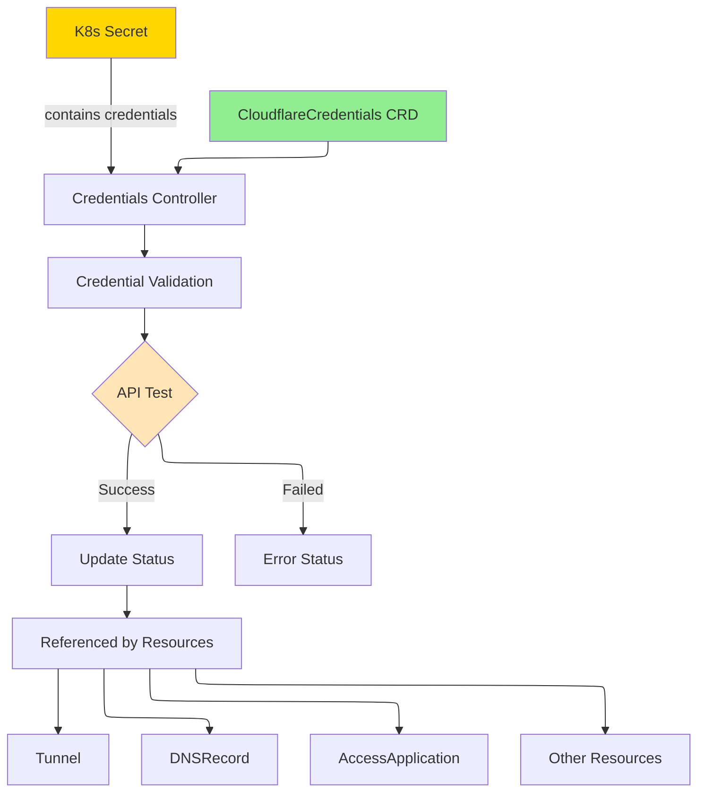

# CloudflareCredentials

CloudflareCredentials is a cluster-scoped resource that securely manages Cloudflare API credentials and configuration for the operator.

## Overview

CloudflareCredentials allows you to securely store and reference Cloudflare API authentication details that can be used by other resources in the operator. Instead of embedding credentials in every resource, you can define them once and reference them across your cluster. This resource supports multiple authentication methods and handles credential validation.

The operator validates credentials when they are created or updated, ensuring that they are working correctly before allowing other resources to use them.

### Key Features

| Feature | Description |
|---------|-------------|
| **Centralized Management** | Define credentials once and reference them from other resources |
| **Multiple Auth Methods** | Support both API Token and Global API Key authentication |
| **Credential Validation** | Automatic validation of credentials against Cloudflare API |
| **Default Credentials** | Mark credentials as default for resources without explicit references |
| **Multi-Secret Support** | Custom key names in secrets for flexible credential storage |
| **Audit Trail** | Track validation status and last validation time |

### Use Cases

- **Credential Management**: Centralize Cloudflare API credentials across multiple resources
- **Multi-Account Setup**: Manage credentials for multiple Cloudflare accounts
- **Access Control**: Control which services can use specific credentials via RBAC
- **Credential Rotation**: Update credentials in one place for all dependent resources
- **Development Environments**: Use different credentials for dev/staging/prod

## Architecture



## Spec

### Main Fields

| Field | Type | Required | Default | Description |
|-------|------|----------|---------|-------------|
| `accountId` | string | **Yes** | - | Cloudflare Account ID |
| `accountName` | string | No | - | Human-readable account name for reference |
| `authType` | string | **Yes** | `apiToken` | Authentication method: `apiToken` or `globalAPIKey` |
| `secretRef` | *SecretReference | **Yes** | - | Reference to Kubernetes Secret containing credentials |
| `defaultDomain` | string | No | - | Default domain for resources using these credentials |
| `isDefault` | bool | No | `false` | Mark as default credentials for resources without explicit reference |

### SecretReference

| Field | Type | Required | Default | Description |
|-------|------|----------|---------|-------------|
| `name` | string | **Yes** | - | Name of the Kubernetes Secret |
| `namespace` | string | No | `cloudflare-operator-system` | Namespace of the Secret |
| `apiTokenKey` | string | No | `CLOUDFLARE_API_TOKEN` | Key name in Secret for API Token |
| `apiKeyKey` | string | No | `CLOUDFLARE_API_KEY` | Key name in Secret for API Key (Global) |
| `emailKey` | string | No | `CLOUDFLARE_EMAIL` | Key name in Secret for Email (Global) |

### Authentication Methods

**API Token (Recommended)**:
```yaml
authType: apiToken
secretRef:
  name: my-credentials
  apiTokenKey: CLOUDFLARE_API_TOKEN
```
The Secret must contain the API token under the specified key.

**Global API Key**:
```yaml
authType: globalAPIKey
secretRef:
  name: my-credentials
  apiKeyKey: CLOUDFLARE_API_KEY
  emailKey: CLOUDFLARE_EMAIL
```
The Secret must contain both the API key and associated email.

## Status

| Field | Type | Description |
|-------|------|-------------|
| `conditions` | []metav1.Condition | Latest observations of resource state |
| `observedGeneration` | int64 | Last generation observed by controller |
| `state` | string | Current state: `pending`, `validated`, `invalid`, `error` |
| `validated` | bool | Whether credentials have been successfully validated |
| `lastValidatedTime` | *metav1.Time | Last successful validation time |
| `accountName` | string | Account name retrieved from Cloudflare API |

### Condition Types

| Type | Reason | Description |
|------|--------|-------------|
| `Ready` | `Validated` | Credentials are valid and ready to use |
| `Ready` | `ValidationFailed` | Credential validation failed |
| `Ready` | `ValidationInProgress` | Currently validating credentials |

## Examples

### Example 1: API Token Credentials

```yaml
apiVersion: v1
kind: Secret
metadata:
  name: cf-api-token
  namespace: cloudflare-operator-system
type: Opaque
stringData:
  CLOUDFLARE_API_TOKEN: "YOUR_API_TOKEN_HERE"
---
apiVersion: networking.cloudflare-operator.io/v1alpha2
kind: CloudflareCredentials
metadata:
  name: production
spec:
  accountId: "1234567890abcdef"
  accountName: "My Production Account"
  authType: apiToken
  secretRef:
    name: cf-api-token
    namespace: cloudflare-operator-system
    apiTokenKey: CLOUDFLARE_API_TOKEN
  defaultDomain: "example.com"
  isDefault: true
```

### Example 2: Global API Key Credentials

```yaml
apiVersion: v1
kind: Secret
metadata:
  name: cf-global-key
  namespace: cloudflare-operator-system
type: Opaque
stringData:
  CLOUDFLARE_API_KEY: "YOUR_GLOBAL_API_KEY"
  CLOUDFLARE_EMAIL: "admin@example.com"
---
apiVersion: networking.cloudflare-operator.io/v1alpha2
kind: CloudflareCredentials
metadata:
  name: legacy-account
spec:
  accountId: "0987654321fedcba"
  authType: globalAPIKey
  secretRef:
    name: cf-global-key
    namespace: cloudflare-operator-system
    apiKeyKey: CLOUDFLARE_API_KEY
    emailKey: CLOUDFLARE_EMAIL
```

### Example 3: Multiple Credentials for Different Accounts

```yaml
---
apiVersion: v1
kind: Secret
metadata:
  name: cf-dev-credentials
  namespace: cloudflare-operator-system
type: Opaque
stringData:
  TOKEN: "dev_account_token"
---
apiVersion: networking.cloudflare-operator.io/v1alpha2
kind: CloudflareCredentials
metadata:
  name: dev-account
spec:
  accountId: "dev123456789"
  accountName: "Development Account"
  authType: apiToken
  secretRef:
    name: cf-dev-credentials
    namespace: cloudflare-operator-system
    apiTokenKey: TOKEN
---
apiVersion: v1
kind: Secret
metadata:
  name: cf-prod-credentials
  namespace: cloudflare-operator-system
type: Opaque
stringData:
  TOKEN: "prod_account_token"
---
apiVersion: networking.cloudflare-operator.io/v1alpha2
kind: CloudflareCredentials
metadata:
  name: prod-account
spec:
  accountId: "prod987654321"
  accountName: "Production Account"
  authType: apiToken
  secretRef:
    name: cf-prod-credentials
    namespace: cloudflare-operator-system
    apiTokenKey: TOKEN
  isDefault: true
```

## Prerequisites

- Cloudflare account with appropriate API access
- API Token or Global API Key depending on chosen authentication method
- Kubernetes Secret containing the credentials

### Creating an API Token

1. Log in to Cloudflare Dashboard
2. Navigate to "API Tokens" in Account Home
3. Click "Create Token"
4. Choose "Edit Cloudflare Workers" or create a custom token
5. Grant necessary permissions
6. Create the Kubernetes Secret with this token

## Limitations

- Only one CloudflareCredentials can be marked as `isDefault: true`
- Credentials are validated synchronously during resource creation/update
- The operator does not support credential expiration or automatic rotation
- API rate limits apply to credential validation requests
- Credentials must be stored in Kubernetes Secrets (no external secret management currently)

## Related Resources

- [Tunnel](tunnel.md) - Securely expose services using these credentials
- [DNSRecord](dnsrecord.md) - Manage DNS records with these credentials
- [AccessApplication](accessapplication.md) - Configure access policies
- [VirtualNetwork](virtualnetwork.md) - Manage virtual networks
- [Configuration Guide](../configuration.md) - Detailed credential setup instructions

## See Also

- [Cloudflare API Token Documentation](https://developers.cloudflare.com/api/tokens/create/)
- [Cloudflare API Authentication](https://developers.cloudflare.com/api/get-started/authentication/)
- [Kubernetes Secrets Documentation](https://kubernetes.io/docs/concepts/configuration/secret/)
