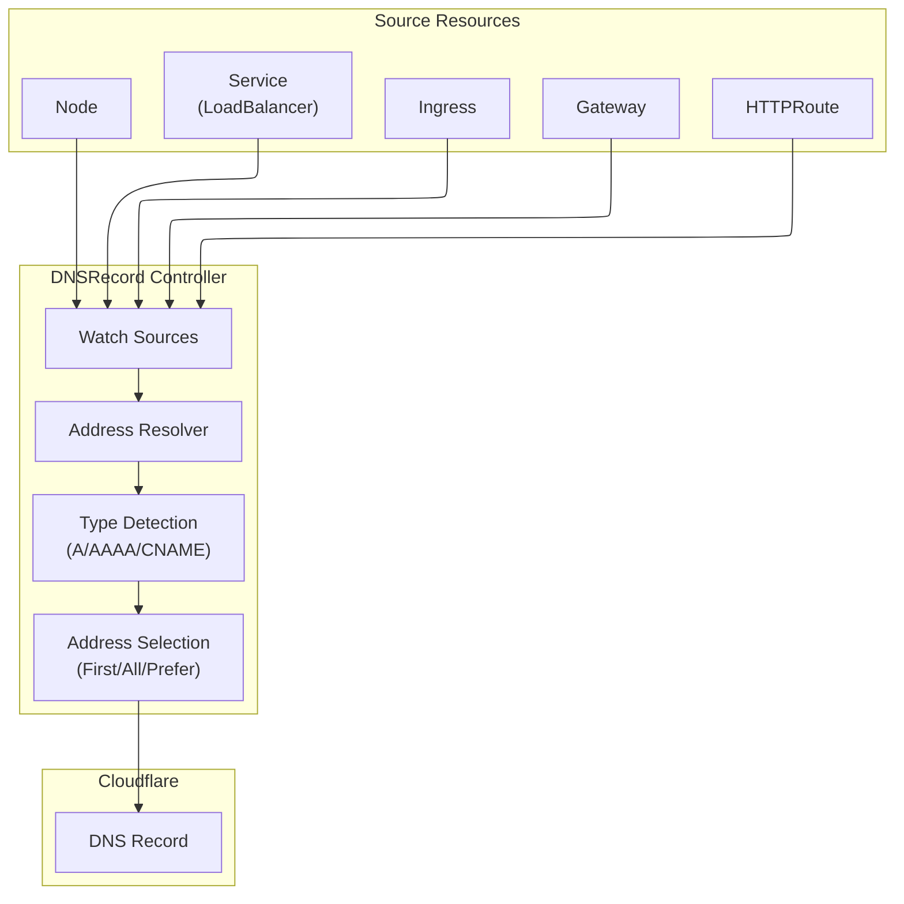
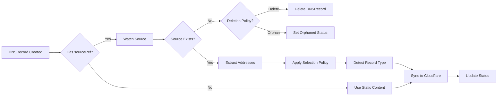

# DNSRecord

DNSRecord is a namespaced resource for managing Cloudflare DNS records declaratively. It supports all standard DNS record types, Cloudflare's proxy features, and **dynamic source resolution** from Kubernetes resources.

## Overview

DNSRecord allows you to manage DNS records in your Cloudflare zone using Kubernetes manifests. Changes to DNSRecord resources are automatically synchronized to Cloudflare, and the operator manages the full lifecycle of DNS records.

### Key Features

| Feature | Description |
|---------|-------------|
| **Comprehensive Record Types** | Supports A, AAAA, CNAME, TXT, MX, SRV, CAA, and more |
| **Dynamic Source Resolution** | Automatically extract IPs from Service, Ingress, Gateway, HTTPRoute, or Node |
| **Cloudflare Proxy** | Enable orange-cloud proxying for eligible record types |
| **Auto Type Detection** | Automatically detect A/AAAA/CNAME based on resolved address |
| **Multi-Address Selection** | Support for First, All (round-robin), PreferIPv4, PreferIPv6 policies |
| **Source Lifecycle Management** | Configurable behavior when source resource is deleted |

### Use Cases

- **Application Endpoints**: Create A/AAAA records for service endpoints
- **LoadBalancer DNS**: Auto-update DNS when LoadBalancer IP changes
- **Ingress DNS**: Create DNS records from Ingress LoadBalancer status
- **Gateway API Integration**: Extract addresses from Gateway resources
- **Node DNS**: Create DNS records for node external IPs
- **Static Records**: Traditional static DNS record management

## Architecture



## Spec

### Main Fields

| Field | Type | Required | Default | Description |
|-------|------|----------|---------|-------------|
| `name` | string | **Yes** | - | DNS record name (subdomain or FQDN, max 255 chars) |
| `type` | string | No* | - | Record type. Auto-detected when using `sourceRef` |
| `content` | string | No* | - | Static record content. Mutually exclusive with `sourceRef` |
| `sourceRef` | *DNSRecordSourceRef | No* | - | Dynamic source reference. Mutually exclusive with `content` |
| `addressSelection` | string | No | `First` | Address selection policy when multiple addresses exist |
| `sourceDeletionPolicy` | string | No | `Delete` | Behavior when source resource is deleted |
| `ttl` | int | No | `1` | Time To Live in seconds (1 = automatic) |
| `proxied` | bool | No | `false` | Enable Cloudflare proxy (orange cloud) |
| `priority` | *int | No | - | Priority for MX/SRV records (0-65535) |
| `comment` | string | No | - | Optional comment (max 100 chars) |
| `tags` | []string | No | - | Tags for organization |
| `data` | *DNSRecordData | No | - | Type-specific data for SRV, CAA, LOC, etc. |
| `cloudflare` | CloudflareDetails | **Yes** | - | Cloudflare API credentials |

> **Note**: Either `content` (static mode) or `sourceRef` (dynamic mode) must be specified, but not both.

### SourceRef - Dynamic Source Reference

Use `sourceRef` to dynamically obtain DNS record content from Kubernetes resources. Exactly one source type must be specified.

| Field | Type | Description |
|-------|------|-------------|
| `service` | *ServiceDNSSource | Extract address from a Kubernetes Service |
| `ingress` | *IngressDNSSource | Extract address from a Kubernetes Ingress |
| `httpRoute` | *HTTPRouteDNSSource | Extract address from a Gateway API HTTPRoute |
| `gateway` | *GatewayDNSSource | Extract address from a Gateway API Gateway |
| `node` | *NodeDNSSource | Extract address from a Kubernetes Node |

#### ServiceDNSSource

| Field | Type | Required | Default | Description |
|-------|------|----------|---------|-------------|
| `name` | string | **Yes** | - | Name of the Service |
| `namespace` | string | No | DNSRecord's namespace | Namespace of the Service |
| `addressType` | string | No | `LoadBalancerIP` | Address extraction method |

**Service Address Types**:

| AddressType | Source Path | Description |
|-------------|-------------|-------------|
| `LoadBalancerIP` | `.status.loadBalancer.ingress[].ip` | LoadBalancer IP address |
| `LoadBalancerHostname` | `.status.loadBalancer.ingress[].hostname` | LoadBalancer hostname (AWS ELB) |
| `ExternalIP` | `.spec.externalIPs[]` | External IPs |
| `ExternalName` | `.spec.externalName` | ExternalName service target |
| `ClusterIP` | `.spec.clusterIP` | ClusterIP (internal use only) |

#### IngressDNSSource

| Field | Type | Required | Default | Description |
|-------|------|----------|---------|-------------|
| `name` | string | **Yes** | - | Name of the Ingress |
| `namespace` | string | No | DNSRecord's namespace | Namespace of the Ingress |

Extracts from `.status.loadBalancer.ingress[].ip` or `.hostname`.

#### GatewayDNSSource

| Field | Type | Required | Default | Description |
|-------|------|----------|---------|-------------|
| `name` | string | **Yes** | - | Name of the Gateway |
| `namespace` | string | No | DNSRecord's namespace | Namespace of the Gateway |

Extracts from `.status.addresses[].value`.

#### HTTPRouteDNSSource

| Field | Type | Required | Default | Description |
|-------|------|----------|---------|-------------|
| `name` | string | **Yes** | - | Name of the HTTPRoute |
| `namespace` | string | No | DNSRecord's namespace | Namespace of the HTTPRoute |

Resolves parent Gateway(s) and extracts their addresses.

#### NodeDNSSource

| Field | Type | Required | Default | Description |
|-------|------|----------|---------|-------------|
| `name` | string | **Yes** | - | Name of the Node |
| `addressType` | string | No | `ExternalIP` | Address extraction method |

**Node Address Types**:

| AddressType | Source Path | Description |
|-------------|-------------|-------------|
| `ExternalIP` | `.status.addresses[type=ExternalIP]` | Node external IP |
| `InternalIP` | `.status.addresses[type=InternalIP]` | Node internal IP |
| `Hostname` | `.status.addresses[type=Hostname]` | Node hostname |

### Address Selection Policy

| Policy | Description |
|--------|-------------|
| `First` | Use the first available address (default) |
| `All` | Create multiple DNS records for all addresses (round-robin) |
| `PreferIPv4` | Prefer IPv4 addresses, fallback to first if none |
| `PreferIPv6` | Prefer IPv6 addresses, fallback to first if none |

### Source Deletion Policy

| Policy | Description |
|--------|-------------|
| `Delete` | Delete DNS record when source resource is deleted (default) |
| `Orphan` | Keep DNS record when source resource is deleted |

### Supported Record Types

A, AAAA, CNAME, TXT, MX, NS, SRV, CAA, CERT, DNSKEY, DS, HTTPS, LOC, NAPTR, SMIMEA, SSHFP, SVCB, TLSA, URI

### DNSRecordData (for advanced record types)

| Field | Type | Used For | Description |
|-------|------|----------|-------------|
| `service` | string | SRV | Service name |
| `proto` | string | SRV | Protocol (tcp/udp) |
| `weight` | int | SRV | Weight for load balancing |
| `port` | int | SRV | Service port |
| `target` | string | SRV | Target hostname |
| `flags` | int | CAA | CAA flags |
| `tag` | string | CAA | CAA tag (issue/issuewild/iodef) |
| `value` | string | CAA | CAA value |

## Status

| Field | Type | Description |
|-------|------|-------------|
| `recordId` | string | Cloudflare DNS Record ID |
| `zoneId` | string | Cloudflare Zone ID |
| `fqdn` | string | Fully Qualified Domain Name |
| `state` | string | Current state (Active, Error, Orphaned) |
| `conditions` | []Condition | Standard Kubernetes conditions |
| `observedGeneration` | int64 | Last observed generation |
| `resolvedType` | string | Auto-detected record type (when using sourceRef) |
| `resolvedContent` | string | Content resolved from source resource |
| `resolvedAddresses` | []string | All resolved addresses (when using All policy) |
| `sourceResourceVersion` | string | Source resource version for change detection |
| `managedRecordIds` | []string | All managed DNS record IDs (multiple when using All) |

## Examples

### Dynamic Mode Examples

#### Service LoadBalancer IP

Automatically create DNS record from Service LoadBalancer IP:

```yaml
apiVersion: networking.cloudflare-operator.io/v1alpha2
kind: DNSRecord
metadata:
  name: api-dns
  namespace: production
spec:
  name: api.example.com
  sourceRef:
    service:
      name: api-service
      addressType: LoadBalancerIP
  proxied: true
  cloudflare:
    domain: example.com
    secret: cloudflare-api-credentials
```

#### Service LoadBalancer Hostname (AWS ELB)

For cloud providers that assign hostnames instead of IPs:

```yaml
apiVersion: networking.cloudflare-operator.io/v1alpha2
kind: DNSRecord
metadata:
  name: app-dns
  namespace: production
spec:
  name: app.example.com
  sourceRef:
    service:
      name: app-service
      addressType: LoadBalancerHostname
  # Type auto-detected as CNAME
  proxied: true
  cloudflare:
    domain: example.com
    secret: cloudflare-api-credentials
```

#### Service ExternalName (CNAME)

Create CNAME from ExternalName service:

```yaml
apiVersion: networking.cloudflare-operator.io/v1alpha2
kind: DNSRecord
metadata:
  name: legacy-cname
  namespace: default
spec:
  name: legacy.example.com
  sourceRef:
    service:
      name: external-service
      addressType: ExternalName
  # Type auto-detected as CNAME
  proxied: false
  cloudflare:
    domain: example.com
    secret: cloudflare-api-credentials
```

#### Ingress

Create DNS record from Ingress LoadBalancer status:

```yaml
apiVersion: networking.cloudflare-operator.io/v1alpha2
kind: DNSRecord
metadata:
  name: web-dns
  namespace: default
spec:
  name: www.example.com
  sourceRef:
    ingress:
      name: web-ingress
  addressSelection: First
  proxied: true
  cloudflare:
    domain: example.com
    secret: cloudflare-api-credentials
```

#### Gateway API

Create DNS record from Gateway address:

```yaml
apiVersion: networking.cloudflare-operator.io/v1alpha2
kind: DNSRecord
metadata:
  name: gateway-dns
  namespace: gateway-system
spec:
  name: app.example.com
  sourceRef:
    gateway:
      name: main-gateway
  addressSelection: PreferIPv4
  proxied: true
  cloudflare:
    domain: example.com
    secret: cloudflare-api-credentials
```

#### HTTPRoute

Create DNS record from HTTPRoute's parent Gateway:

```yaml
apiVersion: networking.cloudflare-operator.io/v1alpha2
kind: DNSRecord
metadata:
  name: route-dns
  namespace: default
spec:
  name: myapp.example.com
  sourceRef:
    httpRoute:
      name: myapp-route
  proxied: true
  cloudflare:
    domain: example.com
    secret: cloudflare-api-credentials
```

#### Node External IP

Create DNS record for a specific node:

```yaml
apiVersion: networking.cloudflare-operator.io/v1alpha2
kind: DNSRecord
metadata:
  name: node-dns
  namespace: default
spec:
  name: node1.example.com
  sourceRef:
    node:
      name: worker-node-1
      addressType: ExternalIP
  proxied: false
  cloudflare:
    domain: example.com
    secret: cloudflare-api-credentials
```

#### Multi-Address Round-Robin

Create multiple A records for load balancing:

```yaml
apiVersion: networking.cloudflare-operator.io/v1alpha2
kind: DNSRecord
metadata:
  name: ha-dns
  namespace: default
spec:
  name: ha.example.com
  sourceRef:
    service:
      name: ha-service
      addressType: LoadBalancerIP
  addressSelection: All  # Creates multiple A records
  ttl: 300
  proxied: false
  cloudflare:
    domain: example.com
    secret: cloudflare-api-credentials
```

#### Orphan Policy

Keep DNS record when source is deleted:

```yaml
apiVersion: networking.cloudflare-operator.io/v1alpha2
kind: DNSRecord
metadata:
  name: persistent-dns
  namespace: default
spec:
  name: stable.example.com
  sourceRef:
    service:
      name: app-service
      addressType: LoadBalancerIP
  sourceDeletionPolicy: Orphan  # Keep DNS when service is deleted
  cloudflare:
    domain: example.com
    secret: cloudflare-api-credentials
```

### Static Mode Examples

#### Basic A Record (Proxied)

```yaml
apiVersion: networking.cloudflare-operator.io/v1alpha2
kind: DNSRecord
metadata:
  name: www-record
  namespace: default
spec:
  name: www
  type: A
  content: 203.0.113.50
  ttl: 1  # Automatic TTL
  proxied: true  # Enable Cloudflare proxy
  comment: "Web server endpoint"
  cloudflare:
    domain: example.com
    secret: cloudflare-api-credentials
```

#### CNAME Record

```yaml
apiVersion: networking.cloudflare-operator.io/v1alpha2
kind: DNSRecord
metadata:
  name: blog-cname
  namespace: default
spec:
  name: blog
  type: CNAME
  content: www.example.com
  proxied: true
  cloudflare:
    domain: example.com
    secret: cloudflare-api-credentials
```

#### TXT Record for Verification

```yaml
apiVersion: networking.cloudflare-operator.io/v1alpha2
kind: DNSRecord
metadata:
  name: txt-verification
  namespace: default
spec:
  name: _verify
  type: TXT
  content: "verification-token-12345"
  ttl: 3600
  tags:
    - verification
    - google
  cloudflare:
    domain: example.com
    secret: cloudflare-api-credentials
```

#### MX Record for Email

```yaml
apiVersion: networking.cloudflare-operator.io/v1alpha2
kind: DNSRecord
metadata:
  name: mx-primary
  namespace: default
spec:
  name: "@"  # Root domain
  type: MX
  content: mail.example.com
  priority: 10
  ttl: 3600
  comment: "Primary mail server"
  cloudflare:
    domain: example.com
    secret: cloudflare-api-credentials
```

#### SRV Record for Service Discovery

```yaml
apiVersion: networking.cloudflare-operator.io/v1alpha2
kind: DNSRecord
metadata:
  name: srv-ldap
  namespace: default
spec:
  name: _ldap._tcp
  type: SRV
  content: ldap.example.com
  priority: 10
  ttl: 3600
  data:
    service: ldap
    proto: tcp
    weight: 5
    port: 389
    target: ldap.example.com
  cloudflare:
    domain: example.com
    secret: cloudflare-api-credentials
```

## Address Resolution Flow



## Prerequisites

1. **Cloudflare Zone**: Domain must be managed by Cloudflare
2. **API Credentials**: API Token with DNS Edit permission
3. **Zone ID**: Automatically resolved from domain name
4. **Source Resources**: For dynamic mode, source resources must exist and have addresses

### Required API Permissions

| Permission | Scope | Purpose |
|------------|-------|---------|
| `Zone:DNS:Edit` | Zone | Create/update/delete DNS records |

### Required RBAC Permissions (for dynamic mode)

The operator requires additional RBAC permissions to watch source resources:

| Resource | Verbs | Purpose |
|----------|-------|---------|
| `services` | get, list, watch | Watch Service for LoadBalancer IPs |
| `ingresses` | get, list, watch | Watch Ingress for LoadBalancer status |
| `gateways` | get, list, watch | Watch Gateway API Gateway |
| `httproutes` | get, list, watch | Watch Gateway API HTTPRoute |
| `nodes` | get, list, watch | Watch Node for addresses |

## Limitations

- **Proxied Records**: Only A, AAAA, and CNAME records can be proxied
- **Root Domain**: Use `"@"` for root domain records
- **TTL with Proxy**: TTL is automatically managed when `proxied: true`
- **Record Uniqueness**: Each DNSRecord resource should manage one DNS record
- **Source Type**: Only one source type can be specified in `sourceRef`
- **Address Availability**: Dynamic mode requires source to have addresses assigned

## Best Practices

1. **Use Dynamic Mode for LoadBalancers**: Use `sourceRef` for resources with dynamic IPs
2. **Set Appropriate TTL**: Use lower TTL for dynamic sources that may change
3. **Use Orphan Policy Carefully**: Consider implications before using `Orphan` deletion policy
4. **Prefer IPv4 for Compatibility**: Use `PreferIPv4` when clients may not support IPv6
5. **Use Descriptive Names**: Name DNSRecord resources clearly (e.g., `api-loadbalancer-dns`)
6. **Enable Proxy for Web**: Use `proxied: true` for web-facing A/AAAA/CNAME records
7. **Monitor Status**: Check `resolvedContent` and `state` fields for issues

## Troubleshooting

### Source Has No Addresses

**Symptom**: DNSRecord shows error "source resource has no addresses"

**Cause**: The source resource (Service, Ingress, etc.) doesn't have addresses assigned yet.

**Solution**:
```bash
# Check Service LoadBalancer status
kubectl get svc <service-name> -o jsonpath='{.status.loadBalancer.ingress}'

# Check Ingress status
kubectl get ingress <ingress-name> -o jsonpath='{.status.loadBalancer.ingress}'
```

### Type Detection Issues

**Symptom**: Wrong record type created

**Solution**: Explicitly specify `type` field to override auto-detection:
```yaml
spec:
  type: A  # Force A record type
  sourceRef:
    service:
      name: my-service
```

### Source Deleted Unexpectedly

**Symptom**: DNS record deleted when source was temporarily unavailable

**Solution**: Use `sourceDeletionPolicy: Orphan` for critical DNS records.

## Related Resources

- [Tunnel](tunnel.md) - Automatically create DNS records for tunnel endpoints
- [Ingress Integration](../guides/ingress-integration.md) - Automatic DNS via Ingress annotations
- [Gateway API](../guides/gateway-api-integration.md) - DNS management with Gateway API

## See Also

- [Examples](../../../examples/01-basic/dns/)
- [Cloudflare DNS Documentation](https://developers.cloudflare.com/dns/)
- [external-dns](https://github.com/kubernetes-sigs/external-dns) - Similar functionality reference
