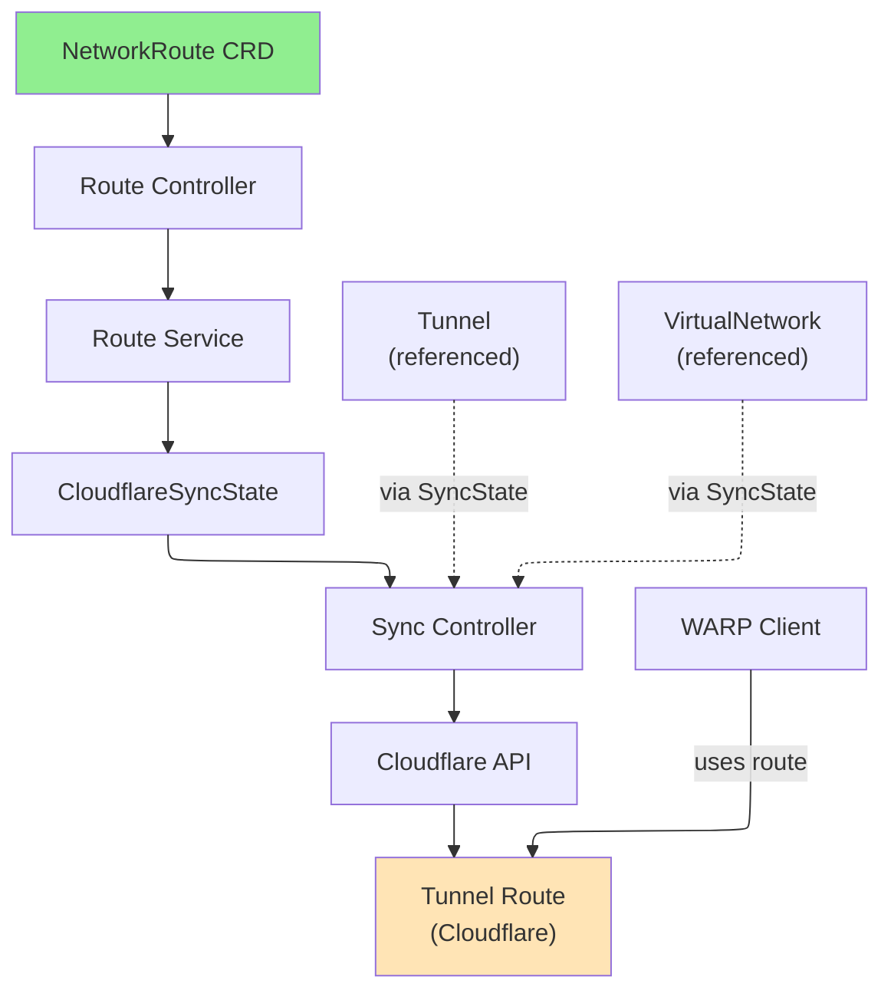

# NetworkRoute

NetworkRoute is a cluster-scoped resource that defines CIDR ranges to be routed through a Cloudflare Tunnel, enabling private network access via WARP clients.

## Overview

A NetworkRoute resource creates a mapping between a private IP CIDR range and a Cloudflare Tunnel through a Virtual Network. This enables WARP-connected clients to access private network resources through the tunnel. Multiple routes can be created for different CIDR ranges, and routes can use different tunnels or virtual networks for flexible traffic management.

### Key Features

| Feature | Description |
|---------|-------------|
| **CIDR Routing** | Route specific IP ranges through tunnels |
| **Tunnel References** | Support for both Tunnel and ClusterTunnel |
| **Virtual Network Support** | Associate routes with specific virtual networks |
| **Cross-VNet Adoption** | Routes can be adopted across different virtual networks |
| **Comments** | Add optional descriptions for organization |

### Use Cases

- **Private Network Access**: Route corporate network ranges through tunnels
- **Multi-Datacenter**: Expose multiple datacenters via different routes
- **Conditional Routing**: Route different IP ranges through different tunnels
- **Zero Trust Networking**: Implement least-privilege access to private resources
- **Disaster Recovery**: Failover routes to different tunnels

## Architecture



## Spec

### Main Fields

| Field | Type | Required | Default | Description |
|-------|------|----------|---------|-------------|
| `network` | string | **Yes** | - | CIDR notation IP range (e.g., "10.0.0.0/8") |
| `tunnelRef` | TunnelRef | **Yes** | - | Reference to Tunnel or ClusterTunnel |
| `virtualNetworkRef` | *VirtualNetworkRef | No | - | Reference to VirtualNetwork (uses default if not specified) |
| `comment` | string | No | - | Optional description (max 500 characters) |
| `cloudflare` | CloudflareDetails | **Yes** | - | Cloudflare API credentials and account information |

### TunnelRef

| Field | Type | Required | Default | Description |
|-------|------|----------|---------|-------------|
| `kind` | string | **Yes** | `ClusterTunnel` | Tunnel resource type (Tunnel or ClusterTunnel) |
| `name` | string | **Yes** | - | Name of the Tunnel or ClusterTunnel resource |
| `namespace` | string | No | - | Namespace of Tunnel (only for namespaced Tunnel resources) |

### VirtualNetworkRef

| Field | Type | Required | Description |
|-------|------|----------|-------------|
| `name` | string | **Yes** | Name of the VirtualNetwork resource |

## Status

| Field | Type | Description |
|-------|------|-------------|
| `network` | string | CIDR of the route in Cloudflare |
| `tunnelId` | string | Cloudflare Tunnel ID this route points to |
| `tunnelName` | string | Name of the Tunnel in Cloudflare |
| `virtualNetworkId` | string | Cloudflare Virtual Network ID |
| `accountId` | string | Cloudflare Account ID |
| `state` | string | Current state of the route |
| `conditions` | []metav1.Condition | Latest observations of resource state |
| `observedGeneration` | int64 | Last generation observed by controller |

## Examples

### Example 1: Basic Route with ClusterTunnel

```yaml
apiVersion: networking.cloudflare-operator.io/v1alpha2
kind: NetworkRoute
metadata:
  name: private-network-10
spec:
  network: "10.0.0.0/8"
  tunnelRef:
    kind: ClusterTunnel
    name: main-tunnel
  cloudflare:
    accountId: "1234567890abcdef"
    credentialsRef:
      name: production
```

### Example 2: Multiple Routes for Failover

```yaml
apiVersion: networking.cloudflare-operator.io/v1alpha2
kind: NetworkRoute
metadata:
  name: dc-primary
spec:
  network: "10.1.0.0/16"
  comment: "Primary datacenter"
  tunnelRef:
    kind: ClusterTunnel
    name: tunnel-primary
  cloudflare:
    accountId: "1234567890abcdef"
    credentialsRef:
      name: production
---
apiVersion: networking.cloudflare-operator.io/v1alpha2
kind: NetworkRoute
metadata:
  name: dc-secondary
spec:
  network: "10.1.0.0/16"
  comment: "Secondary datacenter (failover)"
  tunnelRef:
    kind: ClusterTunnel
    name: tunnel-secondary
  cloudflare:
    accountId: "1234567890abcdef"
    credentialsRef:
      name: production
```

### Example 3: Route with Specific Virtual Network

```yaml
apiVersion: networking.cloudflare-operator.io/v1alpha2
kind: NetworkRoute
metadata:
  name: tenant-a-route
spec:
  network: "172.16.0.0/12"
  comment: "Tenant A private network"
  tunnelRef:
    kind: Tunnel
    name: tenant-a-tunnel
    namespace: production
  virtualNetworkRef:
    name: tenant-a-vnet
  cloudflare:
    accountId: "1234567890abcdef"
    credentialsRef:
      name: production
```

### Example 4: Reference Namespaced Tunnel

```yaml
apiVersion: networking.cloudflare-operator.io/v1alpha2
kind: NetworkRoute
metadata:
  name: app-services
spec:
  network: "192.168.0.0/16"
  comment: "Application services network"
  tunnelRef:
    kind: Tunnel
    name: app-tunnel
    namespace: production
  cloudflare:
    accountId: "1234567890abcdef"
    credentialsRef:
      name: production
```

## Prerequisites

- Cloudflare Zero Trust subscription
- Valid Tunnel or ClusterTunnel resource in the cluster
- Cloudflare API credentials with appropriate permissions
- VirtualNetwork resource (if using explicit virtual network)

## Limitations

- Network CIDR must be valid and not overlap with other routes in the same tunnel
- TunnelRef must point to an existing Tunnel or ClusterTunnel resource
- Only one route can be created per CIDR per tunnel
- NetworkRoute deletion does not remove the route from Cloudflare immediately during maintenance windows
- Cloudflare Zero Trust subscription required

## Related Resources

- [Tunnel](tunnel.md) - Namespaced tunnel resource for routing
- [ClusterTunnel](clustertunnel.md) - Cluster-scoped tunnel resource
- [VirtualNetwork](virtualnetwork.md) - Virtual network for route isolation
- [PrivateService](privateservice.md) - Expose services via private routes
- [WARPConnector](warpconnector.md) - Deploy connectors to advertise routes

## See Also

- [Cloudflare Tunnel Routes Documentation](https://developers.cloudflare.com/cloudflare-one/setup/network/)
- [WARP Client Documentation](https://developers.cloudflare.com/warp-client/)
- [Cloudflare Zero Trust Networking](https://developers.cloudflare.com/cloudflare-one/)
