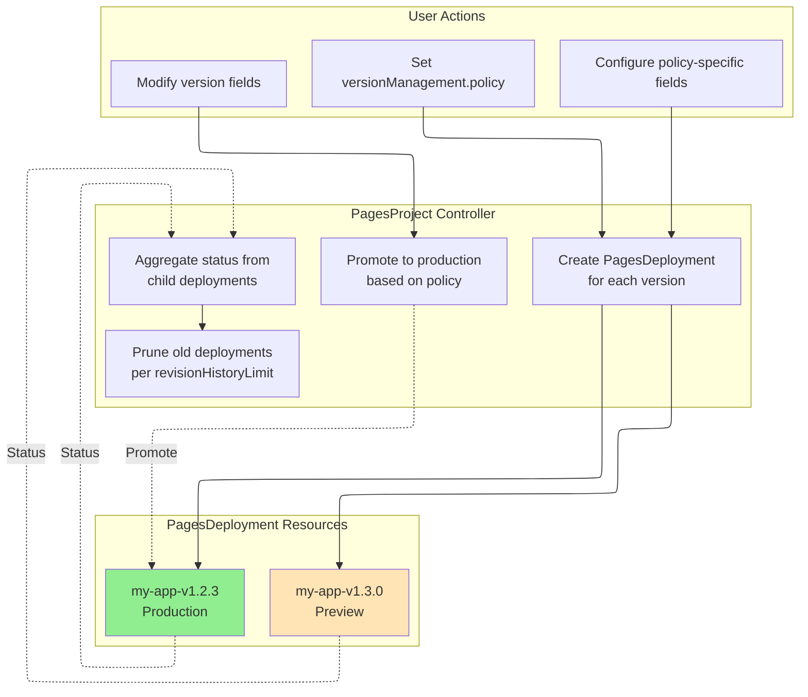

# PagesProject

PagesProject is a namespace-scoped resource that represents a Cloudflare Pages project. Cloudflare Pages is a JAMstack platform for deploying static sites and full-stack applications with Workers integration.

## Overview

PagesProject provides comprehensive management of Cloudflare Pages projects, including:

- **Project Configuration**: Build settings, deployment environments, resource bindings
- **Version Management**: 8 policies for declarative multi-version deployment with automatic rollback
- **Adoption Support**: Import existing Cloudflare projects into Kubernetes management
- **Resource Bindings**: D1, KV, R2, Durable Objects, Workers AI, and more

## Spec

| Field | Type | Required | Default | Description |
|-------|------|----------|---------|-------------|
| `name` | string | No | K8s resource name | Project name in Cloudflare Pages (max 58 chars) |
| `productionBranch` | string | **Yes** | - | Production branch for Git deployments |
| `source` | PagesSourceConfig | No | - | Source repository configuration |
| `buildConfig` | PagesBuildConfig | No | - | Build configuration |
| `deploymentConfigs` | PagesDeploymentConfigs | No | - | Environment-specific configurations |
| `cloudflare` | CloudflareDetails | **Yes** | - | Cloudflare API credentials |
| `adoptionPolicy` | string | No | `MustNotExist` | Adoption policy (see below) |
| `deploymentHistoryLimit` | int | No | `10` | Number of deployment records to keep (0-100) |
| `enableWebAnalytics` | bool | No | `true` | Enable Cloudflare Web Analytics |
| `deletionPolicy` | string | No | `Delete` | Deletion policy: `Delete`, `Orphan` |
| `versionManagement` | VersionManagement | No | - | Version management configuration (see below) |
| `revisionHistoryLimit` | int32 | No | `10` | Managed deployment retention limit (0-100) |

### Adoption Policies

| Policy | Description | Use Case |
|--------|-------------|----------|
| `MustNotExist` | Require project NOT exist (create new) | Default behavior, new projects |
| `IfExists` | Adopt if exists, create if not | Flexible adoption |
| `MustExist` | Require project already exists | Import existing projects |

### Deletion Policies

| Policy | Description |
|--------|-------------|
| `Delete` | Delete the Pages project from Cloudflare |
| `Orphan` | Leave the Pages project in Cloudflare |

## Source Configuration

### PagesSourceConfig

| Field | Type | Required | Default | Description |
|-------|------|----------|---------|-------------|
| `type` | string | No | `direct_upload` | Source type: `github`, `gitlab`, `direct_upload` |
| `github` | PagesGitHubConfig | No | - | GitHub configuration |
| `gitlab` | PagesGitLabConfig | No | - | GitLab configuration |

### PagesGitHubConfig

| Field | Type | Required | Default | Description |
|-------|------|----------|---------|-------------|
| `owner` | string | **Yes** | - | GitHub repository owner |
| `repo` | string | **Yes** | - | GitHub repository name |
| `productionDeploymentsEnabled` | bool | No | `true` | Enable production deployments |
| `previewDeploymentsEnabled` | bool | No | `true` | Enable preview deployments |
| `prCommentsEnabled` | bool | No | `true` | Enable PR comments |
| `deploymentsEnabled` | bool | No | `true` | Enable deployments globally |

### PagesGitLabConfig

| Field | Type | Required | Default | Description |
|-------|------|----------|---------|-------------|
| `owner` | string | **Yes** | - | GitLab namespace |
| `repo` | string | **Yes** | - | GitLab project name |
| `productionDeploymentsEnabled` | bool | No | `true` | Enable production deployments |
| `previewDeploymentsEnabled` | bool | No | `true` | Enable preview deployments |
| `deploymentsEnabled` | bool | No | `true` | Enable deployments globally |

## Build Configuration

### PagesBuildConfig

| Field | Type | Description |
|-------|------|-------------|
| `buildCommand` | string | Command to build the project |
| `destinationDir` | string | Build output directory |
| `rootDir` | string | Root directory for the build |
| `buildCaching` | bool | Enable build caching (default: `true`) |
| `webAnalyticsTag` | string | Web Analytics tag |
| `webAnalyticsToken` | string | Web Analytics token |

## Deployment Configurations

### PagesDeploymentConfigs

| Field | Type | Description |
|-------|------|-------------|
| `preview` | PagesDeploymentConfig | Preview environment configuration |
| `production` | PagesDeploymentConfig | Production environment configuration |

### PagesDeploymentConfig

| Field | Type | Description |
|-------|------|-------------|
| `environmentVariables` | map[string]PagesEnvVar | Environment variables |
| `compatibilityDate` | string | Workers runtime compatibility date |
| `compatibilityFlags` | []string | Workers runtime compatibility flags |
| `d1Bindings` | []PagesD1Binding | D1 database bindings |
| `durableObjectBindings` | []PagesDurableObjectBinding | Durable Object bindings |
| `kvBindings` | []PagesKVBinding | KV namespace bindings |
| `r2Bindings` | []PagesR2Binding | R2 bucket bindings |
| `serviceBindings` | []PagesServiceBinding | Workers service bindings |
| `queueBindings` | []PagesQueueBinding | Queue producer bindings |
| `aiBindings` | []PagesAIBinding | Workers AI bindings |
| `vectorizeBindings` | []PagesVectorizeBinding | Vectorize index bindings |
| `hyperdriveBindings` | []PagesHyperdriveBinding | Hyperdrive bindings |
| `mtlsCertificates` | []PagesMTLSCertificate | mTLS certificate bindings |
| `browserBinding` | PagesBrowserBinding | Browser Rendering binding |
| `placement` | PagesPlacement | Smart Placement configuration |
| `usageModel` | string | Usage model: `bundled`, `unbound` |
| `failOpen` | bool | Fail open when Workers script fails |
| `alwaysUseLatestCompatibilityDate` | bool | Auto-update compatibility date |

### Resource Bindings

#### PagesD1Binding

| Field | Type | Required | Description |
|-------|------|----------|-------------|
| `name` | string | **Yes** | Binding name |
| `databaseId` | string | **Yes** | D1 database ID |

#### PagesKVBinding

| Field | Type | Required | Description |
|-------|------|----------|-------------|
| `name` | string | **Yes** | Binding name |
| `namespaceId` | string | **Yes** | KV namespace ID |

#### PagesR2Binding

| Field | Type | Required | Description |
|-------|------|----------|-------------|
| `name` | string | **Yes** | Binding name |
| `bucketName` | string | **Yes** | R2 bucket name |

#### PagesServiceBinding

| Field | Type | Required | Description |
|-------|------|----------|-------------|
| `name` | string | **Yes** | Binding name |
| `service` | string | **Yes** | Worker service name |
| `environment` | string | No | Worker environment |

#### PagesDurableObjectBinding

| Field | Type | Required | Description |
|-------|------|----------|-------------|
| `name` | string | **Yes** | Binding name |
| `className` | string | **Yes** | Durable Object class name |
| `scriptName` | string | No | Worker script name |
| `environmentName` | string | No | Worker environment name |

## Version Management

PagesProject supports 8 version management policies through `spec.versionManagement`:

| Policy | Description | Use Case |
|--------|-------------|----------|
| `none` | No version management, project config only | Project metadata management |
| `targetVersion` | Single version deployment | Simple scenarios |
| `declarativeVersions` | Version list + template | Batch management |
| `fullVersions` | Complete version configurations | Complex scenarios |
| `gitops` | Preview + Production two-stage | **GitOps workflows** |
| `latestPreview` | Track latest preview deployment | Continuous deployment |
| `autoPromote` | Auto-promote after preview succeeds | Automated pipelines |
| `external` | External system controls versions | Third-party integration |

### VersionManagement

| Field | Type | Description |
|-------|------|-------------|
| `policy` | string | Version management policy (see above) |
| `targetVersion` | TargetVersionSpec | Config for `targetVersion` policy |
| `declarativeVersions` | DeclarativeVersionsSpec | Config for `declarativeVersions` policy |
| `fullVersions` | FullVersionsSpec | Config for `fullVersions` policy |
| `gitops` | GitOpsVersionConfig | Config for `gitops` policy |
| `latestPreview` | LatestPreviewConfig | Config for `latestPreview` policy |
| `autoPromote` | AutoPromoteConfig | Config for `autoPromote` policy |
| `external` | ExternalVersionConfig | Config for `external` policy |

### GitOpsVersionConfig

| Field | Type | Default | Description |
|-------|------|---------|-------------|
| `previewVersion` | string | - | Version to deploy as preview (CI modifies this) |
| `productionVersion` | string | - | Version to promote to production (ops modifies this) |
| `sourceTemplate` | SourceTemplate | - | Template to construct source URL from version |
| `requirePreviewValidation` | bool | `true` | Require version to pass preview before promotion |
| `validationLabels` | map[string]string | - | Labels that mark a version as validated |

### LatestPreviewConfig

| Field | Type | Default | Description |
|-------|------|---------|-------------|
| `sourceTemplate` | SourceTemplate | - | Template to construct source URL from version |
| `labelSelector` | LabelSelector | - | Select which PagesDeployment to track |
| `autoPromote` | bool | `false` | Auto-promote latest successful preview |

### AutoPromoteConfig

| Field | Type | Default | Description |
|-------|------|---------|-------------|
| `sourceTemplate` | SourceTemplate | - | Template to construct source URL from version |
| `promoteAfter` | Duration | immediate | Wait time after preview succeeds |
| `requireHealthCheck` | bool | `false` | Require health check before promotion |
| `healthCheckUrl` | string | - | URL to check for health |
| `healthCheckTimeout` | Duration | `30s` | Health check timeout |

### ExternalVersionConfig

| Field | Type | Default | Description |
|-------|------|---------|-------------|
| `webhookUrl` | string | - | URL to notify when version changes |
| `syncInterval` | Duration | `5m` | Interval to sync version status |
| `currentVersion` | string | - | Externally-controlled current version |
| `productionVersion` | string | - | Externally-controlled production version |

### Version Management Architecture



## Status

| Field | Type | Description |
|-------|------|-------------|
| `projectId` | string | Cloudflare project ID |
| `accountId` | string | Cloudflare account ID |
| `subdomain` | string | The `*.pages.dev` subdomain |
| `domains` | []string | Custom domains configured |
| `latestDeployment` | PagesDeploymentInfo | Latest deployment information |
| `state` | string | Current state (see below) |
| `conditions` | []Condition | Standard Kubernetes conditions |
| `observedGeneration` | int64 | Last observed generation |
| `message` | string | Additional state information |
| `adopted` | bool | Whether project was adopted |
| `adoptedAt` | Time | Adoption timestamp |
| `originalConfig` | PagesProjectOriginalConfig | Original Cloudflare configuration before adoption |
| `deploymentHistory` | []DeploymentHistoryEntry | Recent deployment records (for rollback) |
| `lastSuccessfulDeploymentId` | string | ID of last successful deployment |
| `currentProduction` | ProductionDeploymentInfo | Current production deployment (version mode) |
| `previewDeployment` | PreviewDeploymentInfo | Current preview deployment (version mode) |
| `managedDeployments` | int32 | Count of managed PagesDeployment resources |
| `managedVersions` | []ManagedVersionStatus | Status summary for each managed version |
| `versionMapping` | map[string]string | Version name to deployment ID mapping |
| `validationHistory` | []VersionValidation | Version validation history |
| `activePolicy` | string | Currently active version policy |

### Project States

| State | Description |
|-------|-------------|
| `Pending` | Project is waiting to be created |
| `Creating` | Project is being created |
| `Ready` | Project is created and ready |
| `Updating` | Project is being updated |
| `Deleting` | Project is being deleted |
| `Error` | Error occurred with the project |

### ProductionDeploymentInfo

| Field | Type | Description |
|-------|------|-------------|
| `version` | string | Version name |
| `deploymentId` | string | Cloudflare deployment ID |
| `deploymentName` | string | PagesDeployment resource name |
| `url` | string | Production deployment URL |
| `hashUrl` | string | Deployment-specific URL |
| `deployedAt` | Time | When this version became production |

### ManagedVersionStatus

| Field | Type | Description |
|-------|------|-------------|
| `name` | string | Version name |
| `deploymentName` | string | PagesDeployment resource name |
| `state` | string | Deployment state |
| `isProduction` | bool | Is current production deployment |
| `deploymentId` | string | Cloudflare deployment ID |
| `lastTransitionTime` | Time | When state last changed |

## Examples

### Basic Project with Direct Upload

```yaml
apiVersion: networking.cloudflare-operator.io/v1alpha2
kind: PagesProject
metadata:
  name: my-static-site
  namespace: default
spec:
  name: my-static-site
  productionBranch: main

  source:
    type: direct_upload

  buildConfig:
    buildCommand: npm run build
    destinationDir: dist
    rootDir: "/"
    buildCaching: true

  cloudflare:
    accountId: "<account-id>"
    domain: example.com
    secret: cloudflare-credentials
```

### Project with GitHub Integration

```yaml
apiVersion: networking.cloudflare-operator.io/v1alpha2
kind: PagesProject
metadata:
  name: my-app
  namespace: default
spec:
  name: my-app
  productionBranch: main

  source:
    type: github
    github:
      owner: myorg
      repo: my-app
      productionDeploymentsEnabled: true
      previewDeploymentsEnabled: true
      prCommentsEnabled: true

  buildConfig:
    buildCommand: npm run build
    destinationDir: dist
    buildCaching: true

  cloudflare:
    accountId: "<account-id>"
    domain: example.com
    secret: cloudflare-credentials
```

### GitOps Two-Stage Deployment

```yaml
apiVersion: networking.cloudflare-operator.io/v1alpha2
kind: PagesProject
metadata:
  name: my-app-gitops
  namespace: default
spec:
  name: my-app-gitops
  productionBranch: main

  versionManagement:
    policy: gitops
    gitops:
      # CI modifies this to deploy preview
      previewVersion: "v1.3.0"

      # Ops modifies this to promote to production
      productionVersion: "v1.2.3"

      # Source template
      sourceTemplate:
        type: s3
        s3:
          bucket: "my-artifacts"
          keyTemplate: "builds/{{.Version}}/dist.tar.gz"
          region: "us-east-1"
          archiveType: tar.gz

      # Require preview validation (default: true)
      requirePreviewValidation: true

  revisionHistoryLimit: 10

  cloudflare:
    accountId: "<account-id>"
    credentialsRef:
      name: cloudflare-credentials
```

### Declarative Versions with Template

```yaml
apiVersion: networking.cloudflare-operator.io/v1alpha2
kind: PagesProject
metadata:
  name: my-app-declarative
  namespace: default
spec:
  name: my-app-declarative
  productionBranch: main

  versionManagement:
    policy: declarativeVersions
    declarativeVersions:
      versions:
        - "v1.2.3"
        - "v1.2.2"
        - "v1.2.1"

      sourceTemplate:
        type: http
        http:
          urlTemplate: "https://artifacts.example.com/my-app/{{.Version}}/dist.tar.gz"
          archiveType: tar.gz

      # "latest" = versions[0], or specify version name
      productionTarget: "latest"

  revisionHistoryLimit: 10

  cloudflare:
    accountId: "<account-id>"
    credentialsRef:
      name: cloudflare-credentials
```

### Auto-Promote After Health Check

```yaml
apiVersion: networking.cloudflare-operator.io/v1alpha2
kind: PagesProject
metadata:
  name: my-app-autopromote
  namespace: default
spec:
  name: my-app-autopromote
  productionBranch: main

  versionManagement:
    policy: autoPromote
    autoPromote:
      # Wait 5 minutes after preview succeeds
      promoteAfter: 5m

      # Require health check
      requireHealthCheck: true
      healthCheckUrl: "https://preview.my-app.pages.dev/health"
      healthCheckTimeout: 30s

      sourceTemplate:
        type: http
        http:
          urlTemplate: "https://artifacts.example.com/{{.Version}}/dist.tar.gz"
          archiveType: tar.gz

  revisionHistoryLimit: 10

  cloudflare:
    accountId: "<account-id>"
    credentialsRef:
      name: cloudflare-credentials
```

### Track Latest Preview

```yaml
apiVersion: networking.cloudflare-operator.io/v1alpha2
kind: PagesProject
metadata:
  name: my-app-latestpreview
  namespace: default
spec:
  name: my-app-latestpreview
  productionBranch: main

  versionManagement:
    policy: latestPreview
    latestPreview:
      # Only track deployments matching this selector
      labelSelector:
        matchLabels:
          team: frontend

      # Auto-promote latest successful preview
      autoPromote: true

  revisionHistoryLimit: 10

  cloudflare:
    accountId: "<account-id>"
    credentialsRef:
      name: cloudflare-credentials
```

### External System Control

```yaml
apiVersion: networking.cloudflare-operator.io/v1alpha2
kind: PagesProject
metadata:
  name: my-app-external
  namespace: default
spec:
  name: my-app-external
  productionBranch: main

  versionManagement:
    policy: external
    external:
      # External system updates these fields
      currentVersion: "v1.2.3"
      productionVersion: "v1.2.3"

      # Sync interval
      syncInterval: 5m

      # Optional webhook
      webhookUrl: "https://ci.example.com/webhook"

  revisionHistoryLimit: 10

  cloudflare:
    accountId: "<account-id>"
    credentialsRef:
      name: cloudflare-credentials
```

### Adopt Existing Project

```yaml
apiVersion: networking.cloudflare-operator.io/v1alpha2
kind: PagesProject
metadata:
  name: legacy-site
  namespace: default
spec:
  name: legacy-site
  productionBranch: main

  # Import existing project
  adoptionPolicy: MustExist

  # Keep project when resource is deleted
  deletionPolicy: Orphan

  cloudflare:
    accountId: "<account-id>"
    domain: example.com
    secret: cloudflare-credentials
```

## Use Cases

### GitOps Workflow

1. CI system modifies `spec.versionManagement.gitops.previewVersion` to deploy new version as preview
2. Controller creates PagesDeployment for preview
3. After validation, ops modifies `spec.versionManagement.gitops.productionVersion`
4. Controller promotes the validated version to production

```yaml
# Step 1: CI deploys v1.3.0 as preview
versionManagement:
  policy: gitops
  gitops:
    previewVersion: "v1.3.0"
    productionVersion: "v1.2.3"

# Step 2: Ops promotes v1.3.0 to production
versionManagement:
  policy: gitops
  gitops:
    previewVersion: "v1.3.0"
    productionVersion: "v1.3.0"  # Changed
```

### Rollback

Change `productionVersion` back to a previous version:

```yaml
versionManagement:
  policy: gitops
  gitops:
    previewVersion: "v1.3.0"
    productionVersion: "v1.2.3"  # Rollback to v1.2.3
```

### Multi-Environment Management

Manage different configurations per environment:

```yaml
deploymentConfigs:
  production:
    environmentVariables:
      ENV: { value: "production" }
      DB_URL: { value: "prod-db.example.com" }
  preview:
    environmentVariables:
      ENV: { value: "preview" }
      DB_URL: { value: "staging-db.example.com" }
```

## Related Resources

- [PagesDeployment](pagesdeployment.md) - Deploy specific versions to Cloudflare Pages
- [PagesDomain](pagesdomain.md) - Configure custom domains for Pages projects
- [R2Bucket](r2bucket.md) - Create R2 buckets for use with Pages
- [CloudflareDomain](cloudflareadomain.md) - Configure DNS and SSL settings

## See Also

- [Version Management Guide](../../features/pagesproject-versions.md)
- [Cloudflare Pages Documentation](https://developers.cloudflare.com/pages/)
- [Workers Bindings Reference](https://developers.cloudflare.com/workers/runtime-apis/bindings/)
