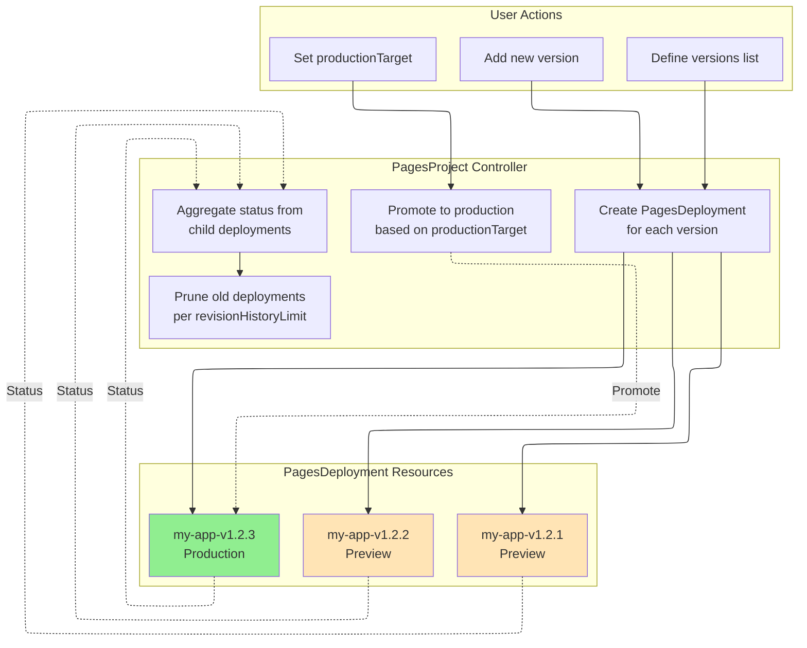

# PagesProject

PagesProject is a namespace-scoped resource that represents a Cloudflare Pages project. Cloudflare Pages is a JAMstack platform for deploying static sites and full-stack applications with Workers integration.

## Overview

PagesProject provides comprehensive management of Cloudflare Pages projects, including:

- **Project Configuration**: Build settings, deployment environments, resource bindings
- **Version Management**: Declarative multi-version deployment with automatic rollback
- **Adoption Support**: Import existing Cloudflare projects into Kubernetes management
- **Resource Bindings**: D1, KV, R2, Durable Objects, Workers AI, and more

## Spec

| Field | Type | Required | Default | Description |
|-------|------|----------|---------|-------------|
| `name` | string | No | K8s resource name | Project name in Cloudflare Pages (max 58 chars) |
| `productionBranch` | string | **Yes** | - | Production branch for Git deployments |
| `source` | PagesSourceConfig | No | - | Source repository configuration |
| `buildConfig` | PagesBuildConfig | No | - | Build configuration |
| `deploymentConfigs` | PagesDeploymentConfigs | No | - | Environment-specific configurations |
| `cloudflare` | CloudflareDetails | **Yes** | - | Cloudflare API credentials |
| `adoptionPolicy` | string | No | `MustNotExist` | Adoption policy (see below) |
| `deploymentHistoryLimit` | int | No | `10` | Number of deployment records to keep (0-100) |
| `enableWebAnalytics` | bool | No | `true` | Enable Cloudflare Web Analytics |
| `deletionPolicy` | string | No | `Delete` | Deletion policy: `Delete`, `Orphan` |
| `versions` | []ProjectVersion | No | - | Declarative version list (max 100) |
| `productionTarget` | string | No | - | Production version target |
| `revisionHistoryLimit` | int32 | No | `10` | Managed deployment retention limit (0-100) |

### Adoption Policies

| Policy | Description | Use Case |
|--------|-------------|----------|
| `MustNotExist` | Require project NOT exist (create new) | Default behavior, new projects |
| `IfExists` | Adopt if exists, create if not | Flexible adoption |
| `MustExist` | Require project already exists | Import existing projects |

### Deletion Policies

| Policy | Description |
|--------|-------------|
| `Delete` | Delete the Pages project from Cloudflare |
| `Orphan` | Leave the Pages project in Cloudflare |

## Source Configuration

### PagesSourceConfig

| Field | Type | Required | Default | Description |
|-------|------|----------|---------|-------------|
| `type` | string | No | `direct_upload` | Source type: `github`, `gitlab`, `direct_upload` |
| `github` | PagesGitHubConfig | No | - | GitHub configuration |
| `gitlab` | PagesGitLabConfig | No | - | GitLab configuration |

### PagesGitHubConfig

| Field | Type | Required | Default | Description |
|-------|------|----------|---------|-------------|
| `owner` | string | **Yes** | - | GitHub repository owner |
| `repo` | string | **Yes** | - | GitHub repository name |
| `productionDeploymentsEnabled` | bool | No | `true` | Enable production deployments |
| `previewDeploymentsEnabled` | bool | No | `true` | Enable preview deployments |
| `prCommentsEnabled` | bool | No | `true` | Enable PR comments |
| `deploymentsEnabled` | bool | No | `true` | Enable deployments globally |

### PagesGitLabConfig

| Field | Type | Required | Default | Description |
|-------|------|----------|---------|-------------|
| `owner` | string | **Yes** | - | GitLab namespace |
| `repo` | string | **Yes** | - | GitLab project name |
| `productionDeploymentsEnabled` | bool | No | `true` | Enable production deployments |
| `previewDeploymentsEnabled` | bool | No | `true` | Enable preview deployments |
| `deploymentsEnabled` | bool | No | `true` | Enable deployments globally |

## Build Configuration

### PagesBuildConfig

| Field | Type | Description |
|-------|------|-------------|
| `buildCommand` | string | Command to build the project |
| `destinationDir` | string | Build output directory |
| `rootDir` | string | Root directory for the build |
| `buildCaching` | bool | Enable build caching (default: `true`) |
| `webAnalyticsTag` | string | Web Analytics tag |
| `webAnalyticsToken` | string | Web Analytics token |

## Deployment Configurations

### PagesDeploymentConfigs

| Field | Type | Description |
|-------|------|-------------|
| `preview` | PagesDeploymentConfig | Preview environment configuration |
| `production` | PagesDeploymentConfig | Production environment configuration |

### PagesDeploymentConfig

| Field | Type | Description |
|-------|------|-------------|
| `environmentVariables` | map[string]PagesEnvVar | Environment variables |
| `compatibilityDate` | string | Workers runtime compatibility date |
| `compatibilityFlags` | []string | Workers runtime compatibility flags |
| `d1Bindings` | []PagesD1Binding | D1 database bindings |
| `durableObjectBindings` | []PagesDurableObjectBinding | Durable Object bindings |
| `kvBindings` | []PagesKVBinding | KV namespace bindings |
| `r2Bindings` | []PagesR2Binding | R2 bucket bindings |
| `serviceBindings` | []PagesServiceBinding | Workers service bindings |
| `queueBindings` | []PagesQueueBinding | Queue producer bindings |
| `aiBindings` | []PagesAIBinding | Workers AI bindings |
| `vectorizeBindings` | []PagesVectorizeBinding | Vectorize index bindings |
| `hyperdriveBindings` | []PagesHyperdriveBinding | Hyperdrive bindings |
| `mtlsCertificates` | []PagesMTLSCertificate | mTLS certificate bindings |
| `browserBinding` | PagesBrowserBinding | Browser Rendering binding |
| `placement` | PagesPlacement | Smart Placement configuration |
| `usageModel` | string | Usage model: `bundled`, `unbound` |
| `failOpen` | bool | Fail open when Workers script fails |
| `alwaysUseLatestCompatibilityDate` | bool | Auto-update compatibility date |

### Resource Bindings

#### PagesD1Binding

| Field | Type | Required | Description |
|-------|------|----------|-------------|
| `name` | string | **Yes** | Binding name |
| `databaseId` | string | **Yes** | D1 database ID |

#### PagesKVBinding

| Field | Type | Required | Description |
|-------|------|----------|-------------|
| `name` | string | **Yes** | Binding name |
| `namespaceId` | string | **Yes** | KV namespace ID |

#### PagesR2Binding

| Field | Type | Required | Description |
|-------|------|----------|-------------|
| `name` | string | **Yes** | Binding name |
| `bucketName` | string | **Yes** | R2 bucket name |

#### PagesServiceBinding

| Field | Type | Required | Description |
|-------|------|----------|-------------|
| `name` | string | **Yes** | Binding name |
| `service` | string | **Yes** | Worker service name |
| `environment` | string | No | Worker environment |

#### PagesDurableObjectBinding

| Field | Type | Required | Description |
|-------|------|----------|-------------|
| `name` | string | **Yes** | Binding name |
| `className` | string | **Yes** | Durable Object class name |
| `scriptName` | string | No | Worker script name |
| `environmentName` | string | No | Worker environment name |

## Version Management

### ProjectVersion

Declarative version management enables multi-version deployments with automatic promotion and rollback.

| Field | Type | Required | Description |
|-------|------|----------|-------------|
| `name` | string | **Yes** | Version identifier (e.g., `v1.2.3`, `2025-01-20`) |
| `source` | PagesDirectUploadSourceSpec | No | Deployment source (HTTP, S3, OCI) |
| `metadata` | map[string]string | No | Version metadata (gitCommit, buildTime, author, etc.) |

### Version Management Features



### Production Target Strategies

| Value | Behavior |
|-------|----------|
| `latest` | Always use `versions[0]` (first/newest version) |
| `vX.Y.Z` | Use specific version by name |
| `""` (empty) | Do not automatically promote to production |

## Status

| Field | Type | Description |
|-------|------|-------------|
| `projectId` | string | Cloudflare project ID |
| `accountId` | string | Cloudflare account ID |
| `subdomain` | string | The `*.pages.dev` subdomain |
| `domains` | []string | Custom domains configured |
| `latestDeployment` | PagesDeploymentInfo | Latest deployment information |
| `state` | string | Current state (see below) |
| `conditions` | []Condition | Standard Kubernetes conditions |
| `observedGeneration` | int64 | Last observed generation |
| `message` | string | Additional state information |
| `adopted` | bool | Whether project was adopted |
| `adoptedAt` | Time | Adoption timestamp |
| `originalConfig` | PagesProjectOriginalConfig | Original Cloudflare configuration before adoption |
| `deploymentHistory` | []DeploymentHistoryEntry | Recent deployment records (for rollback) |
| `lastSuccessfulDeploymentId` | string | ID of last successful deployment |
| `currentProduction` | ProductionDeploymentInfo | Current production deployment (version mode) |
| `managedDeployments` | int32 | Count of managed PagesDeployment resources |
| `managedVersions` | []ManagedVersionStatus | Status summary for each managed version |

### Project States

| State | Description |
|-------|-------------|
| `Pending` | Project is waiting to be created |
| `Creating` | Project is being created |
| `Ready` | Project is created and ready |
| `Updating` | Project is being updated |
| `Deleting` | Project is being deleted |
| `Error` | Error occurred with the project |

### ProductionDeploymentInfo

| Field | Type | Description |
|-------|------|-------------|
| `version` | string | Version name (from ProjectVersion) |
| `deploymentId` | string | Cloudflare deployment ID |
| `deploymentName` | string | PagesDeployment resource name |
| `url` | string | Production deployment URL |
| `hashUrl` | string | Deployment-specific URL |
| `deployedAt` | Time | When this version became production |

### ManagedVersionStatus

| Field | Type | Description |
|-------|------|-------------|
| `name` | string | Version name |
| `deploymentName` | string | PagesDeployment resource name |
| `state` | string | Deployment state |
| `isProduction` | bool | Is current production deployment |
| `deploymentId` | string | Cloudflare deployment ID |
| `lastTransitionTime` | Time | When state last changed |

## Examples

### Basic Project with Direct Upload

```yaml
apiVersion: networking.cloudflare-operator.io/v1alpha2
kind: PagesProject
metadata:
  name: my-static-site
  namespace: default
spec:
  name: my-static-site
  productionBranch: main

  source:
    type: direct_upload

  buildConfig:
    buildCommand: npm run build
    destinationDir: dist
    rootDir: "/"
    buildCaching: true

  cloudflare:
    accountId: "<account-id>"
    domain: example.com
    secret: cloudflare-credentials
```

### Project with GitHub Integration

```yaml
apiVersion: networking.cloudflare-operator.io/v1alpha2
kind: PagesProject
metadata:
  name: my-app
  namespace: default
spec:
  name: my-app
  productionBranch: main

  source:
    type: github
    github:
      owner: myorg
      repo: my-app
      productionDeploymentsEnabled: true
      previewDeploymentsEnabled: true
      prCommentsEnabled: true

  buildConfig:
    buildCommand: npm run build
    destinationDir: dist
    buildCaching: true

  cloudflare:
    accountId: "<account-id>"
    domain: example.com
    secret: cloudflare-credentials
```

### Full-Stack Application with Resource Bindings

```yaml
apiVersion: networking.cloudflare-operator.io/v1alpha2
kind: PagesProject
metadata:
  name: fullstack-app
  namespace: default
spec:
  name: fullstack-app
  productionBranch: main

  deploymentConfigs:
    production:
      environmentVariables:
        API_URL:
          value: "https://api.example.com"
          type: plain_text
        SECRET_KEY:
          value: "supersecret"
          type: secret_text

      compatibilityDate: "2024-01-01"
      compatibilityFlags:
        - nodejs_compat

      # D1 Database
      d1Bindings:
        - name: DB
          databaseId: "<d1-database-id>"

      # KV Namespace
      kvBindings:
        - name: CACHE
          namespaceId: "<kv-namespace-id>"

      # R2 Bucket
      r2Bindings:
        - name: UPLOADS
          bucketName: my-uploads-bucket

      # Workers AI
      aiBindings:
        - name: AI

      # Vectorize
      vectorizeBindings:
        - name: VECTORS
          indexName: my-index

      usageModel: bundled
      failOpen: false

  cloudflare:
    accountId: "<account-id>"
    domain: example.com
    secret: cloudflare-credentials
```

### Adopt Existing Project

```yaml
apiVersion: networking.cloudflare-operator.io/v1alpha2
kind: PagesProject
metadata:
  name: legacy-site
  namespace: default
spec:
  name: legacy-site
  productionBranch: main

  # Import existing project
  adoptionPolicy: MustExist

  # Keep project when resource is deleted
  deletionPolicy: Orphan

  cloudflare:
    accountId: "<account-id>"
    domain: example.com
    secret: cloudflare-credentials
```

### Version Management with Multiple Deployments

```yaml
apiVersion: networking.cloudflare-operator.io/v1alpha2
kind: PagesProject
metadata:
  name: versioned-app
  namespace: default
spec:
  name: versioned-app
  productionBranch: main

  # Define version list
  versions:
    - name: "v1.2.3"
      source:
        source:
          http:
            url: "https://releases.example.com/v1.2.3/dist.tar.gz"
        archive:
          type: tar.gz
        checksum:
          algorithm: sha256
          value: "abc123..."
      metadata:
        gitCommit: "abc123"
        buildTime: "2025-01-20T10:00:00Z"
        author: "deploy-bot"

    - name: "v1.2.2"
      source:
        source:
          http:
            url: "https://releases.example.com/v1.2.2/dist.tar.gz"
        archive:
          type: tar.gz
      metadata:
        gitCommit: "def456"
        buildTime: "2025-01-19T10:00:00Z"

    - name: "v1.2.1"
      source:
        source:
          http:
            url: "https://releases.example.com/v1.2.1/dist.tar.gz"
        archive:
          type: tar.gz

  # Auto-promote latest version to production
  productionTarget: "latest"

  # Keep 10 most recent deployments
  revisionHistoryLimit: 10

  cloudflare:
    accountId: "<account-id>"
    domain: example.com
    secret: cloudflare-credentials
```

### Rollback to Previous Version

```yaml
apiVersion: networking.cloudflare-operator.io/v1alpha2
kind: PagesProject
metadata:
  name: versioned-app
  namespace: default
spec:
  name: versioned-app
  productionBranch: main

  versions:
    - name: "v1.2.3"
      source: {...}
    - name: "v1.2.2"
      source: {...}

  # Rollback: change from "latest" to specific version
  productionTarget: "v1.2.2"

  cloudflare:
    accountId: "<account-id>"
    domain: example.com
    secret: cloudflare-credentials
```

## Use Cases

### Continuous Deployment

Deploy new versions automatically while keeping production stable:

1. Add new version to `versions` list (at position 0)
2. Set `productionTarget: "latest"` for automatic promotion
3. Controller creates PagesDeployment for the new version
4. Once successful, promotes to production

### Blue-Green Deployment

Maintain multiple versions and switch between them:

1. Define multiple versions in `versions` list
2. Test each version in preview environment
3. Switch `productionTarget` to promote desired version
4. Instant rollback by changing `productionTarget` back

### Canary Deployment

Gradually roll out new versions:

1. Deploy new version to preview (`productionTarget: "v1.2.2"`)
2. Monitor metrics and user feedback
3. When confident, switch to new version (`productionTarget: "v1.2.3"`)

### Multi-Environment Management

Manage different configurations per environment:

```yaml
deploymentConfigs:
  production:
    environmentVariables:
      ENV: { value: "production" }
      DB_URL: { value: "prod-db.example.com" }
  preview:
    environmentVariables:
      ENV: { value: "preview" }
      DB_URL: { value: "staging-db.example.com" }
```

## Related Resources

- [PagesDeployment](pagesdeployment.md) - Deploy specific versions to Cloudflare Pages
- [PagesDomain](pagesdomain.md) - Configure custom domains for Pages projects
- [R2Bucket](r2bucket.md) - Create R2 buckets for use with Pages
- [CloudflareDomain](cloudflareadomain.md) - Configure DNS and SSL settings

## See Also

- [Version Management Guide](../../features/pagesproject-versions.md)
- [Cloudflare Pages Documentation](https://developers.cloudflare.com/pages/)
- [Workers Bindings Reference](https://developers.cloudflare.com/workers/runtime-apis/bindings/)
