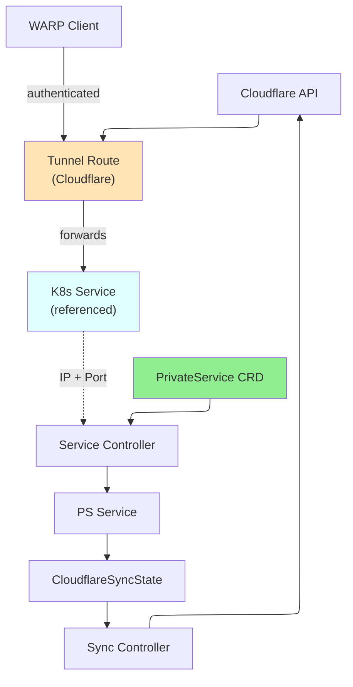

# PrivateService

PrivateService is a namespaced resource that exposes Kubernetes Services privately through a Cloudflare Tunnel and Virtual Network, enabling secure access from WARP clients.

## Overview

PrivateService creates a private network route for a Kubernetes Service, making it accessible only through WARP-connected clients and Cloudflare Tunnel. Instead of exposing services to the internet, PrivateService integrates with your Virtual Network to provide secure, authenticated access to internal services. The operator automatically derives the network CIDR from the service's ClusterIP.

### Key Features

| Feature | Description |
|---------|-------------|
| **Service Integration** | Expose Kubernetes Services via WARP and Tunnels |
| **Automatic CIDR** | Derives network CIDR from Service ClusterIP |
| **Zero Trust** | Access controlled by Cloudflare Access policies |
| **Protocol Support** | TCP and UDP protocol support |
| **Virtual Network** | Associate with specific virtual networks |

### Use Cases

- **Internal Services**: Expose internal APIs and databases securely
- **Multi-Namespace Access**: Provide cross-namespace service access via WARP
- **Database Access**: Secure remote database access without VPN
- **Microservices**: Enable service-to-service communication via private networks
- **Compliance**: Meet security requirements with Zero Trust access

## Architecture



## Spec

### Main Fields

| Field | Type | Required | Default | Description |
|-------|------|----------|---------|-------------|
| `serviceRef` | ServiceRef | **Yes** | - | Reference to Kubernetes Service |
| `tunnelRef` | TunnelRef | **Yes** | - | Reference to Tunnel or ClusterTunnel |
| `virtualNetworkRef` | *VirtualNetworkRef | No | - | Reference to VirtualNetwork |
| `protocol` | string | No | `tcp` | Protocol: `tcp` or `udp` (deprecated, automatic) |
| `comment` | string | No | - | Optional description (max 500 characters) |
| `cloudflare` | CloudflareDetails | **Yes** | - | Cloudflare API credentials |

### ServiceRef

| Field | Type | Required | Description |
|-------|------|----------|-------------|
| `name` | string | **Yes** | Name of the Kubernetes Service |
| `port` | int32 | **Yes** | Port number (1-65535) |

### TunnelRef and VirtualNetworkRef

See [NetworkRoute](networkroute.md) for reference format details.

## Status

| Field | Type | Description |
|-------|------|-------------|
| `network` | string | CIDR created for this private service |
| `serviceIP` | string | ClusterIP of the referenced Service |
| `tunnelId` | string | Cloudflare Tunnel ID |
| `tunnelName` | string | Name of the Tunnel in Cloudflare |
| `virtualNetworkId` | string | Cloudflare Virtual Network ID |
| `accountId` | string | Cloudflare Account ID |
| `state` | string | Current state |
| `conditions` | []metav1.Condition | Latest observations |
| `observedGeneration` | int64 | Last generation observed |

## Examples

### Example 1: Expose Internal API Service

```yaml
apiVersion: networking.cloudflare-operator.io/v1alpha2
kind: PrivateService
metadata:
  name: internal-api
  namespace: production
spec:
  serviceRef:
    name: api-service
    port: 8080
  tunnelRef:
    kind: ClusterTunnel
    name: main-tunnel
  cloudflare:
    accountId: "1234567890abcdef"
    credentialsRef:
      name: production
```

### Example 2: Database Access with Virtual Network

```yaml
apiVersion: networking.cloudflare-operator.io/v1alpha2
kind: PrivateService
metadata:
  name: postgres-private
  namespace: databases
spec:
  serviceRef:
    name: postgres
    port: 5432
  tunnelRef:
    kind: Tunnel
    name: db-tunnel
    namespace: tunnels
  virtualNetworkRef:
    name: db-network
  comment: "PostgreSQL private access"
  cloudflare:
    accountId: "1234567890abcdef"
    credentialsRef:
      name: production
```

### Example 3: Multiple Services in Namespace

```yaml
apiVersion: networking.cloudflare-operator.io/v1alpha2
kind: PrivateService
metadata:
  name: redis-private
  namespace: cache
spec:
  serviceRef:
    name: redis
    port: 6379
  tunnelRef:
    kind: ClusterTunnel
    name: main-tunnel
  cloudflare:
    accountId: "1234567890abcdef"
    credentialsRef:
      name: production
---
apiVersion: networking.cloudflare-operator.io/v1alpha2
kind: PrivateService
metadata:
  name: elasticsearch-private
  namespace: cache
spec:
  serviceRef:
    name: elasticsearch
    port: 9200
  tunnelRef:
    kind: ClusterTunnel
    name: main-tunnel
  cloudflare:
    accountId: "1234567890abcdef"
    credentialsRef:
      name: production
```

## Prerequisites

- Kubernetes Service in the same namespace
- Cloudflare Zero Trust subscription
- Valid Tunnel or ClusterTunnel resource
- WARP client on accessing machines
- Cloudflare Access policies configured

## Limitations

- Service must be in the same namespace as PrivateService
- Only one port per PrivateService
- Service ClusterIP must be valid (not pending)
- WARP enrollment required for client access
- Network derived from Service ClusterIP ranges

## Related Resources

- [NetworkRoute](networkroute.md) - Route CIDR ranges directly
- [Tunnel](tunnel.md) - Tunnel for routing traffic
- [ClusterTunnel](clustertunnel.md) - Cluster-scoped tunnel
- [VirtualNetwork](virtualnetwork.md) - Virtual network for routing
- [WARPConnector](warpconnector.md) - Deploy connectors for route advertisement

## See Also

- [Cloudflare WARP Documentation](https://developers.cloudflare.com/warp-client/)
- [Cloudflare Tunnel Routes](https://developers.cloudflare.com/cloudflare-one/setup/network/)
- [Kubernetes Services](https://kubernetes.io/docs/concepts/services-networking/service/)
