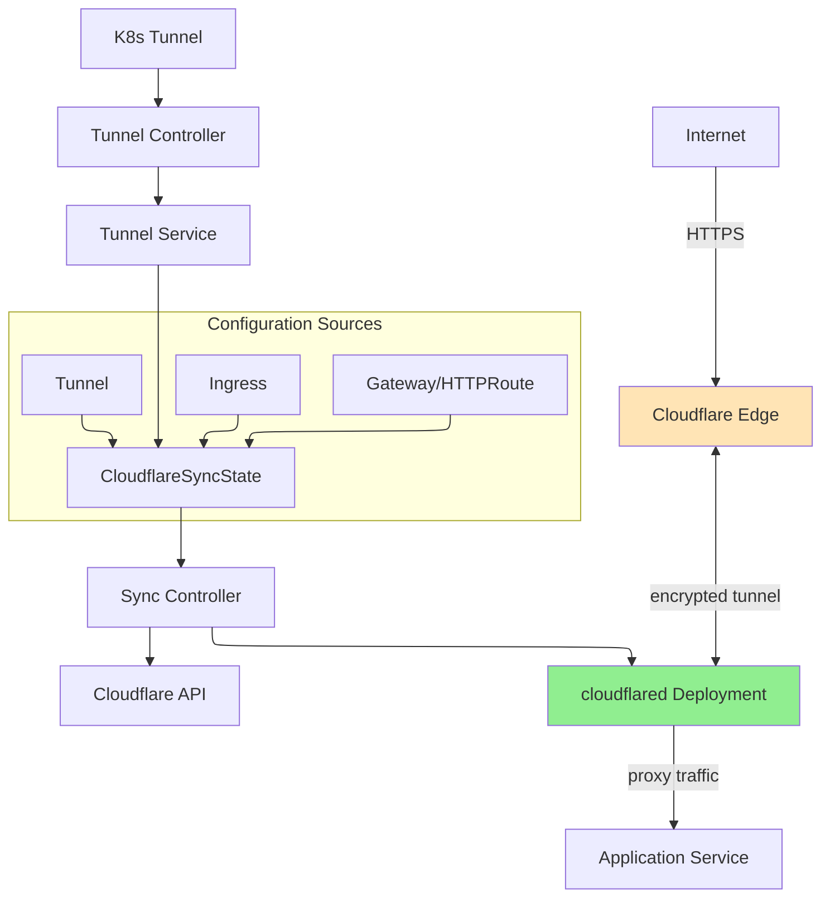

# Tunnel

Tunnel is a namespaced resource that creates and manages Cloudflare Tunnels with automatic cloudflared deployment. It provides a secure way to expose services from your Kubernetes cluster to the internet without opening inbound ports.

## Overview

Cloudflare Tunnel creates an encrypted connection between your Kubernetes cluster and Cloudflare's edge network. When you create a Tunnel resource, the operator automatically deploys cloudflared as a Kubernetes Deployment and manages the tunnel configuration on Cloudflare.

### Key Features

| Feature | Description |
|---------|-------------|
| **Automatic Deployment** | Operator creates and manages cloudflared Deployment automatically |
| **Secure Connection** | All traffic is encrypted and routed through Cloudflare's network |
| **No Inbound Ports** | No need to expose services directly to the internet |
| **Protocol Support** | Supports HTTP/HTTPS, WebSocket, TCP, and UDP protocols |
| **WARP Routing** | Optional private network access via WARP clients |
| **Flexible Configuration** | Customize cloudflared deployment via patch |

### Use Cases

- **Public Web Services**: Expose web applications to the internet securely
- **Internal Services**: Provide Zero Trust access to internal applications
- **Private Networks**: Route private IP ranges through WARP (with `enableWarpRouting: true`)
- **Multi-Protocol**: Support HTTP, HTTPS, gRPC, WebSocket, TCP, and UDP services

## Architecture



## Spec

### Main Fields

| Field | Type | Required | Default | Description |
|-------|------|----------|---------|-------------|
| `newTunnel` | *NewTunnel | No | - | Create a new tunnel (mutually exclusive with `existingTunnel`) |
| `existingTunnel` | *ExistingTunnel | No | - | Use an existing tunnel (mutually exclusive with `newTunnel`) |
| `cloudflare` | CloudflareDetails | **Yes** | - | Cloudflare API credentials and configuration |
| `enableWarpRouting` | bool | No | `false` | Enable WARP routing for private network access |
| `protocol` | string | No | `"auto"` | Tunnel protocol: `"auto"`, `"quic"`, or `"http2"` |
| `fallbackTarget` | string | No | `"http_status:404"` | Default response when no ingress rule matches |
| `noTlsVerify` | bool | No | `false` | Disable origin TLS certificate verification |
| `originCaPool` | string | No | - | Secret containing custom CA certificates for origin TLS |
| `deployPatch` | string | No | `"{}"` | JSON patch for customizing cloudflared Deployment |

### NewTunnel

| Field | Type | Required | Description |
|-------|------|----------|-------------|
| `name` | string | **Yes** | Name for the new tunnel to create on Cloudflare |

### ExistingTunnel

| Field | Type | Required | Description |
|-------|------|----------|-------------|
| `id` | string | No | Existing tunnel UUID (preferred over `name`) |
| `name` | string | No | Existing tunnel name (used if `id` is not provided) |

> **Note**: For `existingTunnel`, at least one of `id` or `name` must be provided. If both are provided, `id` takes precedence.

### CloudflareDetails

See [Configuration Guide](../configuration.md#cloudflare-credentials) for detailed credential configuration options.

Key fields:
- `accountId` - Cloudflare account ID (required)
- `domain` - Domain managed by Cloudflare (required for DNS features)
- `secret` - Secret name containing API credentials (required)
- `credentialsRef` - Reference to CloudflareCredentials resource (recommended)

## Status

| Field | Type | Description |
|-------|------|-------------|
| `tunnelId` | string | Cloudflare tunnel UUID |
| `tunnelName` | string | Cloudflare tunnel name |
| `accountId` | string | Cloudflare account ID |
| `zoneId` | string | Cloudflare zone ID (if domain is configured) |
| `state` | string | Current state: `pending`, `creating`, `active`, `error`, `deleting` |
| `configVersion` | int | Current tunnel configuration version from Cloudflare |
| `syncedHostnames` | []string | Hostnames managed by this Tunnel controller |
| `conditions` | []Condition | Standard Kubernetes conditions |
| `observedGeneration` | int64 | Last observed generation |

## Examples

### Basic New Tunnel

```yaml
apiVersion: networking.cloudflare-operator.io/v1alpha2
kind: Tunnel
metadata:
  name: my-tunnel
  namespace: default
spec:
  newTunnel:
    name: my-k8s-tunnel

  cloudflare:
    accountId: "<your-account-id>"
    domain: example.com
    secret: cloudflare-api-credentials
```

### Use Existing Tunnel by ID

```yaml
apiVersion: networking.cloudflare-operator.io/v1alpha2
kind: Tunnel
metadata:
  name: existing-tunnel
  namespace: production
spec:
  existingTunnel:
    id: "550e8400-e29b-41d4-a716-446655440000"

  cloudflare:
    accountId: "<your-account-id>"
    domain: example.com
    secret: cloudflare-api-credentials
```

### Tunnel with WARP Routing Enabled

For private network access via WARP clients:

```yaml
apiVersion: networking.cloudflare-operator.io/v1alpha2
kind: Tunnel
metadata:
  name: private-network-tunnel
  namespace: default
spec:
  newTunnel:
    name: private-access-tunnel

  # Enable WARP routing for private network access
  enableWarpRouting: true

  cloudflare:
    accountId: "<your-account-id>"
    domain: example.com
    secret: cloudflare-api-credentials
```

### Tunnel with Custom cloudflared Deployment

Customize replicas, resources, and node selectors:

```yaml
apiVersion: networking.cloudflare-operator.io/v1alpha2
kind: Tunnel
metadata:
  name: ha-tunnel
  namespace: production
spec:
  newTunnel:
    name: high-availability-tunnel

  # JSON patch for cloudflared Deployment
  deployPatch: |
    {
      "spec": {
        "replicas": 3,
        "template": {
          "spec": {
            "nodeSelector": {
              "node-type": "edge"
            },
            "resources": {
              "requests": {
                "cpu": "100m",
                "memory": "128Mi"
              },
              "limits": {
                "cpu": "200m",
                "memory": "256Mi"
              }
            }
          }
        }
      }
    }

  cloudflare:
    accountId: "<your-account-id>"
    domain: example.com
    secret: cloudflare-api-credentials
```

### Tunnel with Custom Protocol

Force HTTP/2 protocol instead of auto-negotiation:

```yaml
apiVersion: networking.cloudflare-operator.io/v1alpha2
kind: Tunnel
metadata:
  name: http2-tunnel
  namespace: default
spec:
  newTunnel:
    name: http2-tunnel

  # Force HTTP/2 protocol
  protocol: http2

  cloudflare:
    accountId: "<your-account-id>"
    domain: example.com
    secret: cloudflare-api-credentials
```

### Tunnel with Custom CA Pool

For origins with self-signed certificates:

```yaml
apiVersion: networking.cloudflare-operator.io/v1alpha2
kind: Tunnel
metadata:
  name: custom-ca-tunnel
  namespace: default
spec:
  newTunnel:
    name: custom-ca-tunnel

  # Reference secret containing custom CA certificates
  originCaPool: custom-ca-certificates

  cloudflare:
    accountId: "<your-account-id>"
    domain: example.com
    secret: cloudflare-api-credentials
---
apiVersion: v1
kind: Secret
metadata:
  name: custom-ca-certificates
  namespace: default
type: Opaque
data:
  tls.crt: <base64-encoded-ca-cert>
```

## Prerequisites

1. **Cloudflare Account**: Active Cloudflare account with Zero Trust enabled
2. **API Credentials**: API Token or API Key with appropriate permissions
3. **Kubernetes Secret**: Created secret containing API credentials

### Required API Permissions

| Permission | Scope | Purpose |
|------------|-------|---------|
| `Account:Cloudflare Tunnel:Edit` | Account | Manage tunnel lifecycle |
| `Zone:DNS:Edit` | Zone | Manage DNS records (if using domain) |

See [Configuration Guide](../configuration.md#api-token-permissions) for detailed permission setup.

### Creating Credentials Secret

```yaml
apiVersion: v1
kind: Secret
metadata:
  name: cloudflare-api-credentials
  namespace: default
type: Opaque
stringData:
  # Option 1: API Token (recommended)
  CLOUDFLARE_API_TOKEN: "your-api-token-here"

  # Option 2: API Key + Email
  # CLOUDFLARE_API_KEY: "your-api-key"
  # CLOUDFLARE_EMAIL: "your-email@example.com"
```

## Limitations

- **Tunnel Name Uniqueness**: Tunnel names must be unique within a Cloudflare account
- **Existing Tunnel Credentials**: When using `existingTunnel`, you must manually create a secret containing tunnel credentials
- **Namespace Scope**: Each Tunnel is namespaced; use ClusterTunnel for cluster-wide tunnels
- **Configuration Merging**: Tunnel configuration is merged with Ingress/Gateway rules via CloudflareSyncState

## Tunnel vs ClusterTunnel

| Aspect | Tunnel | ClusterTunnel |
|--------|--------|---------------|
| **Scope** | Namespaced | Cluster-wide |
| **Use Case** | Per-namespace isolation | Shared across namespaces |
| **Secret Location** | Same namespace | `cloudflare-operator-system` |
| **Ingress Binding** | Same namespace only | Any namespace |

## Related Resources

- [ClusterTunnel](clustertunnel.md) - Cluster-scoped tunnel for multi-namespace use
- [DNSRecord](dnsrecord.md) - Manage DNS records for tunnel endpoints
- [Ingress](../guides/ingress-integration.md) - Use native Kubernetes Ingress with Tunnel
- [Gateway API](../guides/gateway-api-integration.md) - Use Gateway API (HTTPRoute) with Tunnel
- [NetworkRoute](networkroute.md) - Route private IP ranges through tunnel (with WARP routing)
- [VirtualNetwork](virtualnetwork.md) - Create virtual networks for private access

## See Also

- [Examples](../../../examples/01-basic/tunnel/)
- [Cloudflare Tunnel Documentation](https://developers.cloudflare.com/cloudflare-one/connections/connect-networks/)
- [cloudflared CLI Reference](https://developers.cloudflare.com/cloudflare-one/connections/connect-networks/downloads/)
