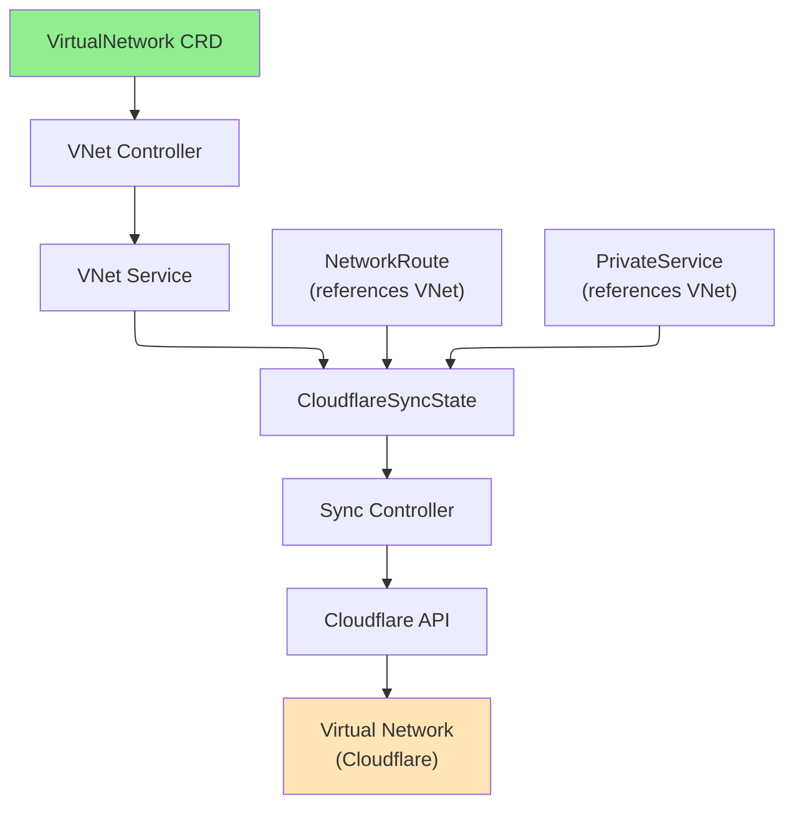

# VirtualNetwork

VirtualNetwork is a cluster-scoped resource that represents a Cloudflare Zero Trust Virtual Network, providing isolated private network address spaces for routing traffic through Cloudflare Tunnels.

## Overview

A Virtual Network creates an isolated private network that can be routed through Cloudflare Tunnels and WARP connectors. Multiple Virtual Networks can exist for the same account, each with its own routing rules and configuration. By default, one Virtual Network serves as the primary routing destination, but you can create additional ones for specific use cases like multi-region deployments or traffic isolation.

### Key Features

| Feature | Description |
|---------|-------------|
| **Isolated Networks** | Create multiple isolated private networks within Cloudflare Zero Trust |
| **Default Network** | Mark one network as default for routing |
| **Comments** | Add optional descriptions for organization and documentation |
| **Account-Level** | Cluster-scoped resources shared across namespaces |

### Use Cases

- **Multi-Region Deployments**: Separate virtual networks for different geographic regions
- **Multi-Tenant**: Isolate traffic between different teams or clients
- **Environment Segregation**: Create separate networks for dev/staging/prod
- **Compliance**: Meet regulatory requirements with network isolation
- **Traffic Management**: Control and route specific IP ranges separately

## Architecture



## Spec

### Main Fields

| Field | Type | Required | Default | Description |
|-------|------|----------|---------|-------------|
| `name` | string | No | Resource name | Name of the Virtual Network in Cloudflare |
| `comment` | string | No | - | Optional description (max 500 characters) |
| `isDefaultNetwork` | bool | No | `false` | Mark this as the default virtual network for the account |
| `cloudflare` | CloudflareDetails | **Yes** | - | Cloudflare API credentials and account information |

### CloudflareDetails

- `accountId` - Cloudflare Account ID (required)
- `domain` - Domain managed by Cloudflare (optional)
- `secret` - Secret name containing API credentials (required)
- `credentialsRef` - Reference to CloudflareCredentials resource (recommended)

## Status

| Field | Type | Description |
|-------|------|-------------|
| `virtualNetworkId` | string | Cloudflare ID of the Virtual Network |
| `accountId` | string | Cloudflare Account ID |
| `state` | string | Current state (active, deleted, etc.) |
| `isDefault` | bool | Whether this is the default Virtual Network |
| `conditions` | []metav1.Condition | Latest observations of resource state |
| `observedGeneration` | int64 | Last generation observed by controller |

## Examples

### Example 1: Default Virtual Network

```yaml
apiVersion: networking.cloudflare-operator.io/v1alpha2
kind: VirtualNetwork
metadata:
  name: default-vnet
spec:
  name: "Default Network"
  comment: "Primary virtual network for all routing"
  isDefaultNetwork: true
  cloudflare:
    accountId: "1234567890abcdef"
    domain: "example.com"
    secret: cloudflare-credentials
```

### Example 2: Regional Virtual Networks

```yaml
apiVersion: networking.cloudflare-operator.io/v1alpha2
kind: VirtualNetwork
metadata:
  name: us-east-vnet
spec:
  name: "US East Virtual Network"
  comment: "Network for US East region deployments"
  cloudflare:
    accountId: "1234567890abcdef"
    domain: "example.com"
    credentialsRef:
      name: production
---
apiVersion: networking.cloudflare-operator.io/v1alpha2
kind: VirtualNetwork
metadata:
  name: eu-west-vnet
spec:
  name: "EU West Virtual Network"
  comment: "Network for EU West region deployments"
  cloudflare:
    accountId: "1234567890abcdef"
    domain: "example.com"
    credentialsRef:
      name: production
```

### Example 3: Multi-Tenant Isolation

```yaml
apiVersion: networking.cloudflare-operator.io/v1alpha2
kind: VirtualNetwork
metadata:
  name: tenant-a-vnet
spec:
  name: "Tenant A Network"
  comment: "Isolated network for Tenant A"
  cloudflare:
    accountId: "1234567890abcdef"
    credentialsRef:
      name: production
---
apiVersion: networking.cloudflare-operator.io/v1alpha2
kind: VirtualNetwork
metadata:
  name: tenant-b-vnet
spec:
  name: "Tenant B Network"
  comment: "Isolated network for Tenant B"
  cloudflare:
    accountId: "1234567890abcdef"
    credentialsRef:
      name: production
```

## Prerequisites

- Cloudflare Zero Trust subscription
- Valid Cloudflare API credentials with appropriate permissions
- Account ID for the target Cloudflare account

## Limitations

- Only one VirtualNetwork can be marked as `isDefaultNetwork: true` per account
- Virtual Networks are account-scoped, not domain-specific
- Network names must be unique per account in Cloudflare
- Virtual Network deletion removes all associated routing

## Related Resources

- [NetworkRoute](networkroute.md) - Define CIDR ranges to route through this VNet
- [PrivateService](privateservice.md) - Expose services through this VNet
- [WARPConnector](warpconnector.md) - Deploy connectors in this VNet
- [Tunnel](tunnel.md) - Route traffic through tunnels in this VNet
- [CloudflareCredentials](cloudflarecredentials.md) - API credentials for VNet management

## See Also

- [Cloudflare Virtual Network Documentation](https://developers.cloudflare.com/cloudflare-one/setup/network/)
- [Cloudflare Zero Trust Networking](https://developers.cloudflare.com/cloudflare-one/)
