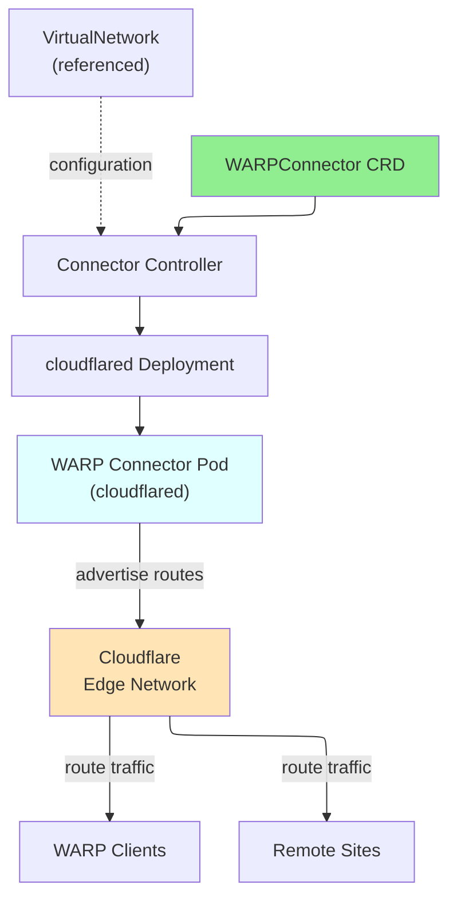

# WARPConnector

WARPConnector is a namespaced resource that deploys and manages Cloudflare WARP connectors in Kubernetes for site-to-site connectivity and private network routing.

## Overview

WARPConnector creates and manages WARP connector deployments within your Kubernetes cluster. These connectors establish outbound-only connections to Cloudflare's network and advertise private network routes, enabling WARP clients and other sites to access resources behind the connector. Multiple connectors can be deployed for redundancy and load distribution.

### Key Features

| Feature | Description |
|---------|-------------|
| **Automatic Deployment** | Creates and manages cloudflared WARP connector Deployment |
| **Route Advertisement** | Automatically advertises configured CIDR routes |
| **High Availability** | Multiple replicas for redundancy |
| **Resource Management** | Configurable CPU and memory resources |
| **Pod Scheduling** | NodeSelector, tolerations, and affinity support |
| **Virtual Network Support** | Associate with specific virtual networks |

### Use Cases

- **Site-to-Site Connectivity**: Connect multiple sites via WARP
- **Route Advertisement**: Advertise private networks to WARP clients
- **Redundant Connections**: Deploy multiple connectors for HA
- **Zero Trust Networking**: Enable secure access to private resources
- **Multi-Region**: Deploy connectors in multiple regions

## Architecture



## Spec

### Main Fields

| Field | Type | Required | Default | Description |
|-------|------|----------|---------|-------------|
| `replicas` | int32 | No | `1` | Number of connector replicas |
| `image` | string | No | `cloudflare/cloudflared:latest` | Container image |
| `virtualNetworkRef` | *VirtualNetworkRef | No | - | Associated Virtual Network |
| `routes` | []WARPConnectorRoute | No | - | Routes to advertise |
| `resources` | *ResourceRequirements | No | - | Compute resources (CPU/memory) |
| `nodeSelector` | map[string]string | No | - | Pod node selector |
| `tolerations` | []Toleration | No | - | Pod tolerations |
| `serviceAccountName` | string | No | - | Service account for connectors |
| `cloudflare` | CloudflareDetails | **Yes** | - | Cloudflare API credentials |

### WARPConnectorRoute

| Field | Type | Required | Description |
|-------|------|----------|-------------|
| `network` | string | **Yes** | CIDR to advertise (e.g., "10.0.0.0/8") |
| `comment` | string | No | Route description |

## Status

| Field | Type | Description |
|-------|------|-------------|
| `connectorId` | string | Cloudflare Connector ID |
| `accountId` | string | Cloudflare Account ID |
| `virtualNetworkId` | string | Associated Virtual Network ID |
| `state` | string | Current state |
| `replicas` | int32 | Number of running replicas |
| `readyReplicas` | int32 | Number of ready replicas |
| `conditions` | []metav1.Condition | Latest observations |

## Examples

### Example 1: Basic WARP Connector

```yaml
apiVersion: networking.cloudflare-operator.io/v1alpha2
kind: WARPConnector
metadata:
  name: main-connector
  namespace: production
spec:
  replicas: 2
  routes:
    - network: "10.0.0.0/8"
      comment: "Internal network"
  cloudflare:
    accountId: "1234567890abcdef"
    credentialsRef:
      name: production
```

### Example 2: Multi-Route with Virtual Network

```yaml
apiVersion: networking.cloudflare-operator.io/v1alpha2
kind: WARPConnector
metadata:
  name: multi-route-connector
  namespace: production
spec:
  replicas: 3
  virtualNetworkRef:
    name: production-vnet
  routes:
    - network: "10.0.0.0/16"
      comment: "Production servers"
    - network: "172.16.0.0/12"
      comment: "Development servers"
    - network: "192.168.0.0/16"
      comment: "Internal services"
  resources:
    requests:
      cpu: "500m"
      memory: "256Mi"
    limits:
      cpu: "1000m"
      memory: "512Mi"
  cloudflare:
    accountId: "1234567890abcdef"
    credentialsRef:
      name: production
```

### Example 3: HA Deployment with Node Selection

```yaml
apiVersion: networking.cloudflare-operator.io/v1alpha2
kind: WARPConnector
metadata:
  name: ha-connector
  namespace: production
spec:
  replicas: 4
  image: "cloudflare/cloudflared:2024.1.0"
  routes:
    - network: "10.0.0.0/8"
  nodeSelector:
    node-type: "connector"
  tolerations:
    - key: "dedicated"
      operator: "Equal"
      value: "connector"
      effect: "NoSchedule"
  serviceAccountName: "warp-connector-sa"
  resources:
    requests:
      cpu: "1000m"
      memory: "512Mi"
    limits:
      cpu: "2000m"
      memory: "1Gi"
  cloudflare:
    accountId: "1234567890abcdef"
    credentialsRef:
      name: production
```

## Prerequisites

- Cloudflare Zero Trust subscription
- Cloudflare Connector enabled in account
- Valid Cloudflare API credentials
- Kubernetes cluster with RBAC configured
- Sufficient resources for connector pods

## Limitations

- Each connector advertises routes independently
- Multiple connectors cannot advertise different routes for same CIDR
- Connector registration requires valid credentials
- Routes must be unique within connector
- Image must be publicly accessible or available in cluster

## Related Resources

- [VirtualNetwork](virtualnetwork.md) - Virtual network for connector routing
- [NetworkRoute](networkroute.md) - Alternative route definition method
- [Tunnel](tunnel.md) - Tunnel-based routing alternative
- [CloudflareCredentials](cloudflarecredentials.md) - API credentials

## See Also

- [Cloudflare WARP Connectors](https://developers.cloudflare.com/cloudflare-one/connections/connect-networks/deploy-warp-connector/)
- [cloudflared Documentation](https://developers.cloudflare.com/cloudflare-one/connections/cloudflared-tunnel/)
- [Kubernetes Deployments](https://kubernetes.io/docs/concepts/workloads/controllers/deployment/)
