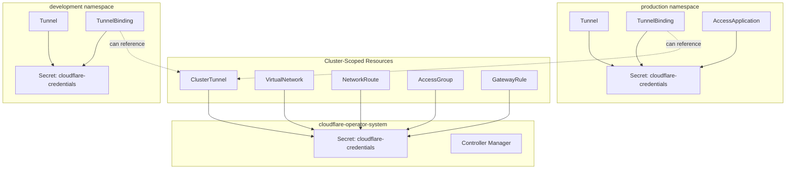

# Namespace Restrictions and Secret Management

This document explains how CRD scope affects Secret lookup and provides guidance on proper credential configuration.

## Overview

The Cloudflare Operator manages resources at two different scopes:

- **Cluster-scoped**: Resources accessible across all namespaces
- **Namespaced**: Resources confined to a specific namespace

The scope determines where the operator looks for Cloudflare API credentials (Secrets).

## CRD Scope Reference

### Cluster-Scoped CRDs (13)

These resources are not bound to any namespace. Secrets must be in the **operator namespace** (`cloudflare-operator-system`).

| CRD | Category | Description |
|-----|----------|-------------|
| CloudflareCredentials | Core | Shared API credential configuration |
| ClusterTunnel | Tunnel | Cluster-wide Cloudflare Tunnel |
| VirtualNetwork | Network | Traffic isolation virtual network |
| NetworkRoute | Network | CIDR routing through tunnel |
| WARPConnector | Network | WARP connector for site-to-site |
| AccessGroup | Access | Reusable access policy group |
| AccessIdentityProvider | Access | Identity provider configuration |
| GatewayRule | Gateway | DNS/HTTP/L4 policy rule |
| GatewayList | Gateway | List for gateway rules |
| GatewayConfiguration | Gateway | Global gateway settings |
| DeviceSettingsPolicy | Device | WARP client configuration |
| DevicePostureRule | Device | Device health check rule |
| TunnelGatewayClassConfig | K8s Integration | Gateway API integration config |

### Namespaced CRDs (8)

These resources exist within a specific namespace. Secrets must be in the **same namespace** as the resource.

| CRD | Category | Description |
|-----|----------|-------------|
| Tunnel | Tunnel | Namespace-scoped Cloudflare Tunnel |
| TunnelBinding | Tunnel | Bind Services to Tunnels with DNS |
| AccessApplication | Access | Zero Trust application |
| AccessServiceToken | Access | M2M authentication token |
| AccessTunnel | Access | Access-protected tunnel endpoint |
| PrivateService | Network | Private IP service exposure |
| DNSRecord | DNS | DNS record management |
| TunnelIngressClassConfig | K8s Integration | Ingress integration config |

## Secret Lookup Rules

### Rule 1: Namespaced Resources

For namespaced CRDs, the operator looks for the Secret in the **same namespace** as the resource.

```yaml
# Example: Tunnel in "production" namespace
apiVersion: networking.cloudflare-operator.io/v1alpha2
kind: Tunnel
metadata:
  name: my-tunnel
  namespace: production  # Resource namespace
spec:
  cloudflare:
    accountId: "abc123"
    domain: example.com
    secret: cloudflare-credentials  # Must exist in "production" namespace
```

Secret must be in the same namespace:

```yaml
apiVersion: v1
kind: Secret
metadata:
  name: cloudflare-credentials
  namespace: production  # Same as Tunnel namespace
type: Opaque
stringData:
  CLOUDFLARE_API_TOKEN: "your-token"
```

### Rule 2: Cluster-Scoped Resources

For cluster-scoped CRDs, the operator looks for the Secret in the **operator namespace** (`cloudflare-operator-system`).

```yaml
# Example: ClusterTunnel (cluster-scoped)
apiVersion: networking.cloudflare-operator.io/v1alpha2
kind: ClusterTunnel
metadata:
  name: shared-tunnel
  # No namespace - cluster-scoped
spec:
  cloudflare:
    accountId: "abc123"
    domain: example.com
    secret: cloudflare-credentials  # Must exist in operator namespace
```

Secret must be in the operator namespace:

```yaml
apiVersion: v1
kind: Secret
metadata:
  name: cloudflare-credentials
  namespace: cloudflare-operator-system  # Operator namespace
type: Opaque
stringData:
  CLOUDFLARE_API_TOKEN: "your-token"
```

### Rule 3: TunnelBinding Special Case

`TunnelBinding` is namespaced but can reference either a `Tunnel` (namespaced) or `ClusterTunnel` (cluster-scoped).

**Referencing a Tunnel (same namespace):**

```yaml
apiVersion: networking.cloudflare-operator.io/v1alpha2
kind: TunnelBinding
metadata:
  name: my-binding
  namespace: production
spec:
  tunnelRef:
    kind: Tunnel
    name: my-tunnel  # Must be in "production" namespace
```

**Referencing a ClusterTunnel:**

```yaml
apiVersion: networking.cloudflare-operator.io/v1alpha2
kind: TunnelBinding
metadata:
  name: my-binding
  namespace: production
spec:
  tunnelRef:
    kind: ClusterTunnel
    name: shared-tunnel  # Cluster-scoped, no namespace needed
```

## Architecture Diagram



## Best Practices

### 1. Use CloudflareCredentials for Cluster Resources

For cluster-scoped resources, consider using the `CloudflareCredentials` CRD to centralize credential management:

```yaml
apiVersion: networking.cloudflare-operator.io/v1alpha2
kind: CloudflareCredentials
metadata:
  name: main-credentials
spec:
  accountId: "abc123"
  secret:
    name: cloudflare-api-token
    namespace: cloudflare-operator-system
```

### 2. Isolate Credentials Per Namespace

For multi-tenant environments, create separate Secrets per namespace with appropriately scoped API tokens:

```yaml
# Production - Full access token
apiVersion: v1
kind: Secret
metadata:
  name: cloudflare-credentials
  namespace: production
stringData:
  CLOUDFLARE_API_TOKEN: "production-token-with-full-access"
---
# Development - Limited access token
apiVersion: v1
kind: Secret
metadata:
  name: cloudflare-credentials
  namespace: development
stringData:
  CLOUDFLARE_API_TOKEN: "dev-token-with-limited-zones"
```

### 3. Use ClusterTunnel for Shared Infrastructure

When multiple namespaces need to share a tunnel:

```yaml
# Cluster-scoped tunnel (credentials in operator namespace)
apiVersion: networking.cloudflare-operator.io/v1alpha2
kind: ClusterTunnel
metadata:
  name: shared-tunnel
spec:
  newTunnel:
    name: k8s-shared-tunnel
  cloudflare:
    accountId: "abc123"
    domain: example.com
    secret: cloudflare-credentials
---
# TunnelBinding in any namespace can reference it
apiVersion: networking.cloudflare-operator.io/v1alpha2
kind: TunnelBinding
metadata:
  name: app-binding
  namespace: team-a
spec:
  tunnelRef:
    kind: ClusterTunnel
    name: shared-tunnel
  subjects:
    - kind: Service
      name: my-app
```

## RBAC Considerations

The operator's ClusterRole grants permissions to read Secrets across all namespaces:

```yaml
- apiGroups: [""]
  resources: ["secrets"]
  verbs: ["get", "list", "watch"]
```

This is necessary because:
- Namespaced resources need Secrets in their namespace
- Cluster-scoped resources need Secrets in the operator namespace
- TunnelBinding may reference ClusterTunnel credentials

## Troubleshooting

### Secret Not Found

**Error**: `Secret "cloudflare-credentials" not found`

**Cause**: Secret is in the wrong namespace.

**Solution**:
1. Check if the CRD is cluster-scoped or namespaced
2. Create the Secret in the correct namespace:
   - Namespaced CRD: Same namespace as the resource
   - Cluster-scoped CRD: `cloudflare-operator-system`

### Permission Denied on Secret

**Error**: `secrets "cloudflare-credentials" is forbidden`

**Cause**: RBAC not configured correctly.

**Solution**: Ensure the operator ServiceAccount has permissions to read Secrets in the target namespace.

### TunnelBinding Can't Find Tunnel

**Error**: `Tunnel "my-tunnel" not found`

**Cause**: Wrong tunnel reference type or namespace.

**Solution**:
- For `kind: Tunnel`: Ensure the Tunnel exists in the same namespace as the TunnelBinding
- For `kind: ClusterTunnel`: Ensure the ClusterTunnel exists (cluster-scoped, no namespace)

## Quick Reference Table

| Resource Type | Secret Location | Example Namespace |
|---------------|-----------------|-------------------|
| Tunnel | Same as resource | `production` |
| ClusterTunnel | Operator namespace | `cloudflare-operator-system` |
| TunnelBinding | Same as resource | `production` |
| VirtualNetwork | Operator namespace | `cloudflare-operator-system` |
| NetworkRoute | Operator namespace | `cloudflare-operator-system` |
| AccessApplication | Same as resource | `production` |
| AccessGroup | Operator namespace | `cloudflare-operator-system` |
| DNSRecord | Same as resource | `production` |
| GatewayRule | Operator namespace | `cloudflare-operator-system` |
