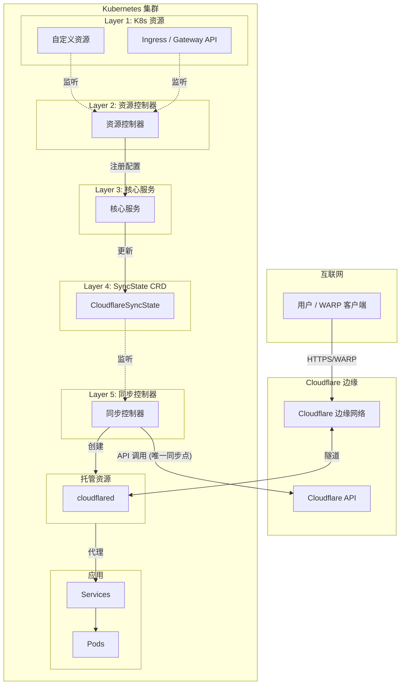

# Cloudflare Operator 文档

欢迎阅读 Cloudflare Zero Trust Operator 文档。此 operator 实现了 Kubernetes 原生的 Cloudflare Zero Trust 资源管理。

## 快速导航

| 主题 | 说明 |
|------|------|
| [快速开始](getting-started.md) | 安装和创建第一个隧道 |
| [配置](configuration.md) | API token 和凭证 |
| [命名空间限制](namespace-restrictions.md) | CRD 作用域与 Secret 管理 |
| [API 参考](api-reference/) | 完整 CRD 文档 |
| [指南](guides/) | 常见任务操作指南 |
| [故障排除](troubleshooting.md) | 常见问题和解决方案 |
| [迁移](migration.md) | 从 v1alpha1 升级 |

## 概述

Cloudflare Operator 提供以下 Kubernetes 原生管理功能：

- **隧道** - 从集群到 Cloudflare 边缘的安全连接
- **私有网络访问** - 允许 WARP 客户端访问内部服务
- **访问控制** - 应用的 Zero Trust 认证
- **网关** - DNS/HTTP/L4 安全策略
- **设备管理** - WARP 客户端配置和态势规则
- **Kubernetes 集成** - 原生 Ingress 和 Gateway API 支持

## 架构

Operator 采用**统一同步架构**，包含六层：

```
K8s 资源 → 资源控制器 → 核心服务 → SyncState CRD → 同步控制器 → Cloudflare API
```



### 核心优势

| 特性 | 说明 |
|------|------|
| **单一同步点** | 只有同步控制器调用 Cloudflare API |
| **无竞态条件** | SyncState CRD 使用 K8s 乐观锁 |
| **防抖** | 500ms 延迟聚合多次变更 |
| **Hash 检测** | 配置无变化时跳过同步 |

> 详见[统一同步架构](../design/UNIFIED_SYNC_ARCHITECTURE.md)。

## CRD 摘要 (共 34 个)

### 凭证与配置

| CRD | 作用域 | 说明 |
|-----|--------|------|
| `CloudflareCredentials` | Cluster | 共享 API 凭证配置 |
| `CloudflareDomain` | Cluster | Zone 设置 (SSL/TLS, 缓存, 安全, WAF) |

### 隧道管理

| CRD | 作用域 | 说明 |
|-----|--------|------|
| `Tunnel` | Namespaced | 带托管 cloudflared 的 Cloudflare Tunnel |
| `ClusterTunnel` | Cluster | 集群级 Cloudflare Tunnel |
| `TunnelBinding` | Namespaced | 将服务绑定到隧道并配置 DNS |

### 私有网络

| CRD | 作用域 | 说明 |
|-----|--------|------|
| `VirtualNetwork` | Cluster | 流量隔离网络 |
| `NetworkRoute` | Cluster | 通过隧道路由 CIDR |
| `PrivateService` | Namespaced | 通过私有 IP 暴露服务 |
| `WARPConnector` | Namespaced | 站点间 WARP 连接器 |

### 访问控制

| CRD | 作用域 | 说明 |
|-----|--------|------|
| `AccessApplication` | Namespaced | Zero Trust 应用 |
| `AccessGroup` | Cluster | 可复用的访问策略组 |
| `AccessPolicy` | Cluster | 可复用的访问策略模板 |
| `AccessIdentityProvider` | Cluster | 身份提供商配置 |
| `AccessServiceToken` | Namespaced | M2M 认证令牌 |
| `AccessTunnel` | Namespaced | Access 保护的隧道端点 |

### 网关与安全

| CRD | 作用域 | 说明 |
|-----|--------|------|
| `GatewayRule` | Cluster | DNS/HTTP/L4 策略规则 |
| `GatewayList` | Cluster | 网关规则使用的列表 |
| `GatewayConfiguration` | Cluster | 全局网关设置 |

### 设备管理

| CRD | 作用域 | 说明 |
|-----|--------|------|
| `DeviceSettingsPolicy` | Cluster | WARP 客户端配置 |
| `DevicePostureRule` | Cluster | 设备健康检查规则 |

### DNS 与连接

| CRD | 作用域 | 说明 |
|-----|--------|------|
| `DNSRecord` | Namespaced | DNS 记录管理 |

### SSL/TLS 与证书

| CRD | 作用域 | 说明 |
|-----|--------|------|
| `OriginCACertificate` | Namespaced | Cloudflare Origin CA 证书 (自动创建 K8s Secret) |

### R2 存储

| CRD | 作用域 | 说明 |
|-----|--------|------|
| `R2Bucket` | Namespaced | R2 存储桶 (支持生命周期规则) |
| `R2BucketDomain` | Namespaced | R2 存储桶自定义域名 |
| `R2BucketNotification` | Namespaced | R2 存储桶事件通知 |

### 规则引擎

| CRD | 作用域 | 说明 |
|-----|--------|------|
| `ZoneRuleset` | Namespaced | Zone 规则集 (WAF, 速率限制等) |
| `TransformRule` | Namespaced | URL 重写与请求头修改 |
| `RedirectRule` | Namespaced | URL 重定向规则 |

### Cloudflare Pages

| CRD | 作用域 | 说明 |
|-----|--------|------|
| `PagesProject` | Namespaced | Pages 项目（构建配置、资源绑定）|
| `PagesDomain` | Namespaced | Pages 项目自定义域名 |
| `PagesDeployment` | Namespaced | Pages 部署（创建、重试、回滚）|

### 域名注册 (企业版)

| CRD | 作用域 | 说明 |
|-----|--------|------|
| `DomainRegistration` | Cluster | 域名注册设置 |

### Kubernetes 集成

| CRD | 作用域 | 说明 |
|-----|--------|------|
| `TunnelIngressClassConfig` | Cluster | Ingress 集成配置 |
| `TunnelGatewayClassConfig` | Cluster | Gateway API 集成配置 |

> **说明**：Operator 还支持原生 Kubernetes `Ingress` 和 Gateway API（`Gateway`、`HTTPRoute`、`TCPRoute`、`UDPRoute`）资源，需配置相应的 IngressClass 或 GatewayClass。

## 命名空间与 Secret 规则

Operator 根据 CRD 作用域使用不同的 Secret 查找规则：

| 资源作用域 | Secret 位置 |
|-----------|-------------|
| Namespaced | 与资源相同的命名空间 |
| Cluster | Operator 命名空间（`cloudflare-operator-system`）|

详细信息请参阅 [命名空间限制](namespace-restrictions.md)。

## 获取帮助

- **示例**：查看 [/examples](../../examples/) 获取实用示例
- **问题**：[GitHub Issues](https://github.com/StringKe/cloudflare-operator/issues)
- **讨论**：[GitHub Discussions](https://github.com/StringKe/cloudflare-operator/discussions)

## 版本信息

- 当前版本：v0.27.x (Alpha)
- API 版本：`networking.cloudflare-operator.io/v1alpha2`
- Kubernetes：v1.28+
- Go：1.25
- controller-runtime：v0.22
- cloudflare-go SDK：v0.116.0
- gateway-api：v1.4.1

## 版本变更

### v0.27.x - AccessApplication 内联策略与 NetworkRoute 改进
- **AccessApplication 内联策略**：直接在 AccessApplication spec 中定义 include/exclude/require 规则，无需单独创建 AccessPolicy 资源
- **NetworkRoute 跨 VNet 采用**：修复 VirtualNetworkID 处理，正确搜索和采用所有虚拟网络中的路由
- 新增 API 方法：`ListTunnelRoutesByNetwork`、`GetDefaultVirtualNetwork`、`ListVirtualNetworks`

### v0.26.0 - Cloudflare Pages 支持
- **PagesProject CRD**：完整 Pages 项目管理，支持构建配置、环境变量、资源绑定（KV、R2、D1、Durable Objects、Queues、AI、Vectorize、Hyperdrive）
- **PagesDomain CRD**：Pages 项目自定义域名管理，跟踪验证状态
- **PagesDeployment CRD**：部署操作（创建、重试、回滚），跟踪阶段历史
- Pages CRD 完整六层架构实现
- 所有 Pages 控制器的单元测试和 E2E 测试

### v0.25.0 - 统一聚合模式
- **L5 同步控制器**：统一聚合模式实现一致的状态管理
- 改进配置 Hash 计算以检测变更
- 增强防抖机制减少 API 调用

### v0.24.0 - AccessPolicy CRD
- **AccessPolicy CRD**：Zero Trust 应用的可复用访问策略模板
- 支持所有策略规则类型：include、exclude、require
- 可被多个 AccessApplication 资源引用

### v0.23.x - 统一同步架构与全面测试
- **统一同步架构**：六层架构与 CloudflareSyncState CRD（100% CRD 覆盖）
- **E2E 测试框架**：完整的 Mock 服务器和测试基础设施
  - WARP Connector 生命周期测试
  - 删除处理的状态一致性测试
  - Tunnel 生命周期 E2E 测试
- **单元测试扩展**：L5 同步控制器和 L3 服务的新测试覆盖
  - `lifecycle_controller_test.go` - Tunnel 生命周期同步测试
  - `connector_controller_test.go` - WARP Connector 同步测试
  - `lifecycle_service_test.go` - Tunnel 服务测试
  - `connector_service_test.go` - WARP 服务测试
  - `origincacertificate_controller_test.go` - 证书同步测试
  - `domainregistration_controller_test.go` - 域名注册同步测试
- **竞态条件修复**：单一同步点消除并发 API 冲突
- **防抖机制**：500ms 聚合减少 API 调用

### v0.22.x - 性能改进
- Tunnel 配置的读取-合并-写入模式
- WARP 路由配置同步到 Cloudflare 远程配置
- 改进错误处理和重试逻辑

### v0.21.0 - 类型安全改进
- 将所有 `interface{}`/`any` 类型替换为精确类型结构体
- 30+ 类型化结构体用于 Access 规则、Gateway 设置、DNS 记录数据
- 新增 200+ 单元测试覆盖类型转换函数

### v0.20.0 - 新增 CRD
- **R2 存储**：R2Bucket、R2BucketDomain、R2BucketNotification
- **规则引擎**：ZoneRuleset、TransformRule、RedirectRule
- **SSL/TLS**：OriginCACertificate (自动创建 K8s Secret)
- **域名注册**：DomainRegistration (企业版)
- OpenSSF Scorecard 安全合规改进

### v0.19.0 - 多 Zone 支持
- **CloudflareDomain** CRD 用于 Zone 设置 (SSL/TLS, 缓存, 安全, WAF)
- DNSRecord 资源支持多 Zone DNS

### v0.18.0 - Kubernetes 集成
- 原生 Kubernetes Ingress 控制器支持
- Gateway API 支持 (Gateway, HTTPRoute, TCPRoute, UDPRoute)
- TunnelIngressClassConfig 和 TunnelGatewayClassConfig CRD
