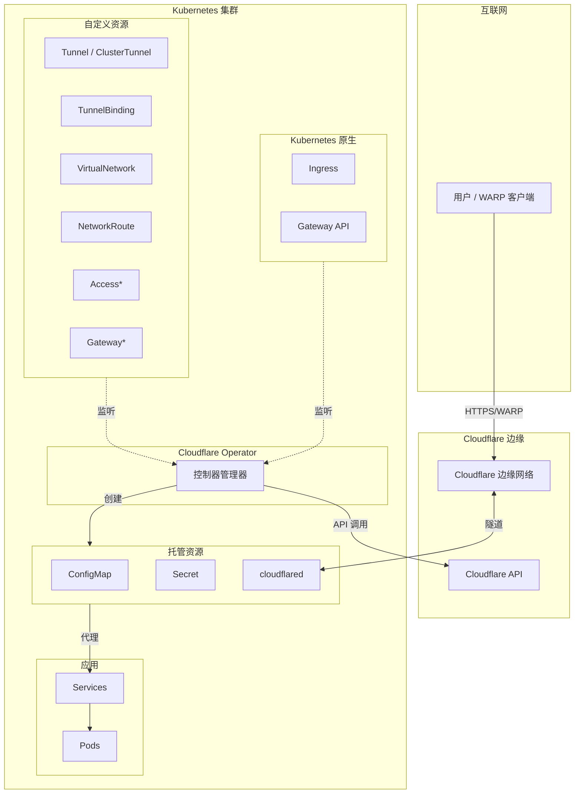

# Cloudflare Operator 文档

欢迎阅读 Cloudflare Zero Trust Operator 文档。此 operator 实现了 Kubernetes 原生的 Cloudflare Zero Trust 资源管理。

## 快速导航

| 主题 | 说明 |
|------|------|
| [快速开始](getting-started.md) | 安装和创建第一个隧道 |
| [配置](configuration.md) | API token 和凭证 |
| [命名空间限制](namespace-restrictions.md) | CRD 作用域与 Secret 管理 |
| [API 参考](api-reference/) | 完整 CRD 文档 |
| [指南](guides/) | 常见任务操作指南 |
| [故障排除](troubleshooting.md) | 常见问题和解决方案 |
| [迁移](migration.md) | 从 v1alpha1 升级 |

## 概述

Cloudflare Operator 提供以下 Kubernetes 原生管理功能：

- **隧道** - 从集群到 Cloudflare 边缘的安全连接
- **私有网络访问** - 允许 WARP 客户端访问内部服务
- **访问控制** - 应用的 Zero Trust 认证
- **网关** - DNS/HTTP/L4 安全策略
- **设备管理** - WARP 客户端配置和态势规则
- **Kubernetes 集成** - 原生 Ingress 和 Gateway API 支持

## 架构

## CRD 摘要

### 核心凭证

| CRD | 作用域 | 说明 |
|-----|--------|------|
| `CloudflareCredentials` | Cluster | 共享 API 凭证配置 |

### 隧道管理

| CRD | 作用域 | 说明 |
|-----|--------|------|
| `Tunnel` | Namespaced | 带托管 cloudflared 的 Cloudflare Tunnel |
| `ClusterTunnel` | Cluster | 集群级 Cloudflare Tunnel |
| `TunnelBinding` | Namespaced | 将服务绑定到隧道并配置 DNS |

### 私有网络

| CRD | 作用域 | 说明 |
|-----|--------|------|
| `VirtualNetwork` | Cluster | 流量隔离网络 |
| `NetworkRoute` | Cluster | 通过隧道路由 CIDR |
| `PrivateService` | Namespaced | 通过私有 IP 暴露服务 |
| `WARPConnector` | Cluster | 站点间 WARP 连接器 |

### 访问控制

| CRD | 作用域 | 说明 |
|-----|--------|------|
| `AccessApplication` | Namespaced | Zero Trust 应用 |
| `AccessGroup` | Cluster | 可复用的访问策略组 |
| `AccessIdentityProvider` | Cluster | 身份提供商配置 |
| `AccessServiceToken` | Namespaced | M2M 认证令牌 |
| `AccessTunnel` | Namespaced | Access 保护的隧道端点 |

### 网关与安全

| CRD | 作用域 | 说明 |
|-----|--------|------|
| `GatewayRule` | Cluster | DNS/HTTP/L4 策略规则 |
| `GatewayList` | Cluster | 网关规则使用的列表 |
| `GatewayConfiguration` | Cluster | 全局网关设置 |

### 设备管理

| CRD | 作用域 | 说明 |
|-----|--------|------|
| `DeviceSettingsPolicy` | Cluster | WARP 客户端配置 |
| `DevicePostureRule` | Cluster | 设备健康检查规则 |

### DNS 与连接

| CRD | 作用域 | 说明 |
|-----|--------|------|
| `DNSRecord` | Namespaced | DNS 记录管理 |

### Kubernetes 集成

| CRD | 作用域 | 说明 |
|-----|--------|------|
| `TunnelIngressClassConfig` | Namespaced | Ingress 集成配置 |
| `TunnelGatewayClassConfig` | Cluster | Gateway API 集成配置 |

> **说明**：Operator 还支持原生 Kubernetes `Ingress` 和 Gateway API（`Gateway`、`HTTPRoute`、`TCPRoute`、`UDPRoute`）资源，需配置相应的 IngressClass 或 GatewayClass。

## 命名空间与 Secret 规则

Operator 根据 CRD 作用域使用不同的 Secret 查找规则：

| 资源作用域 | Secret 位置 |
|-----------|-------------|
| Namespaced | 与资源相同的命名空间 |
| Cluster | Operator 命名空间（`cloudflare-operator-system`）|

详细信息请参阅 [命名空间限制](namespace-restrictions.md)。

## 获取帮助

- **示例**：查看 [/examples](../../examples/) 获取实用示例
- **问题**：[GitHub Issues](https://github.com/StringKe/cloudflare-operator/issues)
- **讨论**：[GitHub Discussions](https://github.com/StringKe/cloudflare-operator/discussions)

## 版本信息

- 当前版本：v0.18.x (Alpha)
- API 版本：`networking.cloudflare-operator.io/v1alpha2`
- Kubernetes：v1.28+
- Go：1.24+
