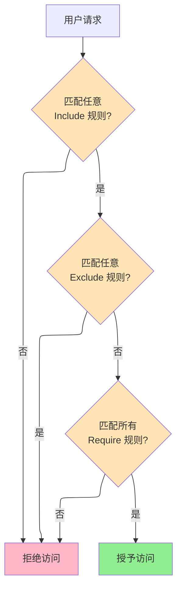
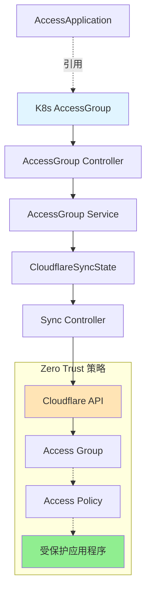

# AccessGroup

AccessGroup 是集群级资源，用于在 Cloudflare Zero Trust 中定义可重用的访问控制规则。Access Group 使用 包含/排除/必需 逻辑来确定用户是否有资格访问应用程序和策略。

## 概述

AccessGroup 提供了一种集中化的方式来定义谁可以访问您的应用程序。Group 可以被多个 AccessApplication 资源引用，从而在整个基础设施中实现一致且易于维护的访问控制。

### 访问控制逻辑



### 使用场景

| 场景 | AccessGroup 配置 |
|------|-----------------|
| **部门访问** | Include: `emailDomain: company.com`, Exclude: 承包商 |
| **地理限制** | Include: 员工, Require: `country: ["US", "CA"]` |
| **MFA 强制** | Include: 员工, Require: `authMethod: mfa` |
| **服务到服务** | Include: `anyValidServiceToken: true` |

## Spec

| 字段 | 类型 | 必需 | 默认值 | 描述 |
|------|------|------|--------|------|
| `name` | string | 否 | K8s 资源名称 | Cloudflare 中的 Access Group 名称 |
| `include` | []AccessGroupRule | **是** | - | 包含规则（OR 逻辑） |
| `exclude` | []AccessGroupRule | 否 | - | 排除规则（NOT 逻辑） |
| `require` | []AccessGroupRule | 否 | - | 必需规则（AND 逻辑，所有规则必须匹配） |
| `isDefault` | bool | 否 | `false` | 标记为默认组 |
| `cloudflare` | CloudflareDetails | **是** | - | Cloudflare API 凭证 |

### AccessGroupRule 类型

AccessGroupRule 支持以下规则类型。每种规则类型都有自己的配置：

| 规则类型 | 描述 | 示例 |
|---------|------|------|
| `email` | 匹配特定邮箱 | `email: { email: "admin@example.com" }` |
| `emailDomain` | 匹配邮箱域名 | `emailDomain: { domain: "example.com" }` |
| `emailList` | 匹配预定义的邮箱列表 | `emailList: { id: "list-uuid" }` |
| `everyone` | 匹配所有用户 | `everyone: true` |
| `ipRanges` | 匹配 IP 范围 | `ipRanges: { ip: ["10.0.0.0/8"] }` |
| `ipList` | 匹配预定义的 IP 列表 | `ipList: { id: "list-uuid" }` |
| `country` | 匹配国家代码 | `country: { country: ["US", "CA"] }` |
| `group` | 匹配 IdP 组 | `group: { id: "group-id" }` |
| `serviceToken` | 匹配特定服务令牌 | `serviceToken: { tokenId: "token-id" }` |
| `anyValidServiceToken` | 匹配任何有效的服务令牌 | `anyValidServiceToken: true` |
| `certificate` | 匹配客户端证书 | `certificate: true` |
| `commonName` | 匹配证书 CN | `commonName: { commonName: "*.example.com" }` |
| `devicePosture` | 匹配设备态势检查 | `devicePosture: { integrationUid: "uid" }` |
| `gsuite` | 匹配 Google Workspace | `gsuite: { email: "user@example.com", identityProviderId: "id" }` |
| `github` | 匹配 GitHub 组织/团队 | `github: { name: "org-name", identityProviderId: "id" }` |
| `azure` | 匹配 Azure AD 组 | `azure: { id: "group-id", identityProviderId: "id" }` |
| `okta` | 匹配 Okta 组 | `okta: { name: "group-name", identityProviderId: "id" }` |
| `oidc` | 匹配 OIDC 声明 | `oidc: { claimName: "role", claimValue: "admin", identityProviderId: "id" }` |
| `saml` | 匹配 SAML 属性 | `saml: { attributeName: "role", attributeValue: "admin", identityProviderId: "id" }` |
| `authMethod` | 匹配认证方法（MFA） | `authMethod: { authMethod: "mfa" }` |
| `authContext` | 匹配 Azure 认证上下文 | `authContext: { id: "ctx-id", acId: "ac-id", identityProviderId: "id" }` |
| `loginMethod` | 匹配 IdP | `loginMethod: { id: "idp-id" }` |
| `externalEvaluation` | 外部 API 评估 | `externalEvaluation: { evaluateUrl: "https://...", keysUrl: "https://..." }` |

## Status

| 字段 | 类型 | 描述 |
|------|------|------|
| `groupId` | string | Cloudflare Access Group ID |
| `accountId` | string | Cloudflare 账户 ID |
| `state` | string | 当前状态（pending、Ready、Error） |
| `conditions` | []Condition | 标准 Kubernetes 条件 |
| `observedGeneration` | int64 | 最后观察到的 generation |

## 示例

### 基础员工组

```yaml
apiVersion: networking.cloudflare-operator.io/v1alpha2
kind: AccessGroup
metadata:
  name: employees
spec:
  name: Company Employees
  include:
    - emailDomain:
        domain: "example.com"

  cloudflare:
    accountId: "<account-id>"
    domain: example.com
    secret: cloudflare-credentials
```

### 带地理限制的部门

```yaml
apiVersion: networking.cloudflare-operator.io/v1alpha2
kind: AccessGroup
metadata:
  name: engineering-us
spec:
  name: Engineering Team - US Only
  include:
    - emailDomain:
        domain: "example.com"
  require:
    - country:
        country: ["US"]

  cloudflare:
    accountId: "<account-id>"
    domain: example.com
    secret: cloudflare-credentials
```

### 排除承包商

```yaml
apiVersion: networking.cloudflare-operator.io/v1alpha2
kind: AccessGroup
metadata:
  name: full-time-employees
spec:
  name: Full-Time Employees Only
  include:
    - emailDomain:
        domain: "example.com"
  exclude:
    - emailDomain:
        domain: "contractor.example.com"
    - email:
        email: "temp-worker@example.com"

  cloudflare:
    accountId: "<account-id>"
    domain: example.com
    secret: cloudflare-credentials
```

### 需要 MFA 的组

```yaml
apiVersion: networking.cloudflare-operator.io/v1alpha2
kind: AccessGroup
metadata:
  name: admin-with-mfa
spec:
  name: Admins with MFA
  include:
    - emailDomain:
        domain: "example.com"
  require:
    - authMethod:
        authMethod: "mfa"

  cloudflare:
    accountId: "<account-id>"
    domain: example.com
    secret: cloudflare-credentials
```

### 服务令牌组（机器到机器）

```yaml
apiVersion: networking.cloudflare-operator.io/v1alpha2
kind: AccessGroup
metadata:
  name: api-services
spec:
  name: API Service Tokens
  include:
    - anyValidServiceToken: true

  cloudflare:
    accountId: "<account-id>"
    domain: example.com
    secret: cloudflare-credentials
```

### 多条件（高级）

```yaml
apiVersion: networking.cloudflare-operator.io/v1alpha2
kind: AccessGroup
metadata:
  name: secure-admin
spec:
  name: Secure Admin Access
  include:
    # 包含特定管理员邮箱
    - email:
        email: "admin@example.com"
    - email:
        email: "security@example.com"
  exclude:
    # 排除来自特定国家的访问
    - country:
        country: ["CN", "RU"]
  require:
    # 必须有 MFA
    - authMethod:
        authMethod: "mfa"
    # 并且必须来自企业网络
    - ipRanges:
        ip: ["10.0.0.0/8", "192.168.0.0/16"]

  cloudflare:
    accountId: "<account-id>"
    domain: example.com
    secret: cloudflare-credentials
```

### GitHub 组织成员

```yaml
apiVersion: networking.cloudflare-operator.io/v1alpha2
kind: AccessGroup
metadata:
  name: github-org-members
spec:
  name: GitHub Organization Members
  include:
    - github:
        name: "my-org"
        identityProviderId: "<github-idp-id>"
        teams:
          - "engineering"
          - "platform"

  cloudflare:
    accountId: "<account-id>"
    domain: example.com
    secret: cloudflare-credentials
```

### Okta 组与设备态势

```yaml
apiVersion: networking.cloudflare-operator.io/v1alpha2
kind: AccessGroup
metadata:
  name: okta-secure
spec:
  name: Okta Users with Secure Device
  include:
    - okta:
        name: "Engineering"
        identityProviderId: "<okta-idp-id>"
  require:
    - devicePosture:
        integrationUid: "<posture-check-uid>"

  cloudflare:
    accountId: "<account-id>"
    domain: example.com
    secret: cloudflare-credentials
```

## Access Group 流程图



## 相关资源

- [AccessApplication](accessapplication.md) - 在策略中引用 AccessGroup
- [AccessPolicy](accesspolicy.md) - 使用组创建可重用策略
- [AccessIdentityProvider](accessidentityprovider.md) - 为规则配置身份提供商

## 另请参阅

- [示例](../../../examples/03-zero-trust/access-group/)
- [Cloudflare Access Groups 文档](https://developers.cloudflare.com/cloudflare-one/policies/access/groups/)
