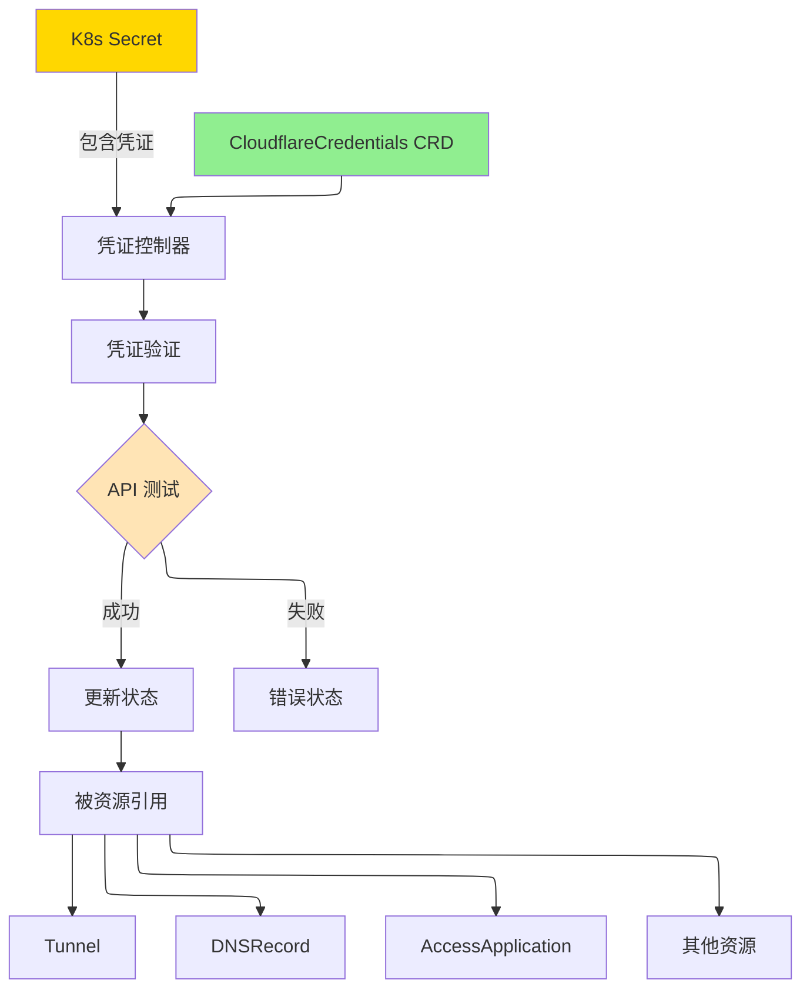

# CloudflareCredentials

CloudflareCredentials 是一个集群作用域的资源，用于安全地管理 Cloudflare API 凭证和操作员配置。

## 概述

CloudflareCredentials 允许您安全地存储和引用 Cloudflare API 身份验证详情，供操作员中的其他资源使用。您无需在每个资源中嵌入凭证，只需定义一次并在整个集群中引用。此资源支持多种身份验证方法，并在创建或更新时验证凭证。

操作员会在创建或更新凭证时对其进行验证，确保凭证有效后才允许其他资源使用它们。

### 主要特性

| 特性 | 描述 |
|------|------|
| **集中管理** | 定义一次凭证，在其他资源中引用 |
| **多种身份验证方法** | 同时支持 API Token 和全局 API Key 身份验证 |
| **凭证验证** | 自动验证凭证是否有效 |
| **默认凭证** | 为没有明确指定凭证的资源标记默认凭证 |
| **多 Secret 支持** | Secret 中的自定义密钥名称支持灵活的凭证存储 |
| **审计跟踪** | 跟踪验证状态和最后验证时间 |

### 使用场景

- **凭证管理**：在多个资源中集中管理 Cloudflare API 凭证
- **多账户设置**：管理多个 Cloudflare 账户的凭证
- **访问控制**：通过 RBAC 控制哪些服务可以使用特定凭证
- **凭证轮换**：在一个地方更新凭证供所有相关资源使用
- **开发环境**：为 dev/staging/prod 使用不同的凭证

## 架构



## 规范

### 主要字段

| 字段 | 类型 | 必需 | 默认值 | 描述 |
|------|------|------|--------|------|
| `accountId` | string | **是** | - | Cloudflare 账户 ID |
| `accountName` | string | 否 | - | 人类可读的账户名称（仅供参考） |
| `authType` | string | **是** | `apiToken` | 身份验证方法：`apiToken` 或 `globalAPIKey` |
| `secretRef` | *SecretReference | **是** | - | 对包含凭证的 Kubernetes Secret 的引用 |
| `defaultDomain` | string | 否 | - | 使用这些凭证的资源的默认域名 |
| `isDefault` | bool | 否 | `false` | 标记为默认凭证，用于没有明确指定的资源 |

### SecretReference

| 字段 | 类型 | 必需 | 默认值 | 描述 |
|------|------|------|--------|------|
| `name` | string | **是** | - | Kubernetes Secret 的名称 |
| `namespace` | string | 否 | `cloudflare-operator-system` | Secret 的命名空间 |
| `apiTokenKey` | string | 否 | `CLOUDFLARE_API_TOKEN` | Secret 中 API Token 的密钥名称 |
| `apiKeyKey` | string | 否 | `CLOUDFLARE_API_KEY` | Secret 中 API Key（全局）的密钥名称 |
| `emailKey` | string | 否 | `CLOUDFLARE_EMAIL` | Secret 中电子邮件的密钥名称（全局） |

### 身份验证方法

**API Token（推荐）**：
```yaml
authType: apiToken
secretRef:
  name: my-credentials
  apiTokenKey: CLOUDFLARE_API_TOKEN
```
Secret 必须在指定的密钥下包含 API Token。

**全局 API Key**：
```yaml
authType: globalAPIKey
secretRef:
  name: my-credentials
  apiKeyKey: CLOUDFLARE_API_KEY
  emailKey: CLOUDFLARE_EMAIL
```
Secret 必须同时包含 API Key 和相关的电子邮件。

## 状态

| 字段 | 类型 | 描述 |
|------|------|------|
| `conditions` | []metav1.Condition | 资源状态的最新观察 |
| `observedGeneration` | int64 | 控制器观察到的最后一代 |
| `state` | string | 当前状态：`pending`、`validated`、`invalid`、`error` |
| `validated` | bool | 凭证是否已成功验证 |
| `lastValidatedTime` | *metav1.Time | 最后一次成功验证的时间 |
| `accountName` | string | 从 Cloudflare API 检索的账户名称 |

### 条件类型

| 类型 | 原因 | 描述 |
|------|------|------|
| `Ready` | `Validated` | 凭证有效且可以使用 |
| `Ready` | `ValidationFailed` | 凭证验证失败 |
| `Ready` | `ValidationInProgress` | 正在验证凭证 |

## 示例

### 示例 1：API Token 凭证

```yaml
apiVersion: v1
kind: Secret
metadata:
  name: cf-api-token
  namespace: cloudflare-operator-system
type: Opaque
stringData:
  CLOUDFLARE_API_TOKEN: "YOUR_API_TOKEN_HERE"
---
apiVersion: networking.cloudflare-operator.io/v1alpha2
kind: CloudflareCredentials
metadata:
  name: production
spec:
  accountId: "1234567890abcdef"
  accountName: "My Production Account"
  authType: apiToken
  secretRef:
    name: cf-api-token
    namespace: cloudflare-operator-system
    apiTokenKey: CLOUDFLARE_API_TOKEN
  defaultDomain: "example.com"
  isDefault: true
```

### 示例 2：全局 API Key 凭证

```yaml
apiVersion: v1
kind: Secret
metadata:
  name: cf-global-key
  namespace: cloudflare-operator-system
type: Opaque
stringData:
  CLOUDFLARE_API_KEY: "YOUR_GLOBAL_API_KEY"
  CLOUDFLARE_EMAIL: "admin@example.com"
---
apiVersion: networking.cloudflare-operator.io/v1alpha2
kind: CloudflareCredentials
metadata:
  name: legacy-account
spec:
  accountId: "0987654321fedcba"
  authType: globalAPIKey
  secretRef:
    name: cf-global-key
    namespace: cloudflare-operator-system
    apiKeyKey: CLOUDFLARE_API_KEY
    emailKey: CLOUDFLARE_EMAIL
```

### 示例 3：为不同账户创建多个凭证

```yaml
---
apiVersion: v1
kind: Secret
metadata:
  name: cf-dev-credentials
  namespace: cloudflare-operator-system
type: Opaque
stringData:
  TOKEN: "dev_account_token"
---
apiVersion: networking.cloudflare-operator.io/v1alpha2
kind: CloudflareCredentials
metadata:
  name: dev-account
spec:
  accountId: "dev123456789"
  accountName: "Development Account"
  authType: apiToken
  secretRef:
    name: cf-dev-credentials
    namespace: cloudflare-operator-system
    apiTokenKey: TOKEN
---
apiVersion: v1
kind: Secret
metadata:
  name: cf-prod-credentials
  namespace: cloudflare-operator-system
type: Opaque
stringData:
  TOKEN: "prod_account_token"
---
apiVersion: networking.cloudflare-operator.io/v1alpha2
kind: CloudflareCredentials
metadata:
  name: prod-account
spec:
  accountId: "prod987654321"
  accountName: "Production Account"
  authType: apiToken
  secretRef:
    name: cf-prod-credentials
    namespace: cloudflare-operator-system
    apiTokenKey: TOKEN
  isDefault: true
```

## 前置条件

- Cloudflare 账户（具有适当的 API 访问权限）
- API Token 或全局 API Key（取决于所选的身份验证方法）
- 包含凭证的 Kubernetes Secret

### 创建 API Token

1. 登录 Cloudflare 仪表板
2. 在账户主页导航到 "API Tokens"
3. 单击 "Create Token"
4. 选择 "Edit Cloudflare Workers" 或创建自定义令牌
5. 授予必要的权限
6. 使用此令牌创建 Kubernetes Secret

## 限制

- 只能有一个 CloudflareCredentials 标记为 `isDefault: true`
- 凭证在资源创建/更新期间进行同步验证
- 操作员不支持凭证过期或自动轮换
- API 速率限制适用于凭证验证请求
- 凭证必须存储在 Kubernetes Secret 中（目前不支持外部 Secret 管理）

## 相关资源

- [Tunnel](tunnel.md) - 使用这些凭证安全暴露服务
- [DNSRecord](dnsrecord.md) - 使用这些凭证管理 DNS 记录
- [AccessApplication](accessapplication.md) - 配置访问策略
- [VirtualNetwork](virtualnetwork.md) - 管理虚拟网络
- [配置指南](../configuration.md) - 详细的凭证设置说明

## 另请参阅

- [Cloudflare API Token 文档](https://developers.cloudflare.com/api/tokens/create/)
- [Cloudflare API 身份验证](https://developers.cloudflare.com/api/get-started/authentication/)
- [Kubernetes Secrets 文档](https://kubernetes.io/docs/concepts/configuration/secret/)
