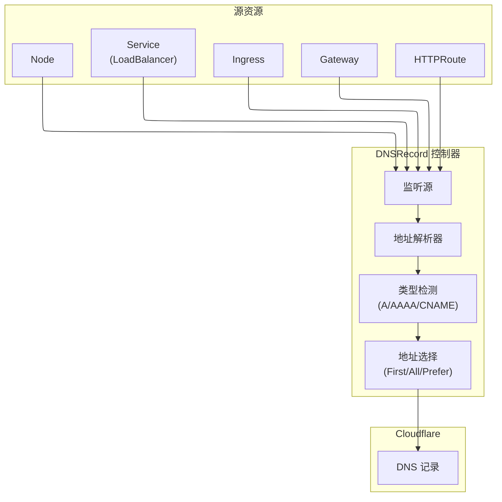
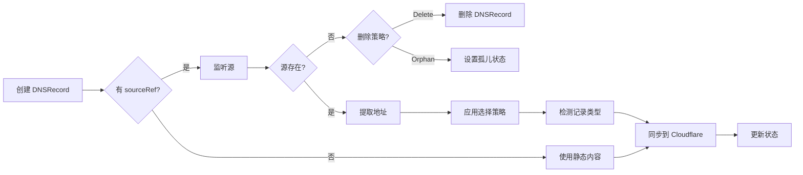

# DNSRecord

DNSRecord 是命名空间级资源，用于声明式管理 Cloudflare DNS 记录。它支持所有标准 DNS 记录类型、Cloudflare 代理功能，以及从 Kubernetes 资源**动态解析源地址**。

## 概述

DNSRecord 允许您使用 Kubernetes 清单管理 Cloudflare 区域中的 DNS 记录。对 DNSRecord 资源的更改会自动同步到 Cloudflare，Operator 管理 DNS 记录的完整生命周期。

### 主要特性

| 特性 | 描述 |
|------|------|
| **全面的记录类型** | 支持 A、AAAA、CNAME、TXT、MX、SRV、CAA 等 |
| **动态源解析** | 自动从 Service、Ingress、Gateway、HTTPRoute 或 Node 提取 IP |
| **Cloudflare 代理** | 为符合条件的记录类型启用橙色云代理 |
| **自动类型检测** | 根据解析的地址自动检测 A/AAAA/CNAME 类型 |
| **多地址选择** | 支持 First、All（轮询）、PreferIPv4、PreferIPv6 策略 |
| **源生命周期管理** | 源资源删除时的可配置行为 |

### 使用场景

- **应用程序端点**: 为服务端点创建 A/AAAA 记录
- **LoadBalancer DNS**: 当 LoadBalancer IP 变化时自动更新 DNS
- **Ingress DNS**: 从 Ingress LoadBalancer 状态创建 DNS 记录
- **Gateway API 集成**: 从 Gateway 资源提取地址
- **Node DNS**: 为节点外部 IP 创建 DNS 记录
- **静态记录**: 传统的静态 DNS 记录管理

## 架构



## Spec

### 主要字段

| 字段 | 类型 | 必需 | 默认值 | 描述 |
|------|------|------|--------|------|
| `name` | string | **是** | - | DNS 记录名称（子域名或 FQDN，最大 255 字符） |
| `type` | string | 否* | - | 记录类型。使用 `sourceRef` 时自动检测 |
| `content` | string | 否* | - | 静态记录内容。与 `sourceRef` 互斥 |
| `sourceRef` | *DNSRecordSourceRef | 否* | - | 动态源引用。与 `content` 互斥 |
| `addressSelection` | string | 否 | `First` | 存在多个地址时的地址选择策略 |
| `sourceDeletionPolicy` | string | 否 | `Delete` | 源资源删除时的行为 |
| `ttl` | int | 否 | `1` | 生存时间（秒）（1 = 自动） |
| `proxied` | bool | 否 | `false` | 启用 Cloudflare 代理（橙色云） |
| `priority` | *int | 否 | - | MX/SRV 记录的优先级（0-65535） |
| `comment` | string | 否 | - | 可选注释（最多 100 字符） |
| `tags` | []string | 否 | - | 用于组织的标签 |
| `data` | *DNSRecordData | 否 | - | SRV、CAA、LOC 等的类型特定数据 |
| `cloudflare` | CloudflareDetails | **是** | - | Cloudflare API 凭证 |

> **注意**: 必须指定 `content`（静态模式）或 `sourceRef`（动态模式）之一，但不能同时指定。

### SourceRef - 动态源引用

使用 `sourceRef` 从 Kubernetes 资源动态获取 DNS 记录内容。必须且只能指定一种源类型。

| 字段 | 类型 | 描述 |
|------|------|------|
| `service` | *ServiceDNSSource | 从 Kubernetes Service 提取地址 |
| `ingress` | *IngressDNSSource | 从 Kubernetes Ingress 提取地址 |
| `httpRoute` | *HTTPRouteDNSSource | 从 Gateway API HTTPRoute 提取地址 |
| `gateway` | *GatewayDNSSource | 从 Gateway API Gateway 提取地址 |
| `node` | *NodeDNSSource | 从 Kubernetes Node 提取地址 |

#### ServiceDNSSource

| 字段 | 类型 | 必需 | 默认值 | 描述 |
|------|------|------|--------|------|
| `name` | string | **是** | - | Service 名称 |
| `namespace` | string | 否 | DNSRecord 的命名空间 | Service 的命名空间 |
| `addressType` | string | 否 | `LoadBalancerIP` | 地址提取方法 |

**Service 地址类型**:

| AddressType | 源路径 | 描述 |
|-------------|--------|------|
| `LoadBalancerIP` | `.status.loadBalancer.ingress[].ip` | LoadBalancer IP 地址 |
| `LoadBalancerHostname` | `.status.loadBalancer.ingress[].hostname` | LoadBalancer 主机名（AWS ELB） |
| `ExternalIP` | `.spec.externalIPs[]` | 外部 IP |
| `ExternalName` | `.spec.externalName` | ExternalName 服务目标 |
| `ClusterIP` | `.spec.clusterIP` | ClusterIP（仅限内部使用） |

#### IngressDNSSource

| 字段 | 类型 | 必需 | 默认值 | 描述 |
|------|------|------|--------|------|
| `name` | string | **是** | - | Ingress 名称 |
| `namespace` | string | 否 | DNSRecord 的命名空间 | Ingress 的命名空间 |

从 `.status.loadBalancer.ingress[].ip` 或 `.hostname` 提取。

#### GatewayDNSSource

| 字段 | 类型 | 必需 | 默认值 | 描述 |
|------|------|------|--------|------|
| `name` | string | **是** | - | Gateway 名称 |
| `namespace` | string | 否 | DNSRecord 的命名空间 | Gateway 的命名空间 |

从 `.status.addresses[].value` 提取。

#### HTTPRouteDNSSource

| 字段 | 类型 | 必需 | 默认值 | 描述 |
|------|------|------|--------|------|
| `name` | string | **是** | - | HTTPRoute 名称 |
| `namespace` | string | 否 | DNSRecord 的命名空间 | HTTPRoute 的命名空间 |

解析父 Gateway 并提取其地址。

#### NodeDNSSource

| 字段 | 类型 | 必需 | 默认值 | 描述 |
|------|------|------|--------|------|
| `name` | string | **是** | - | Node 名称 |
| `addressType` | string | 否 | `ExternalIP` | 地址提取方法 |

**Node 地址类型**:

| AddressType | 源路径 | 描述 |
|-------------|--------|------|
| `ExternalIP` | `.status.addresses[type=ExternalIP]` | 节点外部 IP |
| `InternalIP` | `.status.addresses[type=InternalIP]` | 节点内部 IP |
| `Hostname` | `.status.addresses[type=Hostname]` | 节点主机名 |

### 地址选择策略

| 策略 | 描述 |
|------|------|
| `First` | 使用第一个可用地址（默认） |
| `All` | 为所有地址创建多条 DNS 记录（轮询） |
| `PreferIPv4` | 优先使用 IPv4 地址，如果没有则回退到第一个 |
| `PreferIPv6` | 优先使用 IPv6 地址，如果没有则回退到第一个 |

### 源删除策略

| 策略 | 描述 |
|------|------|
| `Delete` | 源资源删除时删除 DNS 记录（默认） |
| `Orphan` | 源资源删除时保留 DNS 记录 |

### 支持的记录类型

A、AAAA、CNAME、TXT、MX、NS、SRV、CAA、CERT、DNSKEY、DS、HTTPS、LOC、NAPTR、SMIMEA、SSHFP、SVCB、TLSA、URI

### DNSRecordData（用于高级记录类型）

| 字段 | 类型 | 用于 | 描述 |
|------|------|------|------|
| `service` | string | SRV | 服务名称 |
| `proto` | string | SRV | 协议（tcp/udp） |
| `weight` | int | SRV | 负载均衡权重 |
| `port` | int | SRV | 服务端口 |
| `target` | string | SRV | 目标主机名 |
| `flags` | int | CAA | CAA 标志 |
| `tag` | string | CAA | CAA 标签（issue/issuewild/iodef） |
| `value` | string | CAA | CAA 值 |

## Status

| 字段 | 类型 | 描述 |
|------|------|------|
| `recordId` | string | Cloudflare DNS 记录 ID |
| `zoneId` | string | Cloudflare Zone ID |
| `fqdn` | string | 完全限定域名 |
| `state` | string | 当前状态（Active、Error、Orphaned） |
| `conditions` | []Condition | 标准 Kubernetes 条件 |
| `observedGeneration` | int64 | 最后观察到的 generation |
| `resolvedType` | string | 自动检测的记录类型（使用 sourceRef 时） |
| `resolvedContent` | string | 从源资源解析的内容 |
| `resolvedAddresses` | []string | 所有解析的地址（使用 All 策略时） |
| `sourceResourceVersion` | string | 源资源版本（用于变更检测） |
| `managedRecordIds` | []string | 所有管理的 DNS 记录 ID（使用 All 时多个） |

## 示例

### 动态模式示例

#### Service LoadBalancer IP

从 Service LoadBalancer IP 自动创建 DNS 记录：

```yaml
apiVersion: networking.cloudflare-operator.io/v1alpha2
kind: DNSRecord
metadata:
  name: api-dns
  namespace: production
spec:
  name: api.example.com
  sourceRef:
    service:
      name: api-service
      addressType: LoadBalancerIP
  proxied: true
  cloudflare:
    domain: example.com
    secret: cloudflare-api-credentials
```

#### Service LoadBalancer Hostname（AWS ELB）

对于分配主机名而非 IP 的云提供商：

```yaml
apiVersion: networking.cloudflare-operator.io/v1alpha2
kind: DNSRecord
metadata:
  name: app-dns
  namespace: production
spec:
  name: app.example.com
  sourceRef:
    service:
      name: app-service
      addressType: LoadBalancerHostname
  # 类型自动检测为 CNAME
  proxied: true
  cloudflare:
    domain: example.com
    secret: cloudflare-api-credentials
```

#### Service ExternalName（CNAME）

从 ExternalName 服务创建 CNAME：

```yaml
apiVersion: networking.cloudflare-operator.io/v1alpha2
kind: DNSRecord
metadata:
  name: legacy-cname
  namespace: default
spec:
  name: legacy.example.com
  sourceRef:
    service:
      name: external-service
      addressType: ExternalName
  # 类型自动检测为 CNAME
  proxied: false
  cloudflare:
    domain: example.com
    secret: cloudflare-api-credentials
```

#### Ingress

从 Ingress LoadBalancer 状态创建 DNS 记录：

```yaml
apiVersion: networking.cloudflare-operator.io/v1alpha2
kind: DNSRecord
metadata:
  name: web-dns
  namespace: default
spec:
  name: www.example.com
  sourceRef:
    ingress:
      name: web-ingress
  addressSelection: First
  proxied: true
  cloudflare:
    domain: example.com
    secret: cloudflare-api-credentials
```

#### Gateway API

从 Gateway 地址创建 DNS 记录：

```yaml
apiVersion: networking.cloudflare-operator.io/v1alpha2
kind: DNSRecord
metadata:
  name: gateway-dns
  namespace: gateway-system
spec:
  name: app.example.com
  sourceRef:
    gateway:
      name: main-gateway
  addressSelection: PreferIPv4
  proxied: true
  cloudflare:
    domain: example.com
    secret: cloudflare-api-credentials
```

#### HTTPRoute

从 HTTPRoute 的父 Gateway 创建 DNS 记录：

```yaml
apiVersion: networking.cloudflare-operator.io/v1alpha2
kind: DNSRecord
metadata:
  name: route-dns
  namespace: default
spec:
  name: myapp.example.com
  sourceRef:
    httpRoute:
      name: myapp-route
  proxied: true
  cloudflare:
    domain: example.com
    secret: cloudflare-api-credentials
```

#### Node 外部 IP

为特定节点创建 DNS 记录：

```yaml
apiVersion: networking.cloudflare-operator.io/v1alpha2
kind: DNSRecord
metadata:
  name: node-dns
  namespace: default
spec:
  name: node1.example.com
  sourceRef:
    node:
      name: worker-node-1
      addressType: ExternalIP
  proxied: false
  cloudflare:
    domain: example.com
    secret: cloudflare-api-credentials
```

#### 多地址轮询

为负载均衡创建多条 A 记录：

```yaml
apiVersion: networking.cloudflare-operator.io/v1alpha2
kind: DNSRecord
metadata:
  name: ha-dns
  namespace: default
spec:
  name: ha.example.com
  sourceRef:
    service:
      name: ha-service
      addressType: LoadBalancerIP
  addressSelection: All  # 创建多条 A 记录
  ttl: 300
  proxied: false
  cloudflare:
    domain: example.com
    secret: cloudflare-api-credentials
```

#### 孤儿策略

源删除时保留 DNS 记录：

```yaml
apiVersion: networking.cloudflare-operator.io/v1alpha2
kind: DNSRecord
metadata:
  name: persistent-dns
  namespace: default
spec:
  name: stable.example.com
  sourceRef:
    service:
      name: app-service
      addressType: LoadBalancerIP
  sourceDeletionPolicy: Orphan  # 服务删除时保留 DNS
  cloudflare:
    domain: example.com
    secret: cloudflare-api-credentials
```

### 静态模式示例

#### 基础 A 记录（已代理）

```yaml
apiVersion: networking.cloudflare-operator.io/v1alpha2
kind: DNSRecord
metadata:
  name: www-record
  namespace: default
spec:
  name: www
  type: A
  content: 203.0.113.50
  ttl: 1  # 自动 TTL
  proxied: true  # 启用 Cloudflare 代理
  comment: "Web 服务器端点"
  cloudflare:
    domain: example.com
    secret: cloudflare-api-credentials
```

#### CNAME 记录

```yaml
apiVersion: networking.cloudflare-operator.io/v1alpha2
kind: DNSRecord
metadata:
  name: blog-cname
  namespace: default
spec:
  name: blog
  type: CNAME
  content: www.example.com
  proxied: true
  cloudflare:
    domain: example.com
    secret: cloudflare-api-credentials
```

#### 用于验证的 TXT 记录

```yaml
apiVersion: networking.cloudflare-operator.io/v1alpha2
kind: DNSRecord
metadata:
  name: txt-verification
  namespace: default
spec:
  name: _verify
  type: TXT
  content: "verification-token-12345"
  ttl: 3600
  tags:
    - verification
    - google
  cloudflare:
    domain: example.com
    secret: cloudflare-api-credentials
```

#### 用于邮件的 MX 记录

```yaml
apiVersion: networking.cloudflare-operator.io/v1alpha2
kind: DNSRecord
metadata:
  name: mx-primary
  namespace: default
spec:
  name: "@"  # 根域名
  type: MX
  content: mail.example.com
  priority: 10
  ttl: 3600
  comment: "主邮件服务器"
  cloudflare:
    domain: example.com
    secret: cloudflare-api-credentials
```

#### 用于服务发现的 SRV 记录

```yaml
apiVersion: networking.cloudflare-operator.io/v1alpha2
kind: DNSRecord
metadata:
  name: srv-ldap
  namespace: default
spec:
  name: _ldap._tcp
  type: SRV
  content: ldap.example.com
  priority: 10
  ttl: 3600
  data:
    service: ldap
    proto: tcp
    weight: 5
    port: 389
    target: ldap.example.com
  cloudflare:
    domain: example.com
    secret: cloudflare-api-credentials
```

## 地址解析流程



## 前置条件

1. **Cloudflare Zone**: 域名必须由 Cloudflare 管理
2. **API 凭证**: 具有 DNS 编辑权限的 API Token
3. **Zone ID**: 从域名自动解析
4. **源资源**: 对于动态模式，源资源必须存在并有地址

### 所需 API 权限

| 权限 | 范围 | 用途 |
|------|------|------|
| `Zone:DNS:Edit` | Zone | 创建/更新/删除 DNS 记录 |

### 所需 RBAC 权限（用于动态模式）

Operator 需要额外的 RBAC 权限来监听源资源：

| 资源 | 动词 | 用途 |
|------|------|------|
| `services` | get, list, watch | 监听 Service 获取 LoadBalancer IP |
| `ingresses` | get, list, watch | 监听 Ingress 获取 LoadBalancer 状态 |
| `gateways` | get, list, watch | 监听 Gateway API Gateway |
| `httproutes` | get, list, watch | 监听 Gateway API HTTPRoute |
| `nodes` | get, list, watch | 监听 Node 获取地址 |

## 限制

- **代理记录**: 只有 A、AAAA 和 CNAME 记录可以被代理
- **根域名**: 对根域名记录使用 `"@"`
- **代理时的 TTL**: 当 `proxied: true` 时，TTL 自动管理
- **记录唯一性**: 每个 DNSRecord 资源应管理一条 DNS 记录
- **源类型**: `sourceRef` 中只能指定一种源类型
- **地址可用性**: 动态模式要求源有已分配的地址

## 最佳实践

1. **对 LoadBalancer 使用动态模式**: 对具有动态 IP 的资源使用 `sourceRef`
2. **设置适当的 TTL**: 对可能变化的动态源使用较低的 TTL
3. **谨慎使用孤儿策略**: 使用 `Orphan` 删除策略前考虑其影响
4. **为兼容性优先 IPv4**: 当客户端可能不支持 IPv6 时使用 `PreferIPv4`
5. **使用描述性名称**: 清晰命名 DNSRecord 资源（例如，`api-loadbalancer-dns`）
6. **为 Web 启用代理**: 对面向 Web 的 A/AAAA/CNAME 记录使用 `proxied: true`
7. **监控状态**: 检查 `resolvedContent` 和 `state` 字段以发现问题

## 故障排除

### 源没有地址

**症状**: DNSRecord 显示错误 "source resource has no addresses"

**原因**: 源资源（Service、Ingress 等）尚未分配地址。

**解决方案**:
```bash
# 检查 Service LoadBalancer 状态
kubectl get svc <service-name> -o jsonpath='{.status.loadBalancer.ingress}'

# 检查 Ingress 状态
kubectl get ingress <ingress-name> -o jsonpath='{.status.loadBalancer.ingress}'
```

### 类型检测问题

**症状**: 创建了错误的记录类型

**解决方案**: 显式指定 `type` 字段以覆盖自动检测：
```yaml
spec:
  type: A  # 强制 A 记录类型
  sourceRef:
    service:
      name: my-service
```

### 源意外删除

**症状**: 源暂时不可用时 DNS 记录被删除

**解决方案**: 对关键 DNS 记录使用 `sourceDeletionPolicy: Orphan`。

## 相关资源

- [Tunnel](tunnel.md) - 自动为隧道端点创建 DNS 记录
- [Ingress 集成](../guides/ingress-integration.md) - 通过 Ingress 注解自动 DNS
- [Gateway API](../guides/gateway-api-integration.md) - 使用 Gateway API 管理 DNS

## 另请参阅

- [示例](../../../examples/01-basic/dns/)
- [Cloudflare DNS 文档](https://developers.cloudflare.com/dns/)
- [external-dns](https://github.com/kubernetes-sigs/external-dns) - 类似功能参考
