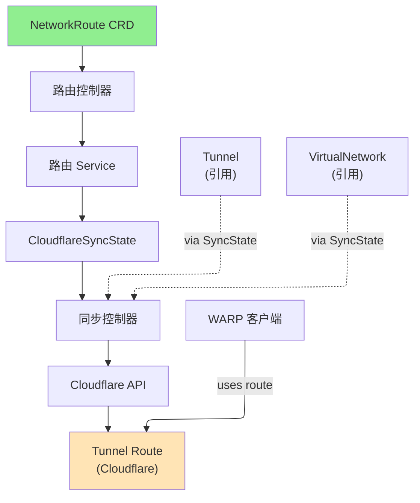

# NetworkRoute

NetworkRoute 是一个集群作用域的资源，定义通过 Cloudflare Tunnel 路由的 CIDR 范围，使 WARP 客户端能够访问私有网络。

## 概述

NetworkRoute 资源在私有 IP CIDR 范围和通过虚拟网络的 Cloudflare Tunnel 之间创建映射。这使得 WARP 连接的客户端能够通过 Tunnel 访问私有网络资源。可以为不同的 CIDR 范围创建多个路由，路由可以使用不同的 Tunnel 或虚拟网络以实现灵活的流量管理。

### 主要特性

| 特性 | 描述 |
|------|------|
| **CIDR 路由** | 通过 Tunnel 路由特定的 IP 范围 |
| **Tunnel 引用** | 支持 Tunnel 和 ClusterTunnel |
| **虚拟网络支持** | 将路由与特定虚拟网络关联 |
| **跨 VNet 采用** | 路由可以在不同虚拟网络之间采用 |
| **注释** | 添加可选的描述用于组织 |

### 使用场景

- **私有网络访问**：通过 Tunnel 路由企业网络范围
- **多数据中心**：通过不同路由暴露多个数据中心
- **条件路由**：通过不同 Tunnel 路由不同的 IP 范围
- **零信任网络**：实现对私有资源的最小权限访问
- **灾难恢复**：将路由故障转移到不同的 Tunnel

## 架构



## 规范

### 主要字段

| 字段 | 类型 | 必需 | 默认值 | 描述 |
|------|------|------|--------|------|
| `network` | string | **是** | - | CIDR 表示法的 IP 范围（例如"10.0.0.0/8"） |
| `tunnelRef` | TunnelRef | **是** | - | Tunnel 或 ClusterTunnel 的引用 |
| `virtualNetworkRef` | *VirtualNetworkRef | 否 | - | VirtualNetwork 的引用（如未指定则使用默认值） |
| `comment` | string | 否 | - | 可选描述（最多 500 个字符） |
| `cloudflare` | CloudflareDetails | **是** | - | Cloudflare API 凭证和账户信息 |

### TunnelRef

| 字段 | 类型 | 必需 | 默认值 | 描述 |
|------|------|------|--------|------|
| `kind` | string | **是** | `ClusterTunnel` | Tunnel 资源类型（Tunnel 或 ClusterTunnel） |
| `name` | string | **是** | - | Tunnel 或 ClusterTunnel 资源的名称 |
| `namespace` | string | 否 | - | Tunnel 的命名空间（仅用于命名空间 Tunnel 资源） |

### VirtualNetworkRef

| 字段 | 类型 | 必需 | 描述 |
|------|------|------|------|
| `name` | string | **是** | VirtualNetwork 资源的名称 |

## 状态

| 字段 | 类型 | 描述 |
|------|------|------|
| `network` | string | Cloudflare 中路由的 CIDR |
| `tunnelId` | string | 此路由指向的 Cloudflare Tunnel ID |
| `tunnelName` | string | Cloudflare 中的 Tunnel 名称 |
| `virtualNetworkId` | string | Cloudflare 虚拟网络 ID |
| `accountId` | string | Cloudflare 账户 ID |
| `state` | string | 路由的当前状态 |
| `conditions` | []metav1.Condition | 资源状态的最新观察 |
| `observedGeneration` | int64 | 控制器观察到的最后一代 |

## 示例

### 示例 1：使用 ClusterTunnel 的基本路由

```yaml
apiVersion: networking.cloudflare-operator.io/v1alpha2
kind: NetworkRoute
metadata:
  name: private-network-10
spec:
  network: "10.0.0.0/8"
  tunnelRef:
    kind: ClusterTunnel
    name: main-tunnel
  cloudflare:
    accountId: "1234567890abcdef"
    credentialsRef:
      name: production
```

### 示例 2：用于故障转移的多路由

```yaml
apiVersion: networking.cloudflare-operator.io/v1alpha2
kind: NetworkRoute
metadata:
  name: dc-primary
spec:
  network: "10.1.0.0/16"
  comment: "Primary datacenter"
  tunnelRef:
    kind: ClusterTunnel
    name: tunnel-primary
  cloudflare:
    accountId: "1234567890abcdef"
    credentialsRef:
      name: production
---
apiVersion: networking.cloudflare-operator.io/v1alpha2
kind: NetworkRoute
metadata:
  name: dc-secondary
spec:
  network: "10.1.0.0/16"
  comment: "Secondary datacenter (failover)"
  tunnelRef:
    kind: ClusterTunnel
    name: tunnel-secondary
  cloudflare:
    accountId: "1234567890abcdef"
    credentialsRef:
      name: production
```

### 示例 3：使用特定虚拟网络的路由

```yaml
apiVersion: networking.cloudflare-operator.io/v1alpha2
kind: NetworkRoute
metadata:
  name: tenant-a-route
spec:
  network: "172.16.0.0/12"
  comment: "Tenant A private network"
  tunnelRef:
    kind: Tunnel
    name: tenant-a-tunnel
    namespace: production
  virtualNetworkRef:
    name: tenant-a-vnet
  cloudflare:
    accountId: "1234567890abcdef"
    credentialsRef:
      name: production
```

### 示例 4：引用命名空间 Tunnel

```yaml
apiVersion: networking.cloudflare-operator.io/v1alpha2
kind: NetworkRoute
metadata:
  name: app-services
spec:
  network: "192.168.0.0/16"
  comment: "Application services network"
  tunnelRef:
    kind: Tunnel
    name: app-tunnel
    namespace: production
  cloudflare:
    accountId: "1234567890abcdef"
    credentialsRef:
      name: production
```

## 前置条件

- Cloudflare Zero Trust 订阅
- 集群中的有效 Tunnel 或 ClusterTunnel 资源
- 具有适当权限的 Cloudflare API 凭证
- VirtualNetwork 资源（如果使用显式虚拟网络）

## 限制

- 网络 CIDR 必须有效且不能与同一 Tunnel 中的其他路由重叠
- TunnelRef 必须指向现有的 Tunnel 或 ClusterTunnel 资源
- 每个 Tunnel 每个 CIDR 只能创建一条路由
- NetworkRoute 删除不会在维护期间立即从 Cloudflare 移除路由
- 需要 Cloudflare Zero Trust 订阅

## 相关资源

- [Tunnel](tunnel.md) - 用于路由的命名空间 Tunnel 资源
- [ClusterTunnel](clustertunnel.md) - 集群作用域的 Tunnel 资源
- [VirtualNetwork](virtualnetwork.md) - 用于路由隔离的虚拟网络
- [PrivateService](privateservice.md) - 通过私有路由暴露服务
- [WARPConnector](warpconnector.md) - 部署连接器以公告路由

## 另请参阅

- [Cloudflare Tunnel Routes 文档](https://developers.cloudflare.com/cloudflare-one/setup/network/)
- [WARP 客户端文档](https://developers.cloudflare.com/warp-client/)
- [Cloudflare Zero Trust 网络](https://developers.cloudflare.com/cloudflare-one/)
