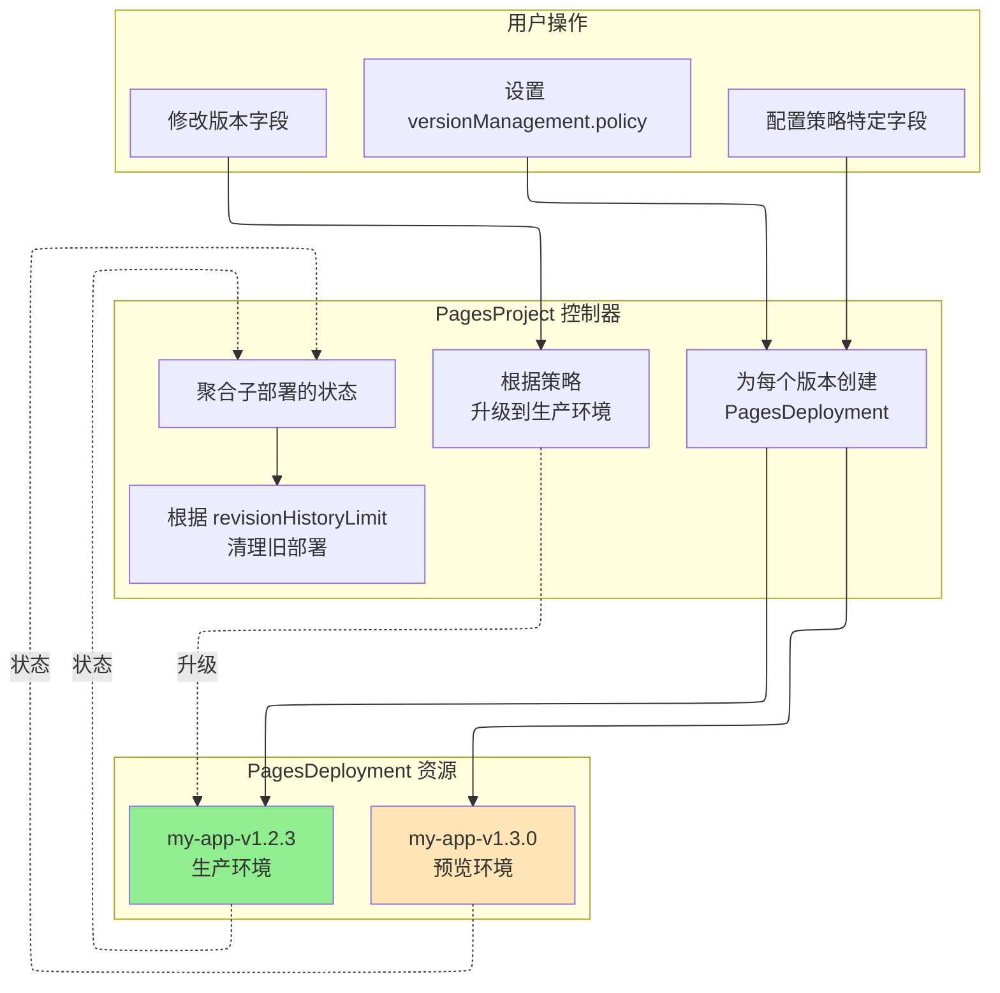

# PagesProject

PagesProject 是一个命名空间级别的资源，代表 Cloudflare Pages 项目。Cloudflare Pages 是一个 JAMstack 平台，用于部署静态站点和集成 Workers 的全栈应用。

## 概述

PagesProject 提供对 Cloudflare Pages 项目的全面管理，包括:

- **项目配置**: 构建设置、部署环境、资源绑定
- **版本管理**: 8 种策略支持声明式多版本部署与自动回滚
- **项目采用**: 将现有 Cloudflare 项目导入 Kubernetes 管理
- **资源绑定**: D1、KV、R2、Durable Objects、Workers AI 等

## Spec 字段

| 字段 | 类型 | 必需 | 默认值 | 说明 |
|------|------|------|--------|------|
| `name` | string | 否 | K8s 资源名 | Cloudflare Pages 中的项目名称（最大 58 字符）|
| `productionBranch` | string | **是** | - | Git 部署的生产分支 |
| `source` | PagesSourceConfig | 否 | - | 源代码仓库配置 |
| `buildConfig` | PagesBuildConfig | 否 | - | 构建配置 |
| `deploymentConfigs` | PagesDeploymentConfigs | 否 | - | 环境特定配置 |
| `cloudflare` | CloudflareDetails | **是** | - | Cloudflare API 凭证 |
| `adoptionPolicy` | string | 否 | `MustNotExist` | 项目采用策略（见下文）|
| `deploymentHistoryLimit` | int | 否 | `10` | 保留的部署记录数量（0-100）|
| `enableWebAnalytics` | bool | 否 | `true` | 启用 Cloudflare Web Analytics |
| `deletionPolicy` | string | 否 | `Delete` | 删除策略: `Delete`、`Orphan` |
| `versionManagement` | VersionManagement | 否 | - | 版本管理配置（见下文）|
| `revisionHistoryLimit` | int32 | 否 | `10` | 托管部署保留限制（0-100）|

### 项目采用策略

| 策略 | 说明 | 使用场景 |
|------|------|----------|
| `MustNotExist` | 要求项目不存在（创建新项目）| 默认行为，新项目 |
| `IfExists` | 如果存在则采用，不存在则创建 | 灵活采用 |
| `MustExist` | 要求项目已存在 | 导入现有项目 |

### 删除策略

| 策略 | 说明 |
|------|------|
| `Delete` | 从 Cloudflare 删除 Pages 项目 |
| `Orphan` | 在 Cloudflare 中保留 Pages 项目 |

## 源代码配置

### PagesSourceConfig

| 字段 | 类型 | 必需 | 默认值 | 说明 |
|------|------|------|--------|------|
| `type` | string | 否 | `direct_upload` | 源类型: `github`、`gitlab`、`direct_upload` |
| `github` | PagesGitHubConfig | 否 | - | GitHub 配置 |
| `gitlab` | PagesGitLabConfig | 否 | - | GitLab 配置 |

### PagesGitHubConfig

| 字段 | 类型 | 必需 | 默认值 | 说明 |
|------|------|------|--------|------|
| `owner` | string | **是** | - | GitHub 仓库所有者 |
| `repo` | string | **是** | - | GitHub 仓库名称 |
| `productionDeploymentsEnabled` | bool | 否 | `true` | 启用生产部署 |
| `previewDeploymentsEnabled` | bool | 否 | `true` | 启用预览部署 |
| `prCommentsEnabled` | bool | 否 | `true` | 启用 PR 评论 |
| `deploymentsEnabled` | bool | 否 | `true` | 全局启用部署 |

### PagesGitLabConfig

| 字段 | 类型 | 必需 | 默认值 | 说明 |
|------|------|------|--------|------|
| `owner` | string | **是** | - | GitLab 命名空间 |
| `repo` | string | **是** | - | GitLab 项目名称 |
| `productionDeploymentsEnabled` | bool | 否 | `true` | 启用生产部署 |
| `previewDeploymentsEnabled` | bool | 否 | `true` | 启用预览部署 |
| `deploymentsEnabled` | bool | 否 | `true` | 全局启用部署 |

## 构建配置

### PagesBuildConfig

| 字段 | 类型 | 说明 |
|------|------|------|
| `buildCommand` | string | 构建项目的命令 |
| `destinationDir` | string | 构建输出目录 |
| `rootDir` | string | 构建的根目录 |
| `buildCaching` | bool | 启用构建缓存（默认: `true`）|
| `webAnalyticsTag` | string | Web Analytics 标签 |
| `webAnalyticsToken` | string | Web Analytics 令牌 |

## 部署配置

### PagesDeploymentConfigs

| 字段 | 类型 | 说明 |
|------|------|------|
| `preview` | PagesDeploymentConfig | 预览环境配置 |
| `production` | PagesDeploymentConfig | 生产环境配置 |

### PagesDeploymentConfig

| 字段 | 类型 | 说明 |
|------|------|------|
| `environmentVariables` | map[string]PagesEnvVar | 环境变量 |
| `compatibilityDate` | string | Workers 运行时兼容日期 |
| `compatibilityFlags` | []string | Workers 运行时兼容标志 |
| `d1Bindings` | []PagesD1Binding | D1 数据库绑定 |
| `durableObjectBindings` | []PagesDurableObjectBinding | Durable Object 绑定 |
| `kvBindings` | []PagesKVBinding | KV 命名空间绑定 |
| `r2Bindings` | []PagesR2Binding | R2 存储桶绑定 |
| `serviceBindings` | []PagesServiceBinding | Workers 服务绑定 |
| `queueBindings` | []PagesQueueBinding | 队列生产者绑定 |
| `aiBindings` | []PagesAIBinding | Workers AI 绑定 |
| `vectorizeBindings` | []PagesVectorizeBinding | Vectorize 索引绑定 |
| `hyperdriveBindings` | []PagesHyperdriveBinding | Hyperdrive 绑定 |
| `mtlsCertificates` | []PagesMTLSCertificate | mTLS 证书绑定 |
| `browserBinding` | PagesBrowserBinding | 浏览器渲染绑定 |
| `placement` | PagesPlacement | Smart Placement 配置 |
| `usageModel` | string | 使用模式: `bundled`、`unbound` |
| `failOpen` | bool | Workers 脚本失败时故障开放 |
| `alwaysUseLatestCompatibilityDate` | bool | 自动更新兼容日期 |

### 资源绑定

#### PagesD1Binding

| 字段 | 类型 | 必需 | 说明 |
|------|------|------|------|
| `name` | string | **是** | 绑定名称 |
| `databaseId` | string | **是** | D1 数据库 ID |

#### PagesKVBinding

| 字段 | 类型 | 必需 | 说明 |
|------|------|------|------|
| `name` | string | **是** | 绑定名称 |
| `namespaceId` | string | **是** | KV 命名空间 ID |

#### PagesR2Binding

| 字段 | 类型 | 必需 | 说明 |
|------|------|------|------|
| `name` | string | **是** | 绑定名称 |
| `bucketName` | string | **是** | R2 存储桶名称 |

#### PagesServiceBinding

| 字段 | 类型 | 必需 | 说明 |
|------|------|------|------|
| `name` | string | **是** | 绑定名称 |
| `service` | string | **是** | Worker 服务名称 |
| `environment` | string | 否 | Worker 环境 |

#### PagesDurableObjectBinding

| 字段 | 类型 | 必需 | 说明 |
|------|------|------|------|
| `name` | string | **是** | 绑定名称 |
| `className` | string | **是** | Durable Object 类名 |
| `scriptName` | string | 否 | Worker 脚本名称 |
| `environmentName` | string | 否 | Worker 环境名称 |

## 版本管理

PagesProject 通过 `spec.versionManagement` 支持 8 种版本管理策略：

| 策略 | 说明 | 使用场景 |
|------|------|----------|
| `none` | 无版本管理，仅项目配置 | 项目元数据管理 |
| `targetVersion` | 单版本部署 | 简单场景 |
| `declarativeVersions` | 版本列表 + 模板 | 批量管理 |
| `fullVersions` | 完整版本配置 | 复杂场景 |
| `gitops` | Preview + Production 两阶段 | **GitOps 工作流** |
| `latestPreview` | 追踪最新预览部署 | 持续部署 |
| `autoPromote` | 预览成功后自动升级 | 自动化流水线 |
| `external` | 外部系统控制版本 | 第三方集成 |

### VersionManagement

| 字段 | 类型 | 说明 |
|------|------|------|
| `policy` | string | 版本管理策略（见上文）|
| `targetVersion` | TargetVersionSpec | `targetVersion` 策略配置 |
| `declarativeVersions` | DeclarativeVersionsSpec | `declarativeVersions` 策略配置 |
| `fullVersions` | FullVersionsSpec | `fullVersions` 策略配置 |
| `gitops` | GitOpsVersionConfig | `gitops` 策略配置 |
| `latestPreview` | LatestPreviewConfig | `latestPreview` 策略配置 |
| `autoPromote` | AutoPromoteConfig | `autoPromote` 策略配置 |
| `external` | ExternalVersionConfig | `external` 策略配置 |

### GitOpsVersionConfig

| 字段 | 类型 | 默认值 | 说明 |
|------|------|--------|------|
| `previewVersion` | string | - | 部署为预览的版本（CI 修改此字段）|
| `productionVersion` | string | - | 升级到生产的版本（运维修改此字段）|
| `sourceTemplate` | SourceTemplate | - | 从版本构造源 URL 的模板 |
| `requirePreviewValidation` | bool | `true` | 要求版本在升级前通过预览验证 |
| `validationLabels` | map[string]string | - | 标记版本已验证的标签 |

### LatestPreviewConfig

| 字段 | 类型 | 默认值 | 说明 |
|------|------|--------|------|
| `sourceTemplate` | SourceTemplate | - | 从版本构造源 URL 的模板 |
| `labelSelector` | LabelSelector | - | 选择要追踪的 PagesDeployment |
| `autoPromote` | bool | `false` | 自动升级最新成功的预览 |

### AutoPromoteConfig

| 字段 | 类型 | 默认值 | 说明 |
|------|------|--------|------|
| `sourceTemplate` | SourceTemplate | - | 从版本构造源 URL 的模板 |
| `promoteAfter` | Duration | 立即 | 预览成功后的等待时间 |
| `requireHealthCheck` | bool | `false` | 升级前要求健康检查 |
| `healthCheckUrl` | string | - | 健康检查 URL |
| `healthCheckTimeout` | Duration | `30s` | 健康检查超时时间 |

### ExternalVersionConfig

| 字段 | 类型 | 默认值 | 说明 |
|------|------|--------|------|
| `webhookUrl` | string | - | 版本变更时通知的 URL |
| `syncInterval` | Duration | `5m` | 同步版本状态的间隔 |
| `currentVersion` | string | - | 外部控制的当前版本 |
| `productionVersion` | string | - | 外部控制的生产版本 |

### 版本管理架构



## Status 字段

| 字段 | 类型 | 说明 |
|------|------|------|
| `projectId` | string | Cloudflare 项目 ID |
| `accountId` | string | Cloudflare 账户 ID |
| `subdomain` | string | `*.pages.dev` 子域名 |
| `domains` | []string | 配置的自定义域名 |
| `latestDeployment` | PagesDeploymentInfo | 最新部署信息 |
| `state` | string | 当前状态（见下文）|
| `conditions` | []Condition | 标准 Kubernetes 条件 |
| `observedGeneration` | int64 | 上次观察的 generation |
| `message` | string | 附加状态信息 |
| `adopted` | bool | 项目是否被采用 |
| `adoptedAt` | Time | 采用时间戳 |
| `originalConfig` | PagesProjectOriginalConfig | 采用前的原始 Cloudflare 配置 |
| `deploymentHistory` | []DeploymentHistoryEntry | 最近的部署记录（用于回滚）|
| `lastSuccessfulDeploymentId` | string | 上次成功部署的 ID |
| `currentProduction` | ProductionDeploymentInfo | 当前生产部署（版本模式）|
| `previewDeployment` | PreviewDeploymentInfo | 当前预览部署（版本模式）|
| `managedDeployments` | int32 | 托管的 PagesDeployment 资源数量 |
| `managedVersions` | []ManagedVersionStatus | 每个托管版本的状态摘要 |
| `versionMapping` | map[string]string | 版本名称到部署 ID 的映射 |
| `validationHistory` | []VersionValidation | 版本验证历史 |
| `activePolicy` | string | 当前活跃的版本策略 |

### 项目状态

| 状态 | 说明 |
|------|------|
| `Pending` | 项目等待创建 |
| `Creating` | 项目正在创建 |
| `Ready` | 项目已创建并就绪 |
| `Updating` | 项目正在更新 |
| `Deleting` | 项目正在删除 |
| `Error` | 项目发生错误 |

### ProductionDeploymentInfo

| 字段 | 类型 | 说明 |
|------|------|------|
| `version` | string | 版本名称 |
| `deploymentId` | string | Cloudflare 部署 ID |
| `deploymentName` | string | PagesDeployment 资源名称 |
| `url` | string | 生产部署 URL |
| `hashUrl` | string | 部署专用 URL |
| `deployedAt` | Time | 此版本成为生产环境的时间 |

### ManagedVersionStatus

| 字段 | 类型 | 说明 |
|------|------|------|
| `name` | string | 版本名称 |
| `deploymentName` | string | PagesDeployment 资源名称 |
| `state` | string | 部署状态 |
| `isProduction` | bool | 是否为当前生产部署 |
| `deploymentId` | string | Cloudflare 部署 ID |
| `lastTransitionTime` | Time | 状态上次变更时间 |

## 示例

### 基础直接上传项目

```yaml
apiVersion: networking.cloudflare-operator.io/v1alpha2
kind: PagesProject
metadata:
  name: my-static-site
  namespace: default
spec:
  name: my-static-site
  productionBranch: main

  source:
    type: direct_upload

  buildConfig:
    buildCommand: npm run build
    destinationDir: dist
    rootDir: "/"
    buildCaching: true

  cloudflare:
    accountId: "<account-id>"
    domain: example.com
    secret: cloudflare-credentials
```

### GitHub 集成项目

```yaml
apiVersion: networking.cloudflare-operator.io/v1alpha2
kind: PagesProject
metadata:
  name: my-app
  namespace: default
spec:
  name: my-app
  productionBranch: main

  source:
    type: github
    github:
      owner: myorg
      repo: my-app
      productionDeploymentsEnabled: true
      previewDeploymentsEnabled: true
      prCommentsEnabled: true

  buildConfig:
    buildCommand: npm run build
    destinationDir: dist
    buildCaching: true

  cloudflare:
    accountId: "<account-id>"
    domain: example.com
    secret: cloudflare-credentials
```

### GitOps 两阶段部署

```yaml
apiVersion: networking.cloudflare-operator.io/v1alpha2
kind: PagesProject
metadata:
  name: my-app-gitops
  namespace: default
spec:
  name: my-app-gitops
  productionBranch: main

  versionManagement:
    policy: gitops
    gitops:
      # CI 修改此字段部署预览
      previewVersion: "v1.3.0"

      # 运维修改此字段升级到生产
      productionVersion: "v1.2.3"

      # 源模板
      sourceTemplate:
        type: s3
        s3:
          bucket: "my-artifacts"
          keyTemplate: "builds/{{.Version}}/dist.tar.gz"
          region: "us-east-1"
          archiveType: tar.gz

      # 要求预览验证（默认: true）
      requirePreviewValidation: true

  revisionHistoryLimit: 10

  cloudflare:
    accountId: "<account-id>"
    credentialsRef:
      name: cloudflare-credentials
```

### 声明式版本与模板

```yaml
apiVersion: networking.cloudflare-operator.io/v1alpha2
kind: PagesProject
metadata:
  name: my-app-declarative
  namespace: default
spec:
  name: my-app-declarative
  productionBranch: main

  versionManagement:
    policy: declarativeVersions
    declarativeVersions:
      versions:
        - "v1.2.3"
        - "v1.2.2"
        - "v1.2.1"

      sourceTemplate:
        type: http
        http:
          urlTemplate: "https://artifacts.example.com/my-app/{{.Version}}/dist.tar.gz"
          archiveType: tar.gz

      # "latest" = versions[0]，或指定版本名称
      productionTarget: "latest"

  revisionHistoryLimit: 10

  cloudflare:
    accountId: "<account-id>"
    credentialsRef:
      name: cloudflare-credentials
```

### 健康检查后自动升级

```yaml
apiVersion: networking.cloudflare-operator.io/v1alpha2
kind: PagesProject
metadata:
  name: my-app-autopromote
  namespace: default
spec:
  name: my-app-autopromote
  productionBranch: main

  versionManagement:
    policy: autoPromote
    autoPromote:
      # 预览成功后等待 5 分钟
      promoteAfter: 5m

      # 要求健康检查
      requireHealthCheck: true
      healthCheckUrl: "https://preview.my-app.pages.dev/health"
      healthCheckTimeout: 30s

      sourceTemplate:
        type: http
        http:
          urlTemplate: "https://artifacts.example.com/{{.Version}}/dist.tar.gz"
          archiveType: tar.gz

  revisionHistoryLimit: 10

  cloudflare:
    accountId: "<account-id>"
    credentialsRef:
      name: cloudflare-credentials
```

### 追踪最新预览

```yaml
apiVersion: networking.cloudflare-operator.io/v1alpha2
kind: PagesProject
metadata:
  name: my-app-latestpreview
  namespace: default
spec:
  name: my-app-latestpreview
  productionBranch: main

  versionManagement:
    policy: latestPreview
    latestPreview:
      # 只追踪匹配此选择器的部署
      labelSelector:
        matchLabels:
          team: frontend

      # 自动升级最新成功的预览
      autoPromote: true

  revisionHistoryLimit: 10

  cloudflare:
    accountId: "<account-id>"
    credentialsRef:
      name: cloudflare-credentials
```

### 外部系统控制

```yaml
apiVersion: networking.cloudflare-operator.io/v1alpha2
kind: PagesProject
metadata:
  name: my-app-external
  namespace: default
spec:
  name: my-app-external
  productionBranch: main

  versionManagement:
    policy: external
    external:
      # 外部系统更新这些字段
      currentVersion: "v1.2.3"
      productionVersion: "v1.2.3"

      # 同步间隔
      syncInterval: 5m

      # 可选的 webhook
      webhookUrl: "https://ci.example.com/webhook"

  revisionHistoryLimit: 10

  cloudflare:
    accountId: "<account-id>"
    credentialsRef:
      name: cloudflare-credentials
```

### 采用现有项目

```yaml
apiVersion: networking.cloudflare-operator.io/v1alpha2
kind: PagesProject
metadata:
  name: legacy-site
  namespace: default
spec:
  name: legacy-site
  productionBranch: main

  # 导入现有项目
  adoptionPolicy: MustExist

  # 删除资源时保留项目
  deletionPolicy: Orphan

  cloudflare:
    accountId: "<account-id>"
    domain: example.com
    secret: cloudflare-credentials
```

## 使用场景

### GitOps 工作流

1. CI 系统修改 `spec.versionManagement.gitops.previewVersion` 将新版本部署为预览
2. 控制器为预览创建 PagesDeployment
3. 验证后，运维修改 `spec.versionManagement.gitops.productionVersion`
4. 控制器将已验证的版本升级到生产环境

```yaml
# 步骤 1: CI 将 v1.3.0 部署为预览
versionManagement:
  policy: gitops
  gitops:
    previewVersion: "v1.3.0"
    productionVersion: "v1.2.3"

# 步骤 2: 运维将 v1.3.0 升级到生产
versionManagement:
  policy: gitops
  gitops:
    previewVersion: "v1.3.0"
    productionVersion: "v1.3.0"  # 已修改
```

### 回滚

将 `productionVersion` 改回之前的版本：

```yaml
versionManagement:
  policy: gitops
  gitops:
    previewVersion: "v1.3.0"
    productionVersion: "v1.2.3"  # 回滚到 v1.2.3
```

### 多环境管理

为每个环境管理不同的配置:

```yaml
deploymentConfigs:
  production:
    environmentVariables:
      ENV: { value: "production" }
      DB_URL: { value: "prod-db.example.com" }
  preview:
    environmentVariables:
      ENV: { value: "preview" }
      DB_URL: { value: "staging-db.example.com" }
```

## 相关资源

- [PagesDeployment](pagesdeployment.md) - 将特定版本部署到 Cloudflare Pages
- [PagesDomain](pagesdomain.md) - 为 Pages 项目配置自定义域名
- [R2Bucket](r2bucket.md) - 创建用于 Pages 的 R2 存储桶
- [CloudflareDomain](cloudflareadomain.md) - 配置 DNS 和 SSL 设置

## 参考资料

- [版本管理指南](../../features/pagesproject-versions.md)
- [Cloudflare Pages 文档](https://developers.cloudflare.com/pages/)
- [Workers 绑定参考](https://developers.cloudflare.com/workers/runtime-apis/bindings/)
