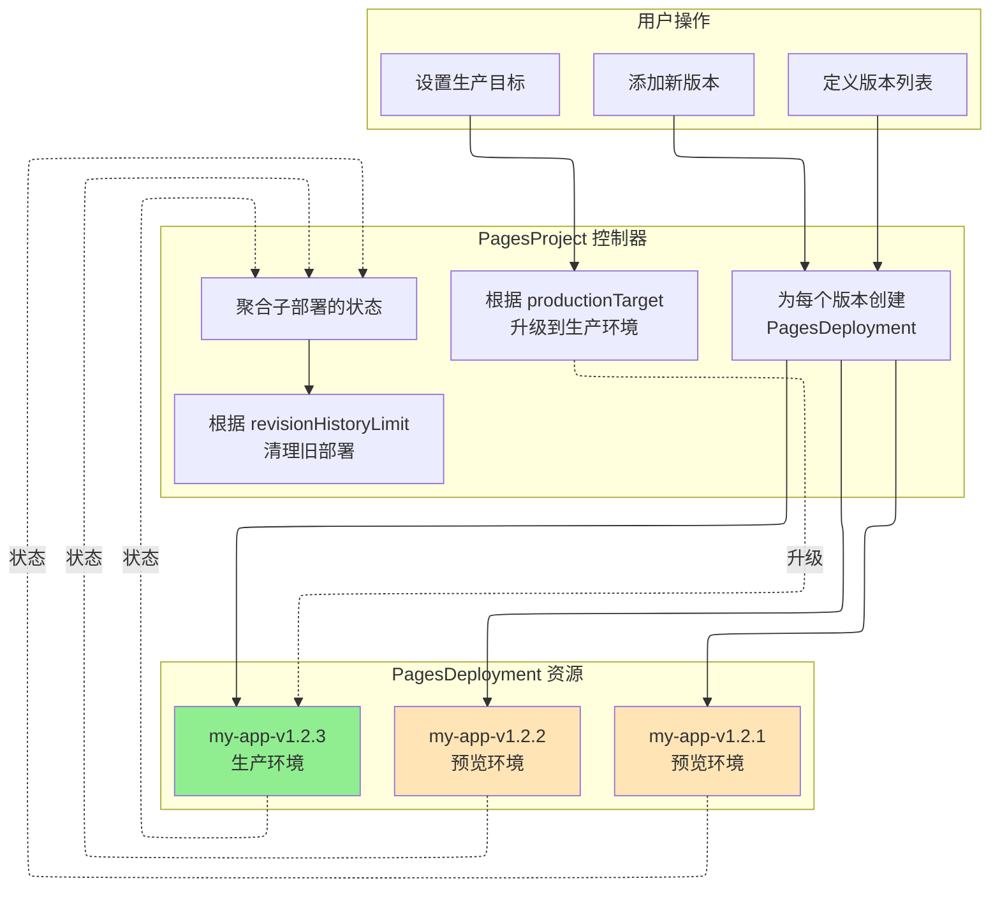

# PagesProject

PagesProject 是一个命名空间级别的资源，代表 Cloudflare Pages 项目。Cloudflare Pages 是一个 JAMstack 平台，用于部署静态站点和集成 Workers 的全栈应用。

## 概述

PagesProject 提供对 Cloudflare Pages 项目的全面管理，包括:

- **项目配置**: 构建设置、部署环境、资源绑定
- **版本管理**: 声明式多版本部署与自动回滚
- **项目采用**: 将现有 Cloudflare 项目导入 Kubernetes 管理
- **资源绑定**: D1、KV、R2、Durable Objects、Workers AI 等

## Spec 字段

| 字段 | 类型 | 必需 | 默认值 | 说明 |
|------|------|------|--------|------|
| `name` | string | 否 | K8s 资源名 | Cloudflare Pages 中的项目名称（最大 58 字符）|
| `productionBranch` | string | **是** | - | Git 部署的生产分支 |
| `source` | PagesSourceConfig | 否 | - | 源代码仓库配置 |
| `buildConfig` | PagesBuildConfig | 否 | - | 构建配置 |
| `deploymentConfigs` | PagesDeploymentConfigs | 否 | - | 环境特定配置 |
| `cloudflare` | CloudflareDetails | **是** | - | Cloudflare API 凭证 |
| `adoptionPolicy` | string | 否 | `MustNotExist` | 项目采用策略（见下文）|
| `deploymentHistoryLimit` | int | 否 | `10` | 保留的部署记录数量（0-100）|
| `enableWebAnalytics` | bool | 否 | `true` | 启用 Cloudflare Web Analytics |
| `deletionPolicy` | string | 否 | `Delete` | 删除策略: `Delete`、`Orphan` |
| `versions` | []ProjectVersion | 否 | - | 声明式版本列表（最大 100 个）|
| `productionTarget` | string | 否 | - | 生产版本目标 |
| `revisionHistoryLimit` | int32 | 否 | `10` | 托管部署保留限制（0-100）|

### 项目采用策略

| 策略 | 说明 | 使用场景 |
|------|------|----------|
| `MustNotExist` | 要求项目不存在（创建新项目）| 默认行为，新项目 |
| `IfExists` | 如果存在则采用，不存在则创建 | 灵活采用 |
| `MustExist` | 要求项目已存在 | 导入现有项目 |

### 删除策略

| 策略 | 说明 |
|------|------|
| `Delete` | 从 Cloudflare 删除 Pages 项目 |
| `Orphan` | 在 Cloudflare 中保留 Pages 项目 |

## 源代码配置

### PagesSourceConfig

| 字段 | 类型 | 必需 | 默认值 | 说明 |
|------|------|------|--------|------|
| `type` | string | 否 | `direct_upload` | 源类型: `github`、`gitlab`、`direct_upload` |
| `github` | PagesGitHubConfig | 否 | - | GitHub 配置 |
| `gitlab` | PagesGitLabConfig | 否 | - | GitLab 配置 |

### PagesGitHubConfig

| 字段 | 类型 | 必需 | 默认值 | 说明 |
|------|------|------|--------|------|
| `owner` | string | **是** | - | GitHub 仓库所有者 |
| `repo` | string | **是** | - | GitHub 仓库名称 |
| `productionDeploymentsEnabled` | bool | 否 | `true` | 启用生产部署 |
| `previewDeploymentsEnabled` | bool | 否 | `true` | 启用预览部署 |
| `prCommentsEnabled` | bool | 否 | `true` | 启用 PR 评论 |
| `deploymentsEnabled` | bool | 否 | `true` | 全局启用部署 |

### PagesGitLabConfig

| 字段 | 类型 | 必需 | 默认值 | 说明 |
|------|------|------|--------|------|
| `owner` | string | **是** | - | GitLab 命名空间 |
| `repo` | string | **是** | - | GitLab 项目名称 |
| `productionDeploymentsEnabled` | bool | 否 | `true` | 启用生产部署 |
| `previewDeploymentsEnabled` | bool | 否 | `true` | 启用预览部署 |
| `deploymentsEnabled` | bool | 否 | `true` | 全局启用部署 |

## 构建配置

### PagesBuildConfig

| 字段 | 类型 | 说明 |
|------|------|------|
| `buildCommand` | string | 构建项目的命令 |
| `destinationDir` | string | 构建输出目录 |
| `rootDir` | string | 构建的根目录 |
| `buildCaching` | bool | 启用构建缓存（默认: `true`）|
| `webAnalyticsTag` | string | Web Analytics 标签 |
| `webAnalyticsToken` | string | Web Analytics 令牌 |

## 部署配置

### PagesDeploymentConfigs

| 字段 | 类型 | 说明 |
|------|------|------|
| `preview` | PagesDeploymentConfig | 预览环境配置 |
| `production` | PagesDeploymentConfig | 生产环境配置 |

### PagesDeploymentConfig

| 字段 | 类型 | 说明 |
|------|------|------|
| `environmentVariables` | map[string]PagesEnvVar | 环境变量 |
| `compatibilityDate` | string | Workers 运行时兼容日期 |
| `compatibilityFlags` | []string | Workers 运行时兼容标志 |
| `d1Bindings` | []PagesD1Binding | D1 数据库绑定 |
| `durableObjectBindings` | []PagesDurableObjectBinding | Durable Object 绑定 |
| `kvBindings` | []PagesKVBinding | KV 命名空间绑定 |
| `r2Bindings` | []PagesR2Binding | R2 存储桶绑定 |
| `serviceBindings` | []PagesServiceBinding | Workers 服务绑定 |
| `queueBindings` | []PagesQueueBinding | 队列生产者绑定 |
| `aiBindings` | []PagesAIBinding | Workers AI 绑定 |
| `vectorizeBindings` | []PagesVectorizeBinding | Vectorize 索引绑定 |
| `hyperdriveBindings` | []PagesHyperdriveBinding | Hyperdrive 绑定 |
| `mtlsCertificates` | []PagesMTLSCertificate | mTLS 证书绑定 |
| `browserBinding` | PagesBrowserBinding | 浏览器渲染绑定 |
| `placement` | PagesPlacement | Smart Placement 配置 |
| `usageModel` | string | 使用模式: `bundled`、`unbound` |
| `failOpen` | bool | Workers 脚本失败时故障开放 |
| `alwaysUseLatestCompatibilityDate` | bool | 自动更新兼容日期 |

### 资源绑定

#### PagesD1Binding

| 字段 | 类型 | 必需 | 说明 |
|------|------|------|------|
| `name` | string | **是** | 绑定名称 |
| `databaseId` | string | **是** | D1 数据库 ID |

#### PagesKVBinding

| 字段 | 类型 | 必需 | 说明 |
|------|------|------|------|
| `name` | string | **是** | 绑定名称 |
| `namespaceId` | string | **是** | KV 命名空间 ID |

#### PagesR2Binding

| 字段 | 类型 | 必需 | 说明 |
|------|------|------|------|
| `name` | string | **是** | 绑定名称 |
| `bucketName` | string | **是** | R2 存储桶名称 |

#### PagesServiceBinding

| 字段 | 类型 | 必需 | 说明 |
|------|------|------|------|
| `name` | string | **是** | 绑定名称 |
| `service` | string | **是** | Worker 服务名称 |
| `environment` | string | 否 | Worker 环境 |

#### PagesDurableObjectBinding

| 字段 | 类型 | 必需 | 说明 |
|------|------|------|------|
| `name` | string | **是** | 绑定名称 |
| `className` | string | **是** | Durable Object 类名 |
| `scriptName` | string | 否 | Worker 脚本名称 |
| `environmentName` | string | 否 | Worker 环境名称 |

## 版本管理

### ProjectVersion

声明式版本管理支持多版本部署，具备自动升级和回滚功能。

| 字段 | 类型 | 必需 | 说明 |
|------|------|------|------|
| `name` | string | **是** | 版本标识符（例如 `v1.2.3`、`2025-01-20`）|
| `source` | PagesDirectUploadSourceSpec | 否 | 部署源（HTTP、S3、OCI）|
| `metadata` | map[string]string | 否 | 版本元数据（gitCommit、buildTime、author 等）|

### 版本管理功能



### 生产目标策略

| 值 | 行为 |
|----|------|
| `latest` | 始终使用 `versions[0]`（第一个/最新版本）|
| `vX.Y.Z` | 使用指定名称的版本 |
| `""` (空) | 不自动升级到生产环境 |

## Status 字段

| 字段 | 类型 | 说明 |
|------|------|------|
| `projectId` | string | Cloudflare 项目 ID |
| `accountId` | string | Cloudflare 账户 ID |
| `subdomain` | string | `*.pages.dev` 子域名 |
| `domains` | []string | 配置的自定义域名 |
| `latestDeployment` | PagesDeploymentInfo | 最新部署信息 |
| `state` | string | 当前状态（见下文）|
| `conditions` | []Condition | 标准 Kubernetes 条件 |
| `observedGeneration` | int64 | 上次观察的 generation |
| `message` | string | 附加状态信息 |
| `adopted` | bool | 项目是否被采用 |
| `adoptedAt` | Time | 采用时间戳 |
| `originalConfig` | PagesProjectOriginalConfig | 采用前的原始 Cloudflare 配置 |
| `deploymentHistory` | []DeploymentHistoryEntry | 最近的部署记录（用于回滚）|
| `lastSuccessfulDeploymentId` | string | 上次成功部署的 ID |
| `currentProduction` | ProductionDeploymentInfo | 当前生产部署（版本模式）|
| `managedDeployments` | int32 | 托管的 PagesDeployment 资源数量 |
| `managedVersions` | []ManagedVersionStatus | 每个托管版本的状态摘要 |

### 项目状态

| 状态 | 说明 |
|------|------|
| `Pending` | 项目等待创建 |
| `Creating` | 项目正在创建 |
| `Ready` | 项目已创建并就绪 |
| `Updating` | 项目正在更新 |
| `Deleting` | 项目正在删除 |
| `Error` | 项目发生错误 |

### ProductionDeploymentInfo

| 字段 | 类型 | 说明 |
|------|------|------|
| `version` | string | 版本名称（来自 ProjectVersion）|
| `deploymentId` | string | Cloudflare 部署 ID |
| `deploymentName` | string | PagesDeployment 资源名称 |
| `url` | string | 生产部署 URL |
| `hashUrl` | string | 部署专用 URL |
| `deployedAt` | Time | 此版本成为生产环境的时间 |

### ManagedVersionStatus

| 字段 | 类型 | 说明 |
|------|------|------|
| `name` | string | 版本名称 |
| `deploymentName` | string | PagesDeployment 资源名称 |
| `state` | string | 部署状态 |
| `isProduction` | bool | 是否为当前生产部署 |
| `deploymentId` | string | Cloudflare 部署 ID |
| `lastTransitionTime` | Time | 状态上次变更时间 |

## 示例

### 基础直接上传项目

```yaml
apiVersion: networking.cloudflare-operator.io/v1alpha2
kind: PagesProject
metadata:
  name: my-static-site
  namespace: default
spec:
  name: my-static-site
  productionBranch: main

  source:
    type: direct_upload

  buildConfig:
    buildCommand: npm run build
    destinationDir: dist
    rootDir: "/"
    buildCaching: true

  cloudflare:
    accountId: "<account-id>"
    domain: example.com
    secret: cloudflare-credentials
```

### GitHub 集成项目

```yaml
apiVersion: networking.cloudflare-operator.io/v1alpha2
kind: PagesProject
metadata:
  name: my-app
  namespace: default
spec:
  name: my-app
  productionBranch: main

  source:
    type: github
    github:
      owner: myorg
      repo: my-app
      productionDeploymentsEnabled: true
      previewDeploymentsEnabled: true
      prCommentsEnabled: true

  buildConfig:
    buildCommand: npm run build
    destinationDir: dist
    buildCaching: true

  cloudflare:
    accountId: "<account-id>"
    domain: example.com
    secret: cloudflare-credentials
```

### 带资源绑定的全栈应用

```yaml
apiVersion: networking.cloudflare-operator.io/v1alpha2
kind: PagesProject
metadata:
  name: fullstack-app
  namespace: default
spec:
  name: fullstack-app
  productionBranch: main

  deploymentConfigs:
    production:
      environmentVariables:
        API_URL:
          value: "https://api.example.com"
          type: plain_text
        SECRET_KEY:
          value: "supersecret"
          type: secret_text

      compatibilityDate: "2024-01-01"
      compatibilityFlags:
        - nodejs_compat

      # D1 数据库
      d1Bindings:
        - name: DB
          databaseId: "<d1-database-id>"

      # KV 命名空间
      kvBindings:
        - name: CACHE
          namespaceId: "<kv-namespace-id>"

      # R2 存储桶
      r2Bindings:
        - name: UPLOADS
          bucketName: my-uploads-bucket

      # Workers AI
      aiBindings:
        - name: AI

      # Vectorize
      vectorizeBindings:
        - name: VECTORS
          indexName: my-index

      usageModel: bundled
      failOpen: false

  cloudflare:
    accountId: "<account-id>"
    domain: example.com
    secret: cloudflare-credentials
```

### 采用现有项目

```yaml
apiVersion: networking.cloudflare-operator.io/v1alpha2
kind: PagesProject
metadata:
  name: legacy-site
  namespace: default
spec:
  name: legacy-site
  productionBranch: main

  # 导入现有项目
  adoptionPolicy: MustExist

  # 删除资源时保留项目
  deletionPolicy: Orphan

  cloudflare:
    accountId: "<account-id>"
    domain: example.com
    secret: cloudflare-credentials
```

### 多版本管理部署

```yaml
apiVersion: networking.cloudflare-operator.io/v1alpha2
kind: PagesProject
metadata:
  name: versioned-app
  namespace: default
spec:
  name: versioned-app
  productionBranch: main

  # 定义版本列表
  versions:
    - name: "v1.2.3"
      source:
        source:
          http:
            url: "https://releases.example.com/v1.2.3/dist.tar.gz"
        archive:
          type: tar.gz
        checksum:
          algorithm: sha256
          value: "abc123..."
      metadata:
        gitCommit: "abc123"
        buildTime: "2025-01-20T10:00:00Z"
        author: "deploy-bot"

    - name: "v1.2.2"
      source:
        source:
          http:
            url: "https://releases.example.com/v1.2.2/dist.tar.gz"
        archive:
          type: tar.gz
      metadata:
        gitCommit: "def456"
        buildTime: "2025-01-19T10:00:00Z"

    - name: "v1.2.1"
      source:
        source:
          http:
            url: "https://releases.example.com/v1.2.1/dist.tar.gz"
        archive:
          type: tar.gz

  # 自动升级最新版本到生产环境
  productionTarget: "latest"

  # 保留 10 个最近的部署
  revisionHistoryLimit: 10

  cloudflare:
    accountId: "<account-id>"
    domain: example.com
    secret: cloudflare-credentials
```

### 回滚到之前的版本

```yaml
apiVersion: networking.cloudflare-operator.io/v1alpha2
kind: PagesProject
metadata:
  name: versioned-app
  namespace: default
spec:
  name: versioned-app
  productionBranch: main

  versions:
    - name: "v1.2.3"
      source: {...}
    - name: "v1.2.2"
      source: {...}

  # 回滚: 从 "latest" 改为特定版本
  productionTarget: "v1.2.2"

  cloudflare:
    accountId: "<account-id>"
    domain: example.com
    secret: cloudflare-credentials
```

## 使用场景

### 持续部署

自动部署新版本，同时保持生产环境稳定:

1. 将新版本添加到 `versions` 列表顶部（位置 0）
2. 设置 `productionTarget: "latest"` 实现自动升级
3. 控制器为新版本创建 PagesDeployment
4. 成功后自动升级到生产环境

### 蓝绿部署

维护多个版本并在它们之间切换:

1. 在 `versions` 列表中定义多个版本
2. 在预览环境中测试每个版本
3. 切换 `productionTarget` 升级所需版本
4. 通过更改 `productionTarget` 实现即时回滚

### 金丝雀部署

逐步推出新版本:

1. 将新版本部署到预览环境（`productionTarget: "v1.2.2"`）
2. 监控指标和用户反馈
3. 确认无误后切换到新版本（`productionTarget: "v1.2.3"`）

### 多环境管理

为每个环境管理不同的配置:

```yaml
deploymentConfigs:
  production:
    environmentVariables:
      ENV: { value: "production" }
      DB_URL: { value: "prod-db.example.com" }
  preview:
    environmentVariables:
      ENV: { value: "preview" }
      DB_URL: { value: "staging-db.example.com" }
```

## 相关资源

- [PagesDeployment](pagesdeployment.md) - 将特定版本部署到 Cloudflare Pages
- [PagesDomain](pagesdomain.md) - 为 Pages 项目配置自定义域名
- [R2Bucket](r2bucket.md) - 创建用于 Pages 的 R2 存储桶
- [CloudflareDomain](cloudflareadomain.md) - 配置 DNS 和 SSL 设置

## 参考资料

- [版本管理指南](../../features/pagesproject-versions.md)
- [Cloudflare Pages 文档](https://developers.cloudflare.com/pages/)
- [Workers 绑定参考](https://developers.cloudflare.com/workers/runtime-apis/bindings/)
