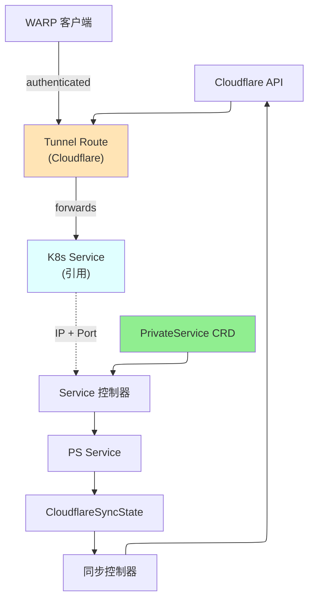

# PrivateService

PrivateService 是一个命名空间作用域的资源，通过 Cloudflare Tunnel 和虚拟网络私自暴露 Kubernetes Service，使 WARP 客户端能够安全访问。

## 概述

PrivateService 为 Kubernetes Service 创建私有网络路由，使其仅可通过 WARP 连接的客户端和 Cloudflare Tunnel 访问。PrivateService 不是向互联网暴露服务，而是与虚拟网络集成以提供对内部服务的安全、经过身份验证的访问。操作员会自动从服务的 ClusterIP 派生网络 CIDR。

### 主要特性

| 特性 | 描述 |
|------|------|
| **Service 集成** | 通过 WARP 和 Tunnel 暴露 Kubernetes Service |
| **自动 CIDR** | 从 Service ClusterIP 派生网络 CIDR |
| **零信任** | Cloudflare Access 策略控制访问 |
| **协议支持** | TCP 和 UDP 协议支持 |
| **虚拟网络** | 与特定虚拟网络关联 |

### 使用场景

- **内部服务**：安全地暴露内部 API 和数据库
- **跨命名空间访问**：通过 WARP 提供跨命名空间服务访问
- **数据库访问**：无需 VPN 即可安全远程数据库访问
- **微服务**：通过私有网络启用服务间通信
- **合规性**：使用零信任访问满足安全要求

## 架构



## 规范

### 主要字段

| 字段 | 类型 | 必需 | 默认值 | 描述 |
|------|------|------|--------|------|
| `serviceRef` | ServiceRef | **是** | - | Kubernetes Service 的引用 |
| `tunnelRef` | TunnelRef | **是** | - | Tunnel 或 ClusterTunnel 的引用 |
| `virtualNetworkRef` | *VirtualNetworkRef | 否 | - | VirtualNetwork 的引用 |
| `protocol` | string | 否 | `tcp` | 协议：`tcp` 或 `udp`（已弃用，自动） |
| `comment` | string | 否 | - | 可选描述（最多 500 个字符） |
| `cloudflare` | CloudflareDetails | **是** | - | Cloudflare API 凭证 |

### ServiceRef

| 字段 | 类型 | 必需 | 描述 |
|------|------|------|------|
| `name` | string | **是** | Kubernetes Service 的名称 |
| `port` | int32 | **是** | 端口号（1-65535） |

### TunnelRef 和 VirtualNetworkRef

请参阅 [NetworkRoute](networkroute.md) 获取参考格式详情。

## 状态

| 字段 | 类型 | 描述 |
|------|------|------|
| `network` | string | 为此私有服务创建的 CIDR |
| `serviceIP` | string | 引用的 Service 的 ClusterIP |
| `tunnelId` | string | Cloudflare Tunnel ID |
| `tunnelName` | string | Cloudflare 中的 Tunnel 名称 |
| `virtualNetworkId` | string | Cloudflare 虚拟网络 ID |
| `accountId` | string | Cloudflare 账户 ID |
| `state` | string | 当前状态 |
| `conditions` | []metav1.Condition | 最新观察 |
| `observedGeneration` | int64 | 控制器观察到的最后一代 |

## 示例

### 示例 1：暴露内部 API Service

```yaml
apiVersion: networking.cloudflare-operator.io/v1alpha2
kind: PrivateService
metadata:
  name: internal-api
  namespace: production
spec:
  serviceRef:
    name: api-service
    port: 8080
  tunnelRef:
    kind: ClusterTunnel
    name: main-tunnel
  cloudflare:
    accountId: "1234567890abcdef"
    credentialsRef:
      name: production
```

### 示例 2：使用虚拟网络进行数据库访问

```yaml
apiVersion: networking.cloudflare-operator.io/v1alpha2
kind: PrivateService
metadata:
  name: postgres-private
  namespace: databases
spec:
  serviceRef:
    name: postgres
    port: 5432
  tunnelRef:
    kind: Tunnel
    name: db-tunnel
    namespace: tunnels
  virtualNetworkRef:
    name: db-network
  comment: "PostgreSQL private access"
  cloudflare:
    accountId: "1234567890abcdef"
    credentialsRef:
      name: production
```

### 示例 3：命名空间中的多个 Service

```yaml
apiVersion: networking.cloudflare-operator.io/v1alpha2
kind: PrivateService
metadata:
  name: redis-private
  namespace: cache
spec:
  serviceRef:
    name: redis
    port: 6379
  tunnelRef:
    kind: ClusterTunnel
    name: main-tunnel
  cloudflare:
    accountId: "1234567890abcdef"
    credentialsRef:
      name: production
---
apiVersion: networking.cloudflare-operator.io/v1alpha2
kind: PrivateService
metadata:
  name: elasticsearch-private
  namespace: cache
spec:
  serviceRef:
    name: elasticsearch
    port: 9200
  tunnelRef:
    kind: ClusterTunnel
    name: main-tunnel
  cloudflare:
    accountId: "1234567890abcdef"
    credentialsRef:
      name: production
```

## 前置条件

- 同一命名空间中的 Kubernetes Service
- Cloudflare Zero Trust 订阅
- 有效的 Tunnel 或 ClusterTunnel 资源
- 访问机器上的 WARP 客户端
- 配置的 Cloudflare Access 策略

## 限制

- Service 必须与 PrivateService 在同一命名空间
- 每个 PrivateService 只能有一个端口
- Service ClusterIP 必须有效（不是待处理）
- 客户端访问需要 WARP 注册
- 从 Service ClusterIP 范围派生的网络

## 相关资源

- [NetworkRoute](networkroute.md) - 直接路由 CIDR 范围
- [Tunnel](tunnel.md) - 用于路由流量的 Tunnel
- [ClusterTunnel](clustertunnel.md) - 集群作用域的 Tunnel
- [VirtualNetwork](virtualnetwork.md) - 用于路由的虚拟网络
- [WARPConnector](warpconnector.md) - 部署连接器以公告路由

## 另请参阅

- [Cloudflare WARP 文档](https://developers.cloudflare.com/warp-client/)
- [Cloudflare Tunnel Routes](https://developers.cloudflare.com/cloudflare-one/setup/network/)
- [Kubernetes Services](https://kubernetes.io/docs/concepts/services-networking/service/)
