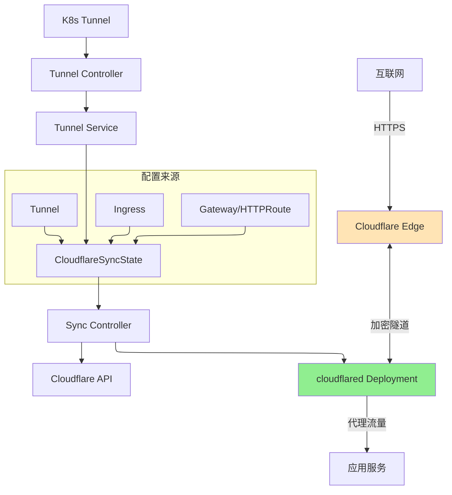

# Tunnel

Tunnel 是命名空间级资源，用于创建和管理 Cloudflare Tunnel，并自动部署 cloudflared。它提供了一种安全的方式，无需开放入站端口即可将 Kubernetes 集群中的服务暴露到互联网。

## 概述

Cloudflare Tunnel 在您的 Kubernetes 集群与 Cloudflare 边缘网络之间创建加密连接。当您创建 Tunnel 资源时，Operator 会自动将 cloudflared 部署为 Kubernetes Deployment，并在 Cloudflare 上管理隧道配置。

### 主要特性

| 特性 | 描述 |
|------|------|
| **自动部署** | Operator 自动创建和管理 cloudflared Deployment |
| **安全连接** | 所有流量都经过加密并通过 Cloudflare 网络路由 |
| **无需入站端口** | 无需将服务直接暴露到互联网 |
| **协议支持** | 支持 HTTP/HTTPS、WebSocket、TCP 和 UDP 协议 |
| **WARP 路由** | 可选的通过 WARP 客户端访问私有网络 |
| **灵活配置** | 通过 patch 自定义 cloudflared 部署 |

### 使用场景

- **公共 Web 服务**: 安全地将 Web 应用程序暴露到互联网
- **内部服务**: 为内部应用程序提供 Zero Trust 访问
- **私有网络**: 通过 WARP 路由私有 IP 范围（需启用 `enableWarpRouting: true`）
- **多协议**: 支持 HTTP、HTTPS、gRPC、WebSocket、TCP 和 UDP 服务

## 架构



## Spec

### 主要字段

| 字段 | 类型 | 必需 | 默认值 | 描述 |
|------|------|------|--------|------|
| `newTunnel` | *NewTunnel | 否 | - | 创建新隧道（与 `existingTunnel` 互斥） |
| `existingTunnel` | *ExistingTunnel | 否 | - | 使用现有隧道（与 `newTunnel` 互斥） |
| `cloudflare` | CloudflareDetails | **是** | - | Cloudflare API 凭证和配置 |
| `enableWarpRouting` | bool | 否 | `false` | 启用 WARP 路由以实现私有网络访问 |
| `protocol` | string | 否 | `"auto"` | 隧道协议：`"auto"`、`"quic"` 或 `"http2"` |
| `fallbackTarget` | string | 否 | `"http_status:404"` | 无匹配入口规则时的默认响应 |
| `noTlsVerify` | bool | 否 | `false` | 禁用源站 TLS 证书验证 |
| `originCaPool` | string | 否 | - | 包含源站 TLS 自定义 CA 证书的 Secret |
| `deployPatch` | string | 否 | `"{}"` | 用于自定义 cloudflared Deployment 的 JSON patch |

### NewTunnel

| 字段 | 类型 | 必需 | 描述 |
|------|------|------|------|
| `name` | string | **是** | 要在 Cloudflare 上创建的新隧道名称 |

### ExistingTunnel

| 字段 | 类型 | 必需 | 描述 |
|------|------|------|------|
| `id` | string | 否 | 现有隧道 UUID（优先于 `name`） |
| `name` | string | 否 | 现有隧道名称（如果未提供 `id` 则使用） |

> **注意**: 对于 `existingTunnel`，至少需要提供 `id` 或 `name` 之一。如果两者都提供，则 `id` 优先。

### CloudflareDetails

详细的凭证配置选项请参见[配置指南](../configuration.md#cloudflare-credentials)。

关键字段：
- `accountId` - Cloudflare 账户 ID（必需）
- `domain` - 由 Cloudflare 管理的域名（DNS 功能需要）
- `secret` - 包含 API 凭证的 Secret 名称（必需）
- `credentialsRef` - 引用 CloudflareCredentials 资源（推荐）

## Status

| 字段 | 类型 | 描述 |
|------|------|------|
| `tunnelId` | string | Cloudflare 隧道 UUID |
| `tunnelName` | string | Cloudflare 隧道名称 |
| `accountId` | string | Cloudflare 账户 ID |
| `zoneId` | string | Cloudflare Zone ID（如果配置了域名） |
| `state` | string | 当前状态：`pending`、`creating`、`active`、`error`、`deleting` |
| `configVersion` | int | 来自 Cloudflare 的当前隧道配置版本 |
| `syncedHostnames` | []string | 由此 Tunnel 控制器管理的主机名 |
| `conditions` | []Condition | 标准 Kubernetes 条件 |
| `observedGeneration` | int64 | 最后观察到的 generation |

## 示例

### 基础新隧道

```yaml
apiVersion: networking.cloudflare-operator.io/v1alpha2
kind: Tunnel
metadata:
  name: my-tunnel
  namespace: default
spec:
  newTunnel:
    name: my-k8s-tunnel

  cloudflare:
    accountId: "<your-account-id>"
    domain: example.com
    secret: cloudflare-api-credentials
```

### 通过 ID 使用现有隧道

```yaml
apiVersion: networking.cloudflare-operator.io/v1alpha2
kind: Tunnel
metadata:
  name: existing-tunnel
  namespace: production
spec:
  existingTunnel:
    id: "550e8400-e29b-41d4-a716-446655440000"

  cloudflare:
    accountId: "<your-account-id>"
    domain: example.com
    secret: cloudflare-api-credentials
```

### 启用 WARP 路由的隧道

用于通过 WARP 客户端访问私有网络：

```yaml
apiVersion: networking.cloudflare-operator.io/v1alpha2
kind: Tunnel
metadata:
  name: private-network-tunnel
  namespace: default
spec:
  newTunnel:
    name: private-access-tunnel

  # 启用 WARP 路由以实现私有网络访问
  enableWarpRouting: true

  cloudflare:
    accountId: "<your-account-id>"
    domain: example.com
    secret: cloudflare-api-credentials
```

### 自定义 cloudflared 部署的隧道

自定义副本数、资源和节点选择器：

```yaml
apiVersion: networking.cloudflare-operator.io/v1alpha2
kind: Tunnel
metadata:
  name: ha-tunnel
  namespace: production
spec:
  newTunnel:
    name: high-availability-tunnel

  # cloudflared Deployment 的 JSON patch
  deployPatch: |
    {
      "spec": {
        "replicas": 3,
        "template": {
          "spec": {
            "nodeSelector": {
              "node-type": "edge"
            },
            "resources": {
              "requests": {
                "cpu": "100m",
                "memory": "128Mi"
              },
              "limits": {
                "cpu": "200m",
                "memory": "256Mi"
              }
            }
          }
        }
      }
    }

  cloudflare:
    accountId: "<your-account-id>"
    domain: example.com
    secret: cloudflare-api-credentials
```

### 自定义协议的隧道

强制使用 HTTP/2 协议而不是自动协商：

```yaml
apiVersion: networking.cloudflare-operator.io/v1alpha2
kind: Tunnel
metadata:
  name: http2-tunnel
  namespace: default
spec:
  newTunnel:
    name: http2-tunnel

  # 强制使用 HTTP/2 协议
  protocol: http2

  cloudflare:
    accountId: "<your-account-id>"
    domain: example.com
    secret: cloudflare-api-credentials
```

### 使用自定义 CA 池的隧道

用于具有自签名证书的源站：

```yaml
apiVersion: networking.cloudflare-operator.io/v1alpha2
kind: Tunnel
metadata:
  name: custom-ca-tunnel
  namespace: default
spec:
  newTunnel:
    name: custom-ca-tunnel

  # 引用包含自定义 CA 证书的 Secret
  originCaPool: custom-ca-certificates

  cloudflare:
    accountId: "<your-account-id>"
    domain: example.com
    secret: cloudflare-api-credentials
---
apiVersion: v1
kind: Secret
metadata:
  name: custom-ca-certificates
  namespace: default
type: Opaque
data:
  tls.crt: <base64-encoded-ca-cert>
```

## 前置条件

1. **Cloudflare 账户**: 已启用 Zero Trust 的活跃 Cloudflare 账户
2. **API 凭证**: 具有适当权限的 API Token 或 API Key
3. **Kubernetes Secret**: 已创建包含 API 凭证的 Secret

### 所需 API 权限

| 权限 | 范围 | 用途 |
|------|------|------|
| `Account:Cloudflare Tunnel:Edit` | Account | 管理隧道生命周期 |
| `Zone:DNS:Edit` | Zone | 管理 DNS 记录（如果使用域名） |

详细的权限设置请参见[配置指南](../configuration.md#api-token-permissions)。

### 创建凭证 Secret

```yaml
apiVersion: v1
kind: Secret
metadata:
  name: cloudflare-api-credentials
  namespace: default
type: Opaque
stringData:
  # 方式 1: API Token（推荐）
  CLOUDFLARE_API_TOKEN: "your-api-token-here"

  # 方式 2: API Key + Email
  # CLOUDFLARE_API_KEY: "your-api-key"
  # CLOUDFLARE_EMAIL: "your-email@example.com"
```

## 限制

- **隧道名称唯一性**: 隧道名称在 Cloudflare 账户内必须唯一
- **现有隧道凭证**: 使用 `existingTunnel` 时，必须手动创建包含隧道凭证的 Secret
- **命名空间作用域**: 每个 Tunnel 都是命名空间级的；使用 ClusterTunnel 实现集群级隧道
- **配置合并**: Tunnel 配置通过 CloudflareSyncState 与 Ingress/Gateway 规则合并

## Tunnel vs ClusterTunnel

| 方面 | Tunnel | ClusterTunnel |
|------|--------|---------------|
| **作用域** | 命名空间级 | 集群级 |
| **使用场景** | 每个命名空间隔离 | 跨命名空间共享 |
| **Secret 位置** | 同一命名空间 | `cloudflare-operator-system` |
| **Ingress 绑定** | 仅同一命名空间 | 任意命名空间 |

## 相关资源

- [ClusterTunnel](clustertunnel.md) - 用于多命名空间使用的集群级隧道
- [DNSRecord](dnsrecord.md) - 管理隧道端点的 DNS 记录
- [Ingress](../guides/ingress-integration.md) - 将原生 Kubernetes Ingress 与 Tunnel 配合使用
- [Gateway API](../guides/gateway-api-integration.md) - 将 Gateway API (HTTPRoute) 与 Tunnel 配合使用
- [NetworkRoute](networkroute.md) - 通过隧道路由私有 IP 范围（需 WARP 路由）
- [VirtualNetwork](virtualnetwork.md) - 创建用于私有访问的虚拟网络

## 另请参阅

- [示例](../../../examples/01-basic/tunnel/)
- [Cloudflare Tunnel 文档](https://developers.cloudflare.com/cloudflare-one/connections/connect-networks/)
- [cloudflared CLI 参考](https://developers.cloudflare.com/cloudflare-one/connections/connect-networks/downloads/)
