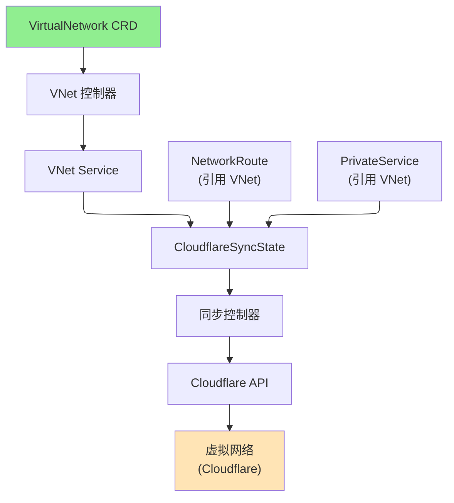

# VirtualNetwork

VirtualNetwork 是一个集群作用域的资源，代表 Cloudflare Zero Trust 虚拟网络，为通过 Cloudflare Tunnel 路由流量提供隔离的私有网络地址空间。

## 概述

虚拟网络在 Cloudflare Zero Trust 中创建一个隔离的私有网络，可以通过 Cloudflare Tunnel 和 WARP 连接器路由。每个账户可以存在多个虚拟网络，每个都有自己的路由规则和配置。默认情况下，一个虚拟网络作为主要路由目标，但您可以为特定用例（如多区域部署或流量隔离）创建其他网络。

### 主要特性

| 特性 | 描述 |
|------|------|
| **隔离网络** | 在 Cloudflare Zero Trust 中创建多个隔离的私有网络 |
| **默认网络** | 将一个网络标记为默认用于路由 |
| **注释** | 添加可选的描述用于组织和文档 |
| **账户级别** | 集群作用域资源，在命名空间之间共享 |

### 使用场景

- **多区域部署**：不同地理区域的单独虚拟网络
- **多租户**：隔离不同团队或客户之间的流量
- **环境隔离**：为 dev/staging/prod 创建单独的网络
- **合规性**：使用网络隔离满足法规要求
- **流量管理**：单独控制和路由特定 IP 范围

## 架构



## 规范

### 主要字段

| 字段 | 类型 | 必需 | 默认值 | 描述 |
|------|------|------|--------|------|
| `name` | string | 否 | 资源名称 | Cloudflare 中虚拟网络的名称 |
| `comment` | string | 否 | - | 可选描述（最多 500 个字符） |
| `isDefaultNetwork` | bool | 否 | `false` | 将此标记为账户的默认虚拟网络 |
| `cloudflare` | CloudflareDetails | **是** | - | Cloudflare API 凭证和账户信息 |

### CloudflareDetails

- `accountId` - Cloudflare 账户 ID（必需）
- `domain` - 由 Cloudflare 管理的域名（可选）
- `secret` - 包含 API 凭证的 Secret 名称（必需）
- `credentialsRef` - CloudflareCredentials 资源的引用（推荐）

## 状态

| 字段 | 类型 | 描述 |
|------|------|------|
| `virtualNetworkId` | string | 虚拟网络的 Cloudflare ID |
| `accountId` | string | Cloudflare 账户 ID |
| `state` | string | 当前状态（活动、已删除等） |
| `isDefault` | bool | 是否为默认虚拟网络 |
| `conditions` | []metav1.Condition | 资源状态的最新观察 |
| `observedGeneration` | int64 | 控制器观察到的最后一代 |

## 示例

### 示例 1：默认虚拟网络

```yaml
apiVersion: networking.cloudflare-operator.io/v1alpha2
kind: VirtualNetwork
metadata:
  name: default-vnet
spec:
  name: "Default Network"
  comment: "Primary virtual network for all routing"
  isDefaultNetwork: true
  cloudflare:
    accountId: "1234567890abcdef"
    domain: "example.com"
    secret: cloudflare-credentials
```

### 示例 2：区域虚拟网络

```yaml
apiVersion: networking.cloudflare-operator.io/v1alpha2
kind: VirtualNetwork
metadata:
  name: us-east-vnet
spec:
  name: "US East Virtual Network"
  comment: "Network for US East region deployments"
  cloudflare:
    accountId: "1234567890abcdef"
    domain: "example.com"
    credentialsRef:
      name: production
---
apiVersion: networking.cloudflare-operator.io/v1alpha2
kind: VirtualNetwork
metadata:
  name: eu-west-vnet
spec:
  name: "EU West Virtual Network"
  comment: "Network for EU West region deployments"
  cloudflare:
    accountId: "1234567890abcdef"
    domain: "example.com"
    credentialsRef:
      name: production
```

### 示例 3：多租户隔离

```yaml
apiVersion: networking.cloudflare-operator.io/v1alpha2
kind: VirtualNetwork
metadata:
  name: tenant-a-vnet
spec:
  name: "Tenant A Network"
  comment: "Isolated network for Tenant A"
  cloudflare:
    accountId: "1234567890abcdef"
    credentialsRef:
      name: production
---
apiVersion: networking.cloudflare-operator.io/v1alpha2
kind: VirtualNetwork
metadata:
  name: tenant-b-vnet
spec:
  name: "Tenant B Network"
  comment: "Isolated network for Tenant B"
  cloudflare:
    accountId: "1234567890abcdef"
    credentialsRef:
      name: production
```

## 前置条件

- Cloudflare Zero Trust 订阅
- 具有适当权限的有效 Cloudflare API 凭证
- 目标 Cloudflare 账户的账户 ID

## 限制

- 每个账户只能有一个 VirtualNetwork 标记为 `isDefaultNetwork: true`
- 虚拟网络的范围是账户级别，而不是特定于域的
- 网络名称在 Cloudflare 中每个账户必须唯一
- 删除虚拟网络会移除所有关联的路由

## 相关资源

- [NetworkRoute](networkroute.md) - 定义要通过此 VNet 路由的 CIDR 范围
- [PrivateService](privateservice.md) - 通过此 VNet 暴露服务
- [WARPConnector](warpconnector.md) - 在此 VNet 中部署连接器
- [Tunnel](tunnel.md) - 通过此 VNet 中的 Tunnel 路由流量
- [CloudflareCredentials](cloudflarecredentials.md) - VNet 管理的 API 凭证

## 另请参阅

- [Cloudflare 虚拟网络文档](https://developers.cloudflare.com/cloudflare-one/setup/network/)
- [Cloudflare Zero Trust 网络](https://developers.cloudflare.com/cloudflare-one/)
