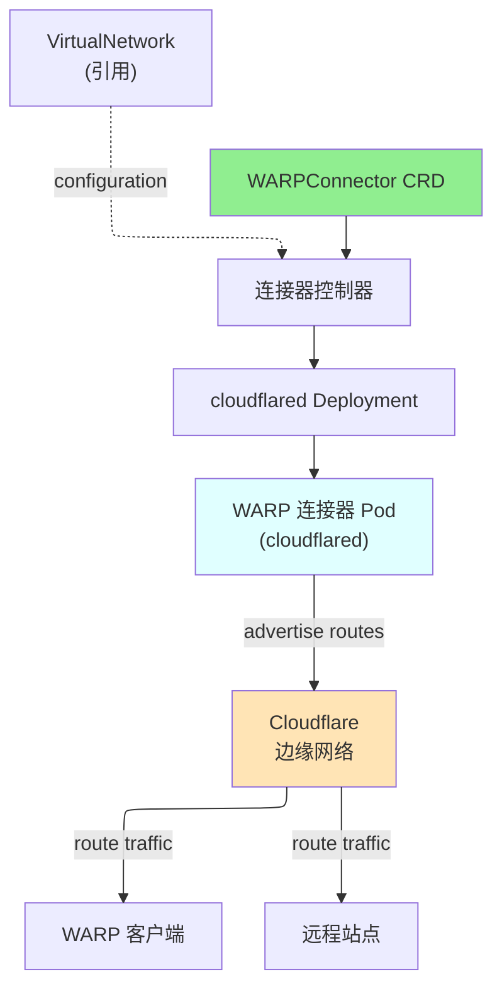

# WARPConnector

WARPConnector 是一个命名空间作用域的资源，用于在 Kubernetes 中部署和管理 Cloudflare WARP 连接器，实现站点间连接和私有网络路由。

## 概述

WARPConnector 在 Kubernetes 集群内创建和管理 WARP 连接器部署。这些连接器建立到 Cloudflare 网络的出站连接，并公告私有网络路由，使 WARP 客户端和其他站点能够访问连接器后面的资源。可以部署多个连接器以实现冗余和负载分配。

### 主要特性

| 特性 | 描述 |
|------|------|
| **自动部署** | 自动创建和管理 cloudflared WARP 连接器部署 |
| **路由公告** | 自动公告配置的 CIDR 路由 |
| **高可用性** | 多个副本用于冗余 |
| **资源管理** | 可配置的 CPU 和内存资源 |
| **Pod 调度** | NodeSelector、容错和亲和性支持 |
| **虚拟网络支持** | 与特定虚拟网络关联 |

### 使用场景

- **站点间连接**：通过 WARP 连接多个站点
- **路由公告**：向 WARP 客户端公告私有网络
- **冗余连接**：部署多个连接器以实现高可用性
- **零信任网络**：启用对私有资源的安全访问
- **多区域**：在多个区域部署连接器

## 架构



## 规范

### 主要字段

| 字段 | 类型 | 必需 | 默认值 | 描述 |
|------|------|------|--------|------|
| `replicas` | int32 | 否 | `1` | 连接器副本数 |
| `image` | string | 否 | `cloudflare/cloudflared:latest` | 容器镜像 |
| `virtualNetworkRef` | *VirtualNetworkRef | 否 | - | 关联的虚拟网络 |
| `routes` | []WARPConnectorRoute | 否 | - | 要公告的路由 |
| `resources` | *ResourceRequirements | 否 | - | 计算资源（CPU/内存） |
| `nodeSelector` | map[string]string | 否 | - | Pod 节点选择器 |
| `tolerations` | []Toleration | 否 | - | Pod 容错 |
| `serviceAccountName` | string | 否 | - | 连接器的服务账户 |
| `cloudflare` | CloudflareDetails | **是** | - | Cloudflare API 凭证 |

### WARPConnectorRoute

| 字段 | 类型 | 必需 | 描述 |
|------|------|------|------|
| `network` | string | **是** | 要公告的 CIDR（例如"10.0.0.0/8"） |
| `comment` | string | 否 | 路由描述 |

## 状态

| 字段 | 类型 | 描述 |
|------|------|------|
| `connectorId` | string | Cloudflare 连接器 ID |
| `accountId` | string | Cloudflare 账户 ID |
| `virtualNetworkId` | string | 关联的虚拟网络 ID |
| `state` | string | 当前状态 |
| `replicas` | int32 | 运行中的副本数 |
| `readyReplicas` | int32 | 就绪的副本数 |
| `conditions` | []metav1.Condition | 最新观察 |

## 示例

### 示例 1：基本 WARP 连接器

```yaml
apiVersion: networking.cloudflare-operator.io/v1alpha2
kind: WARPConnector
metadata:
  name: main-connector
  namespace: production
spec:
  replicas: 2
  routes:
    - network: "10.0.0.0/8"
      comment: "Internal network"
  cloudflare:
    accountId: "1234567890abcdef"
    credentialsRef:
      name: production
```

### 示例 2：多路由与虚拟网络

```yaml
apiVersion: networking.cloudflare-operator.io/v1alpha2
kind: WARPConnector
metadata:
  name: multi-route-connector
  namespace: production
spec:
  replicas: 3
  virtualNetworkRef:
    name: production-vnet
  routes:
    - network: "10.0.0.0/16"
      comment: "Production servers"
    - network: "172.16.0.0/12"
      comment: "Development servers"
    - network: "192.168.0.0/16"
      comment: "Internal services"
  resources:
    requests:
      cpu: "500m"
      memory: "256Mi"
    limits:
      cpu: "1000m"
      memory: "512Mi"
  cloudflare:
    accountId: "1234567890abcdef"
    credentialsRef:
      name: production
```

### 示例 3：具有节点选择的高可用性部署

```yaml
apiVersion: networking.cloudflare-operator.io/v1alpha2
kind: WARPConnector
metadata:
  name: ha-connector
  namespace: production
spec:
  replicas: 4
  image: "cloudflare/cloudflared:2024.1.0"
  routes:
    - network: "10.0.0.0/8"
  nodeSelector:
    node-type: "connector"
  tolerations:
    - key: "dedicated"
      operator: "Equal"
      value: "connector"
      effect: "NoSchedule"
  serviceAccountName: "warp-connector-sa"
  resources:
    requests:
      cpu: "1000m"
      memory: "512Mi"
    limits:
      cpu: "2000m"
      memory: "1Gi"
  cloudflare:
    accountId: "1234567890abcdef"
    credentialsRef:
      name: production
```

## 前置条件

- Cloudflare Zero Trust 订阅
- 账户中启用的 Cloudflare 连接器
- 有效的 Cloudflare API 凭证
- 配置了 RBAC 的 Kubernetes 集群
- 连接器 Pod 的充足资源

## 限制

- 每个连接器独立公告路由
- 多个连接器不能为相同的 CIDR 公告不同的路由
- 连接器注册需要有效的凭证
- 路由必须在连接器内唯一
- 镜像必须公开可访问或在集群中可用

## 相关资源

- [VirtualNetwork](virtualnetwork.md) - 连接器路由的虚拟网络
- [NetworkRoute](networkroute.md) - 替代路由定义方法
- [Tunnel](tunnel.md) - 基于 Tunnel 的路由替代方案
- [CloudflareCredentials](cloudflarecredentials.md) - API 凭证

## 另请参阅

- [Cloudflare WARP 连接器](https://developers.cloudflare.com/cloudflare-one/connections/connect-networks/deploy-warp-connector/)
- [cloudflared 文档](https://developers.cloudflare.com/cloudflare-one/connections/cloudflared-tunnel/)
- [Kubernetes Deployments](https://kubernetes.io/docs/concepts/workloads/controllers/deployment/)
