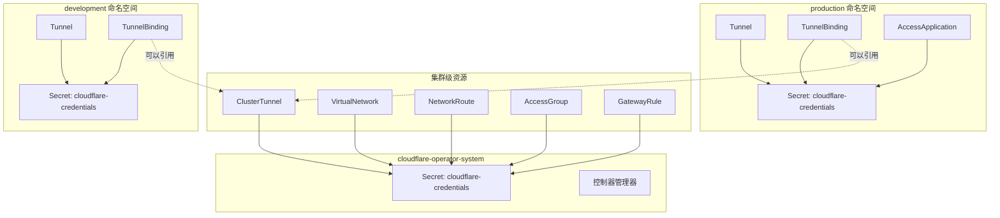

# 命名空间限制与 Secret 管理

本文档说明 CRD 作用域如何影响 Secret 查找，并提供正确配置凭证的指南。

## 概述

Cloudflare Operator 在两个不同的作用域管理资源：

- **集群级 (Cluster-scoped)**：可跨所有命名空间访问的资源
- **命名空间级 (Namespaced)**：限制在特定命名空间内的资源

作用域决定了 operator 在哪里查找 Cloudflare API 凭证（Secret）。

## CRD 作用域参考

### 集群级 CRD（13 个）

这些资源不绑定到任何命名空间。Secret 必须在 **operator 命名空间**（`cloudflare-operator-system`）中。

| CRD | 类别 | 说明 |
|-----|------|------|
| CloudflareCredentials | 核心 | 共享 API 凭证配置 |
| ClusterTunnel | 隧道 | 集群级 Cloudflare Tunnel |
| VirtualNetwork | 网络 | 流量隔离虚拟网络 |
| NetworkRoute | 网络 | 通过隧道路由 CIDR |
| WARPConnector | 网络 | 站点间 WARP 连接器 |
| AccessGroup | 访问控制 | 可复用的访问策略组 |
| AccessIdentityProvider | 访问控制 | 身份提供商配置 |
| GatewayRule | 网关 | DNS/HTTP/L4 策略规则 |
| GatewayList | 网关 | 网关规则使用的列表 |
| GatewayConfiguration | 网关 | 全局网关设置 |
| DeviceSettingsPolicy | 设备 | WARP 客户端配置 |
| DevicePostureRule | 设备 | 设备健康检查规则 |
| TunnelGatewayClassConfig | K8s 集成 | Gateway API 集成配置 |

### 命名空间级 CRD（8 个）

这些资源存在于特定命名空间内。Secret 必须在与资源**相同的命名空间**中。

| CRD | 类别 | 说明 |
|-----|------|------|
| Tunnel | 隧道 | 命名空间级 Cloudflare Tunnel |
| TunnelBinding | 隧道 | 将服务绑定到隧道并配置 DNS |
| AccessApplication | 访问控制 | Zero Trust 应用 |
| AccessServiceToken | 访问控制 | M2M 认证令牌 |
| AccessTunnel | 访问控制 | Access 保护的隧道端点 |
| PrivateService | 网络 | 私有 IP 服务暴露 |
| DNSRecord | DNS | DNS 记录管理 |
| TunnelIngressClassConfig | K8s 集成 | Ingress 集成配置 |

## Secret 查找规则

### 规则 1：命名空间级资源

对于命名空间级 CRD，operator 在与资源**相同的命名空间**中查找 Secret。

```yaml
# 示例：production 命名空间中的 Tunnel
apiVersion: networking.cloudflare-operator.io/v1alpha2
kind: Tunnel
metadata:
  name: my-tunnel
  namespace: production  # 资源命名空间
spec:
  cloudflare:
    accountId: "abc123"
    domain: example.com
    secret: cloudflare-credentials  # 必须在 production 命名空间中
```

Secret 必须在相同的命名空间中：

```yaml
apiVersion: v1
kind: Secret
metadata:
  name: cloudflare-credentials
  namespace: production  # 与 Tunnel 命名空间相同
type: Opaque
stringData:
  CLOUDFLARE_API_TOKEN: "your-token"
```

### 规则 2：集群级资源

对于集群级 CRD，operator 在 **operator 命名空间**（`cloudflare-operator-system`）中查找 Secret。

```yaml
# 示例：ClusterTunnel（集群级）
apiVersion: networking.cloudflare-operator.io/v1alpha2
kind: ClusterTunnel
metadata:
  name: shared-tunnel
  # 没有 namespace - 集群级
spec:
  cloudflare:
    accountId: "abc123"
    domain: example.com
    secret: cloudflare-credentials  # 必须在 operator 命名空间中
```

Secret 必须在 operator 命名空间中：

```yaml
apiVersion: v1
kind: Secret
metadata:
  name: cloudflare-credentials
  namespace: cloudflare-operator-system  # Operator 命名空间
type: Opaque
stringData:
  CLOUDFLARE_API_TOKEN: "your-token"
```

### 规则 3：TunnelBinding 特殊情况

`TunnelBinding` 是命名空间级的，但可以引用 `Tunnel`（命名空间级）或 `ClusterTunnel`（集群级）。

**引用 Tunnel（相同命名空间）：**

```yaml
apiVersion: networking.cloudflare-operator.io/v1alpha2
kind: TunnelBinding
metadata:
  name: my-binding
  namespace: production
spec:
  tunnelRef:
    kind: Tunnel
    name: my-tunnel  # 必须在 production 命名空间中
```

**引用 ClusterTunnel：**

```yaml
apiVersion: networking.cloudflare-operator.io/v1alpha2
kind: TunnelBinding
metadata:
  name: my-binding
  namespace: production
spec:
  tunnelRef:
    kind: ClusterTunnel
    name: shared-tunnel  # 集群级，无需命名空间
```

## 架构图



## 最佳实践

### 1. 为集群资源使用 CloudflareCredentials

对于集群级资源，考虑使用 `CloudflareCredentials` CRD 来集中管理凭证：

```yaml
apiVersion: networking.cloudflare-operator.io/v1alpha2
kind: CloudflareCredentials
metadata:
  name: main-credentials
spec:
  accountId: "abc123"
  secret:
    name: cloudflare-api-token
    namespace: cloudflare-operator-system
```

### 2. 按命名空间隔离凭证

对于多租户环境，为每个命名空间创建单独的 Secret，使用适当范围的 API token：

```yaml
# 生产环境 - 完全访问 token
apiVersion: v1
kind: Secret
metadata:
  name: cloudflare-credentials
  namespace: production
stringData:
  CLOUDFLARE_API_TOKEN: "production-token-with-full-access"
---
# 开发环境 - 受限访问 token
apiVersion: v1
kind: Secret
metadata:
  name: cloudflare-credentials
  namespace: development
stringData:
  CLOUDFLARE_API_TOKEN: "dev-token-with-limited-zones"
```

### 3. 为共享基础设施使用 ClusterTunnel

当多个命名空间需要共享隧道时：

```yaml
# 集群级隧道（凭证在 operator 命名空间）
apiVersion: networking.cloudflare-operator.io/v1alpha2
kind: ClusterTunnel
metadata:
  name: shared-tunnel
spec:
  newTunnel:
    name: k8s-shared-tunnel
  cloudflare:
    accountId: "abc123"
    domain: example.com
    secret: cloudflare-credentials
---
# 任何命名空间中的 TunnelBinding 都可以引用它
apiVersion: networking.cloudflare-operator.io/v1alpha2
kind: TunnelBinding
metadata:
  name: app-binding
  namespace: team-a
spec:
  tunnelRef:
    kind: ClusterTunnel
    name: shared-tunnel
  subjects:
    - kind: Service
      name: my-app
```

## RBAC 注意事项

Operator 的 ClusterRole 授予在所有命名空间读取 Secret 的权限：

```yaml
- apiGroups: [""]
  resources: ["secrets"]
  verbs: ["get", "list", "watch"]
```

这是必要的，因为：
- 命名空间级资源需要其命名空间中的 Secret
- 集群级资源需要 operator 命名空间中的 Secret
- TunnelBinding 可能引用 ClusterTunnel 的凭证

## 故障排除

### Secret 未找到

**错误**：`Secret "cloudflare-credentials" not found`

**原因**：Secret 在错误的命名空间中。

**解决方案**：
1. 检查 CRD 是集群级还是命名空间级
2. 在正确的命名空间创建 Secret：
   - 命名空间级 CRD：与资源相同的命名空间
   - 集群级 CRD：`cloudflare-operator-system`

### Secret 权限被拒绝

**错误**：`secrets "cloudflare-credentials" is forbidden`

**原因**：RBAC 配置不正确。

**解决方案**：确保 operator ServiceAccount 有权限读取目标命名空间中的 Secret。

### TunnelBinding 找不到 Tunnel

**错误**：`Tunnel "my-tunnel" not found`

**原因**：隧道引用类型或命名空间错误。

**解决方案**：
- 对于 `kind: Tunnel`：确保 Tunnel 存在于与 TunnelBinding 相同的命名空间
- 对于 `kind: ClusterTunnel`：确保 ClusterTunnel 存在（集群级，无命名空间）

## 快速参考表

| 资源类型 | Secret 位置 | 示例命名空间 |
|---------|-------------|-------------|
| Tunnel | 与资源相同 | `production` |
| ClusterTunnel | Operator 命名空间 | `cloudflare-operator-system` |
| TunnelBinding | 与资源相同 | `production` |
| VirtualNetwork | Operator 命名空间 | `cloudflare-operator-system` |
| NetworkRoute | Operator 命名空间 | `cloudflare-operator-system` |
| AccessApplication | 与资源相同 | `production` |
| AccessGroup | Operator 命名空间 | `cloudflare-operator-system` |
| DNSRecord | 与资源相同 | `production` |
| GatewayRule | Operator 命名空间 | `cloudflare-operator-system` |
